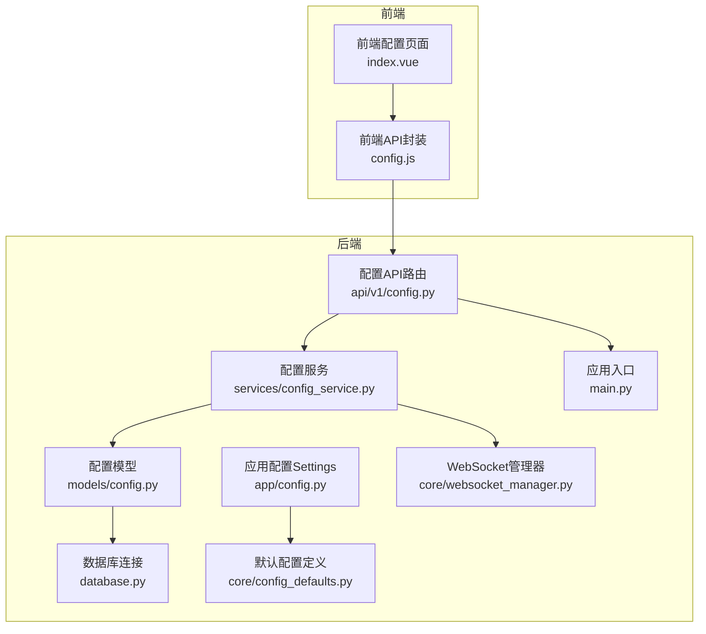
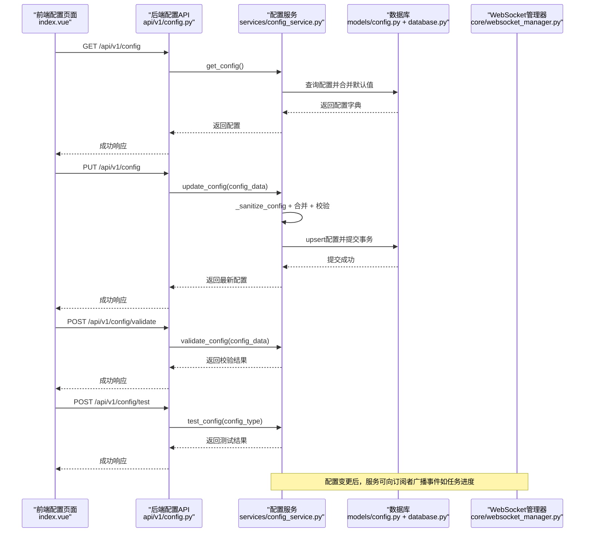
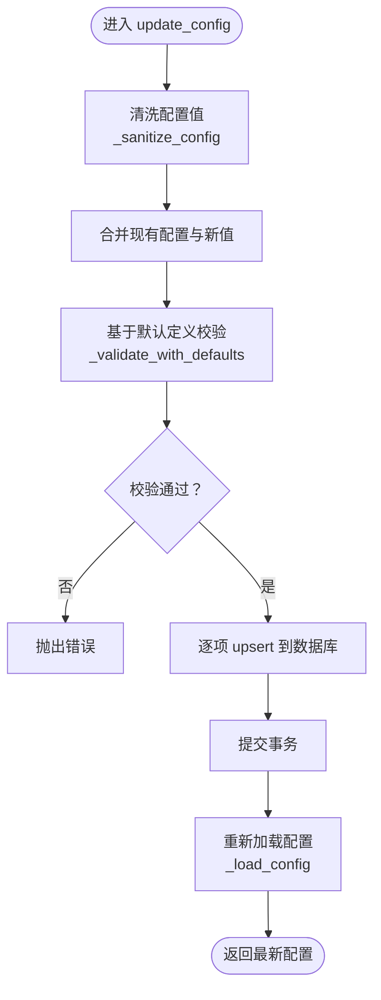
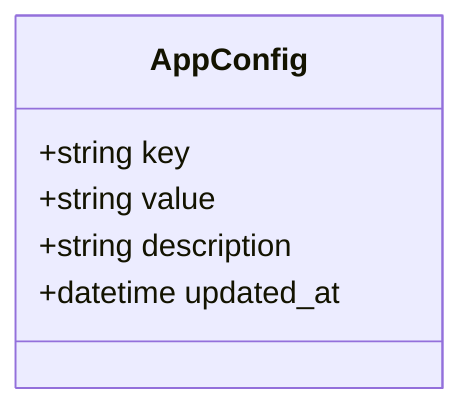
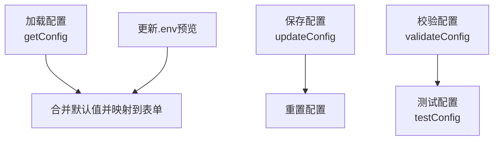
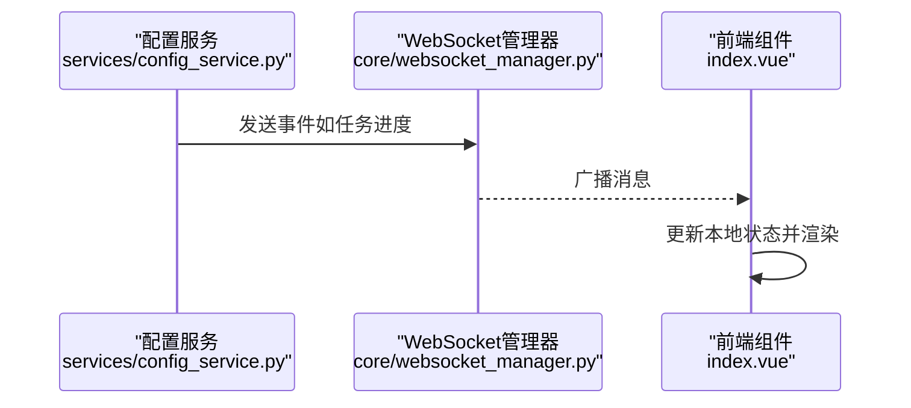
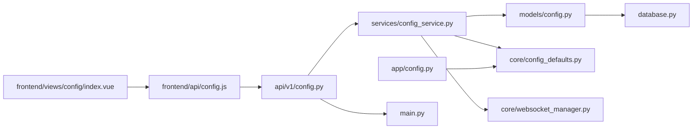

# 环境配置

<cite>
**本文引用的文件**
- [backend/app/services/config_service.py](file://backend/app/services/config_service.py)
- [backend/app/api/v1/config.py](file://backend/app/api/v1/config.py)
- [backend/app/models/config.py](file://backend/app/models/config.py)
- [backend/app/core/config_defaults.py](file://backend/app/core/config_defaults.py)
- [backend/app/config.py](file://backend/app/config.py)
- [backend/app/database.py](file://backend/app/database.py)
- [frontend/src/views/config/index.vue](file://frontend/src/views/config/index.vue)
- [frontend/src/api/config.js](file://frontend/src/api/config.js)
- [backend/app/main.py](file://backend/app/main.py)
- [backend/app/core/websocket_manager.py](file://backend/app/core/websocket_manager.py)
</cite>

## 目录
1. [简介](#简介)
2. [项目结构](#项目结构)
3. [核心组件](#核心组件)
4. [架构总览](#架构总览)
5. [详细组件分析](#详细组件分析)
6. [依赖关系分析](#依赖关系分析)
7. [性能考量](#性能考量)
8. [故障排查指南](#故障排查指南)
9. [结论](#结论)
10. [附录](#附录)

## 简介
本章节聚焦“环境配置”模块，系统性阐述后端配置服务如何通过数据库持久化管理敏感参数（如AI模型API密钥、数据库连接、量化交易平台账户等），以及前端配置界面如何以多标签页形式组织这些参数并进行安全展示与校验。文档还覆盖API接口定义、字段类型与默认值、校验规则、测试接口、配置变更后的事件广播与组件级生效流程，并明确哪些配置需要重启服务才能生效及其技术原因。

## 项目结构
围绕“环境配置”的前后端关键文件分布如下：
- 后端
  - 配置服务：backend/app/services/config_service.py
  - API路由：backend/app/api/v1/config.py
  - 配置模型：backend/app/models/config.py
  - 默认配置定义：backend/app/core/config_defaults.py
  - 应用配置（Pydantic Settings）：backend/app/config.py
  - 数据库连接：backend/app/database.py
  - 应用入口与异常处理：backend/app/main.py
  - WebSocket管理器：backend/app/core/websocket_manager.py
- 前端
  - 配置页面（多标签页）：frontend/src/views/config/index.vue
  - 配置API封装：frontend/src/api/config.js

图表来源
- [frontend/src/views/config/index.vue](file://frontend/src/views/config/index.vue#L1-L634)
- [frontend/src/api/config.js](file://frontend/src/api/config.js#L1-L38)
- [backend/app/api/v1/config.py](file://backend/app/api/v1/config.py#L1-L91)
- [backend/app/services/config_service.py](file://backend/app/services/config_service.py#L1-L182)
- [backend/app/models/config.py](file://backend/app/models/config.py#L1-L21)
- [backend/app/database.py](file://backend/app/database.py#L1-L45)
- [backend/app/config.py](file://backend/app/config.py#L1-L92)
- [backend/app/core/config_defaults.py](file://backend/app/core/config_defaults.py#L1-L154)
- [backend/app/core/websocket_manager.py](file://backend/app/core/websocket_manager.py#L1-L119)
- [backend/app/main.py](file://backend/app/main.py#L1-L92)

章节来源
- [backend/app/services/config_service.py](file://backend/app/services/config_service.py#L1-L182)
- [backend/app/api/v1/config.py](file://backend/app/api/v1/config.py#L1-L91)
- [frontend/src/views/config/index.vue](file://frontend/src/views/config/index.vue#L1-L634)

## 核心组件
- 配置服务（ConfigService）
  - 职责：从数据库读取配置、合并默认值、清洗与校验、更新与写入、测试配置可用性。
  - 关键方法：get_config、update_config、validate_config、test_config、_load_config、_validate_with_defaults、_test_*。
- 配置模型（AppConfig）
  - 表结构：key、value、description、updated_at。
- 默认配置定义（CONFIG_DEFAULTS）
  - 字段：键名、默认值、是否必填、类型（text/password/boolean/select）、选项列表等。
- 应用配置（Settings）
  - Pydantic Settings，从.env文件加载，包含应用、CORS、数据库、JWT、AI、数据源、MySQL、邮件、Webhook、MiniQMT、Redis等配置项。
- 前端配置界面（index.vue）
  - 多标签页：基础配置、数据源配置、量化交易配置、通知配置。
  - 敏感字段掩码显示（密码输入框、显示密码按钮）。
- 前端API封装（config.js）
  - 提供getConfig、updateConfig、validateConfig、testConfig四个方法。
- WebSocket管理器（WebSocketConnectionManager）
  - 维护连接与订阅，支持向订阅者广播任务进度消息。

章节来源
- [backend/app/services/config_service.py](file://backend/app/services/config_service.py#L1-L182)
- [backend/app/models/config.py](file://backend/app/models/config.py#L1-L21)
- [backend/app/core/config_defaults.py](file://backend/app/core/config_defaults.py#L1-L154)
- [backend/app/config.py](file://backend/app/config.py#L1-L92)
- [frontend/src/views/config/index.vue](file://frontend/src/views/config/index.vue#L1-L634)
- [frontend/src/api/config.js](file://frontend/src/api/config.js#L1-L38)
- [backend/app/core/websocket_manager.py](file://backend/app/core/websocket_manager.py#L1-L119)

## 架构总览
后端采用“API路由 -> 服务层 -> 数据模型 -> 数据库”的分层设计；前端通过API封装调用后端接口，实现配置的读取、更新、校验与测试。配置变更后，后端可结合WebSocket向订阅者广播事件，前端组件按需刷新。

图表来源
- [backend/app/api/v1/config.py](file://backend/app/api/v1/config.py#L1-L91)
- [backend/app/services/config_service.py](file://backend/app/services/config_service.py#L1-L182)
- [backend/app/models/config.py](file://backend/app/models/config.py#L1-L21)
- [backend/app/database.py](file://backend/app/database.py#L1-L45)
- [backend/app/core/websocket_manager.py](file://backend/app/core/websocket_manager.py#L1-L119)
- [frontend/src/views/config/index.vue](file://frontend/src/views/config/index.vue#L1-L634)
- [frontend/src/api/config.js](file://frontend/src/api/config.js#L1-L38)

## 详细组件分析

### 配置服务（ConfigService）
- 数据结构与复杂度
  - 配置以键值对存储于数据库表，查询与合并默认值的时间复杂度近似O(n)，n为配置项数量。
  - upsert操作基于主键查找，典型为O(log n)或O(1)（索引支持）。
- 处理逻辑
  - 清洗：将布尔/None值规范化为字符串，保证统一存储。
  - 合并与校验：先合并现有配置与新值，再依据默认定义进行必填与格式校验。
  - 测试：针对不同配置类型（DeepSeek、邮件、Webhook、MySQL）执行针对性校验。
  - 默认注入：首次启动时确保默认配置写入数据库。
- 错误处理
  - 校验失败抛出ValueError，由API层转换为HTTP 400。
  - 其他异常转换为HTTP 500。
- 动态加载与热更新
  - 服务层每次读取均从数据库加载并合并默认值，具备“动态加载”能力。
  - 热更新：当前实现未内置“监听文件变化并自动重载”的机制；配置变更后需重启服务以使部分配置（如数据库URL、CORS、JWT等）生效。

图表来源
- [backend/app/services/config_service.py](file://backend/app/services/config_service.py#L1-L182)

章节来源
- [backend/app/services/config_service.py](file://backend/app/services/config_service.py#L1-L182)

### 配置模型（AppConfig）
- 字段
  - key：配置键（主键，带注释）
  - value：配置值（文本，非空，默认空串）
  - description：配置说明（文本，可空）
  - updated_at：更新时间（自动更新）
- 关系
  - 与服务层的ConfigService配合，完成配置的增删改查与默认注入。

图表来源
- [backend/app/models/config.py](file://backend/app/models/config.py#L1-L21)

章节来源
- [backend/app/models/config.py](file://backend/app/models/config.py#L1-L21)

### 默认配置定义（CONFIG_DEFAULTS）
- 字段属性
  - 键名：DEEPSEEK_API_KEY、DEEPSEEK_BASE_URL、TUSHARE_TOKEN、MINIQMT_*、EMAIL_*、WEBHOOK_*、MYSQL_* 等。
  - 属性：value（默认值）、description（说明）、required（是否必填）、type（类型）、options（可选枚举）。
- 作用
  - 服务层在加载配置时使用默认值补齐缺失项。
  - 前端表单根据类型渲染输入控件（密码、布尔开关、下拉选择等）。

章节来源
- [backend/app/core/config_defaults.py](file://backend/app/core/config_defaults.py#L1-L154)

### 应用配置（Settings）
- 来源：.env文件，使用Pydantic Settings加载。
- 包含：应用、CORS、数据库、JWT、AI、数据源、MySQL、邮件、Webhook、MiniQMT、Redis等。
- 重要性：部分配置（如DATABASE_URL、CORS_ORIGINS、SECRET_KEY等）一旦启动即被缓存，需重启服务才能生效。

章节来源
- [backend/app/config.py](file://backend/app/config.py#L1-L92)

### 前端配置界面（index.vue）
- 多标签页布局
  - 基础配置：DeepSeek API Key与Base URL。
  - 数据源配置：Tushare Token与MySQL行情库开关与参数。
  - 量化交易配置：MiniQMT开关、账户ID、账户类型、用户数据目录。
  - 通知配置：邮件与Webhook开关与参数。
- 敏感字段掩码显示
  - 密码输入框（type=password），支持显示密码按钮，避免明文泄露。
- 行为
  - 重新加载：从后端获取配置并回填表单。
  - 校验：调用后端validate接口进行必填与格式校验。
  - 保存：调用后端update接口写入数据库。
  - 重置：恢复为最近一次加载/保存的配置。
  - 预览：生成.env预览文本，便于确认即将写入的内容。

图表来源
- [frontend/src/views/config/index.vue](file://frontend/src/views/config/index.vue#L1-L634)
- [frontend/src/api/config.js](file://frontend/src/api/config.js#L1-L38)

章节来源
- [frontend/src/views/config/index.vue](file://frontend/src/views/config/index.vue#L1-L634)
- [frontend/src/api/config.js](file://frontend/src/api/config.js#L1-L38)

### API接口文档
- GET /api/v1/config
  - 功能：获取当前配置（从数据库读取并合并默认值）。
  - 返回：配置字典。
  - 异常：校验失败返回400，其他异常返回500。
- PUT /api/v1/config
  - 功能：更新配置（清洗、合并、校验、upsert、提交事务）。
  - 请求体：配置键值对。
  - 返回：最新配置字典。
  - 异常：校验失败返回400，其他异常返回500。
- POST /api/v1/config/validate
  - 功能：验证配置有效性（清洗、合并、校验）。
  - 请求体：配置键值对。
  - 返回：{"success": true, "message": "..."}。
  - 异常：校验失败返回400，其他异常返回500。
- GET /api/v1/config/test?config_type=...
- POST /api/v1/config/test
  - 功能：测试指定配置的准备情况。
  - 参数/请求体：config_type（deepseek/email/webhook/mysql）。
  - 返回：{"success": true, "message": "..."}。
  - 异常：参数错误或校验失败返回400，其他异常返回500。

章节来源
- [backend/app/api/v1/config.py](file://backend/app/api/v1/config.py#L1-L91)

### 配置字段定义与校验规则
- 字段清单与默认值（节选）
  - DEEPSEEK_API_KEY：必填，password类型，默认空串。
  - DEEPSEEK_BASE_URL：非必填，text类型，默认"https://api.deepseek.com/v1"。
  - TUSHARE_TOKEN：非必填，password类型，默认空串。
  - MYSQL_ENABLED：非必填，boolean类型，默认false。
  - MYSQL_HOST/MYSQL_PORT/MYSQL_USER/MYSQL_PASSWORD/MYSQL_DATABASE/MYSQL_STOCK_TABLE：MySQL相关，非必填，text/password类型，默认值见默认定义。
  - MINIQMT_ENABLED/ACCOUNT_ID/ACCOUNT_TYPE/USERDATA_PATH：MiniQMT相关，非必填。
  - EMAIL_ENABLED/SMTP_SERVER/SMTP_PORT/EMAIL_FROM/EMAIL_PASSWORD/EMAIL_TO：邮件相关，非必填。
  - WEBHOOK_ENABLED/WEBHOOK_TYPE/WEBHOOK_URL/WEBHOOK_KEYWORD：Webhook相关，非必填。
- 校验规则
  - 必填项：若默认定义要求必填且当前为空，则校验失败。
  - DeepSeek API Key：长度至少20字符。
  - MySQL：启用后必须提供主机、端口、用户、数据库、行情表名。
  - 邮件：启用后必须提供SMTP服务器、端口、发件人、授权码、收件人。
  - Webhook：启用后必须提供URL；当类型为钉钉时需提供关键词。

章节来源
- [backend/app/core/config_defaults.py](file://backend/app/core/config_defaults.py#L1-L154)
- [backend/app/services/config_service.py](file://backend/app/services/config_service.py#L1-L182)

### 配置变更后的事件广播与组件级生效流程
- 事件广播
  - 服务层可通过WebSocket管理器向订阅者广播事件（例如任务进度）。前端组件可订阅对应任务ID，接收实时更新。
- 组件级生效
  - 对于“配置服务”管理的键值型配置，前端保存后即可通过GET接口读取最新值，组件按需刷新。
  - 对于应用配置（Settings），由于部分字段在应用启动时被缓存（如DATABASE_URL、CORS_ORIGINS、SECRET_KEY等），需重启服务才能生效。

图表来源
- [backend/app/core/websocket_manager.py](file://backend/app/core/websocket_manager.py#L1-L119)
- [frontend/src/views/config/index.vue](file://frontend/src/views/config/index.vue#L1-L634)

章节来源
- [backend/app/core/websocket_manager.py](file://backend/app/core/websocket_manager.py#L1-L119)
- [backend/app/services/config_service.py](file://backend/app/services/config_service.py#L1-L182)

## 依赖关系分析
- 组件耦合
  - API路由依赖服务层；服务层依赖模型与数据库；模型依赖数据库引擎；前端依赖API封装。
- 外部依赖
  - 数据库：SQLAlchemy（关系型数据库）。
  - 配置加载：Pydantic Settings（.env文件）。
  - WebSocket：FastAPI WebSocket连接管理。
- 循环依赖
  - 未发现循环依赖迹象；模块职责清晰，接口边界明确。

图表来源
- [backend/app/api/v1/config.py](file://backend/app/api/v1/config.py#L1-L91)
- [backend/app/services/config_service.py](file://backend/app/services/config_service.py#L1-L182)
- [backend/app/models/config.py](file://backend/app/models/config.py#L1-L21)
- [backend/app/database.py](file://backend/app/database.py#L1-L45)
- [backend/app/core/config_defaults.py](file://backend/app/core/config_defaults.py#L1-L154)
- [backend/app/config.py](file://backend/app/config.py#L1-L92)
- [backend/app/main.py](file://backend/app/main.py#L1-L92)
- [backend/app/core/websocket_manager.py](file://backend/app/core/websocket_manager.py#L1-L119)
- [frontend/src/views/config/index.vue](file://frontend/src/views/config/index.vue#L1-L634)
- [frontend/src/api/config.js](file://frontend/src/api/config.js#L1-L38)

章节来源
- [backend/app/api/v1/config.py](file://backend/app/api/v1/config.py#L1-L91)
- [backend/app/services/config_service.py](file://backend/app/services/config_service.py#L1-L182)
- [backend/app/models/config.py](file://backend/app/models/config.py#L1-L21)
- [backend/app/database.py](file://backend/app/database.py#L1-L45)
- [backend/app/core/config_defaults.py](file://backend/app/core/config_defaults.py#L1-L154)
- [backend/app/config.py](file://backend/app/config.py#L1-L92)
- [backend/app/main.py](file://backend/app/main.py#L1-L92)
- [frontend/src/views/config/index.vue](file://frontend/src/views/config/index.vue#L1-L634)
- [frontend/src/api/config.js](file://frontend/src/api/config.js#L1-L38)

## 性能考量
- 数据库访问
  - 配置读取与更新均为轻量级操作，单次事务提交成本低；建议在高频场景下避免频繁重复保存。
- 序列化与传输
  - 配置字典较小，JSON序列化开销可忽略；注意前端预览生成时的字符串拼接。
- 缓存与热更新
  - Settings实例使用LRU缓存，减少重复解析.env的成本；但部分字段仍需重启生效。

[本节为通用指导，不直接分析具体文件]

## 故障排查指南
- 常见问题
  - 配置保存后无效：确认是否属于Settings中的静态配置（如DATABASE_URL、CORS_ORIGINS、SECRET_KEY等），此类配置需重启服务。
  - 校验失败：检查必填项与格式（如DeepSeek API Key长度、MySQL字段完整性、邮件/Webhook参数）。
  - 测试失败：根据测试接口返回的消息定位具体缺失或错误项。
  - WebSocket无法接收事件：检查订阅任务ID与连接状态。
- 建议步骤
  - 使用“校验配置”接口先行验证。
  - 使用“测试配置”接口对关键模块（DeepSeek、邮件、Webhook、MySQL）进行连通性测试。
  - 查看后端异常处理统一响应，定位错误详情。

章节来源
- [backend/app/api/v1/config.py](file://backend/app/api/v1/config.py#L1-L91)
- [backend/app/services/config_service.py](file://backend/app/services/config_service.py#L1-L182)
- [backend/app/core/websocket_manager.py](file://backend/app/core/websocket_manager.py#L1-L119)

## 结论
本模块通过“数据库持久化 + 默认值补齐 + 统一校验 + 测试接口 + 前端多标签页”的组合，实现了对AI模型API密钥、数据库连接、量化交易账户、通知渠道等敏感配置的安全与可控管理。服务层具备动态加载能力，前端提供掩码显示与预览，API层提供标准接口与错误处理。对于部分应用配置（Settings），需重启服务才能生效；其余配置可在运行时通过API更新并即时生效。

[本节为总结性内容，不直接分析具体文件]

## 附录

### 需要重启服务才能生效的配置（技术原因）
- 数据库URL（DATABASE_URL）
  - 原因：数据库引擎在应用启动时初始化，后续更改不会自动重建连接。
- CORS允许源（CORS_ORIGINS）
  - 原因：中间件在应用启动时注册，运行期修改不会影响已注册的CORS策略。
- JWT密钥与算法（SECRET_KEY、ALGORITHM）
  - 原因：令牌签发/验证依赖这些参数，运行期修改会导致旧令牌失效且无法解码新令牌。
- 应用名称与版本（APP_NAME、APP_VERSION）
  - 原因：属于应用元信息，通常在启动时固定，运行期修改无实际意义。

章节来源
- [backend/app/config.py](file://backend/app/config.py#L1-L92)
- [backend/app/database.py](file://backend/app/database.py#L1-L45)
- [backend/app/main.py](file://backend/app/main.py#L1-L92)