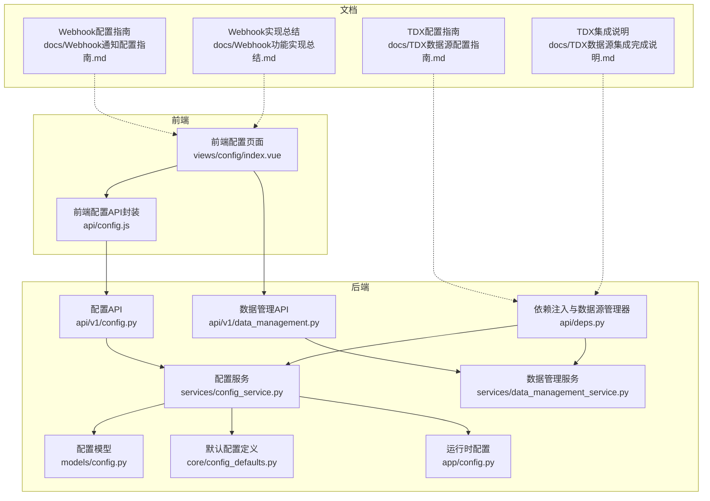
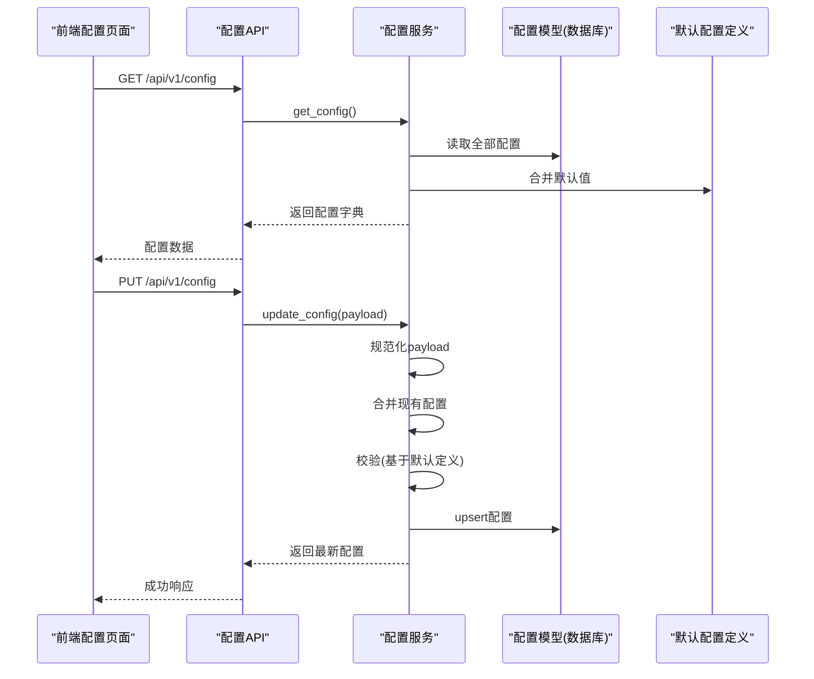
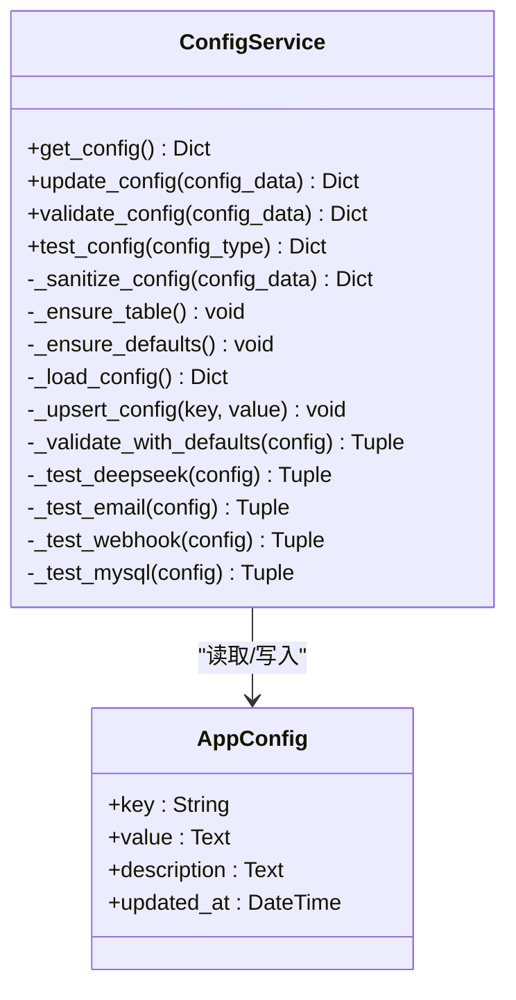
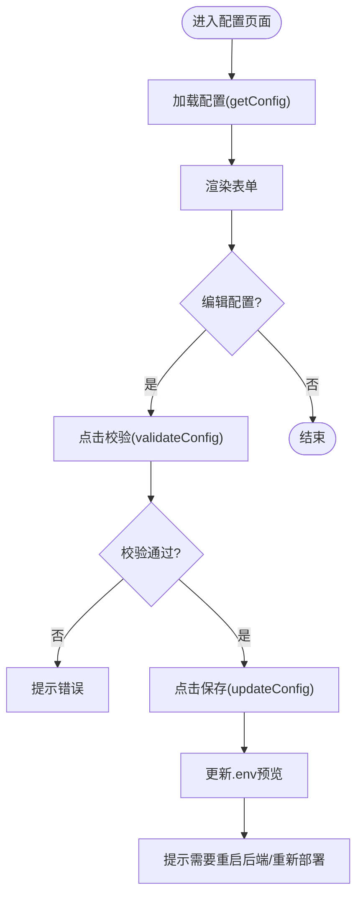
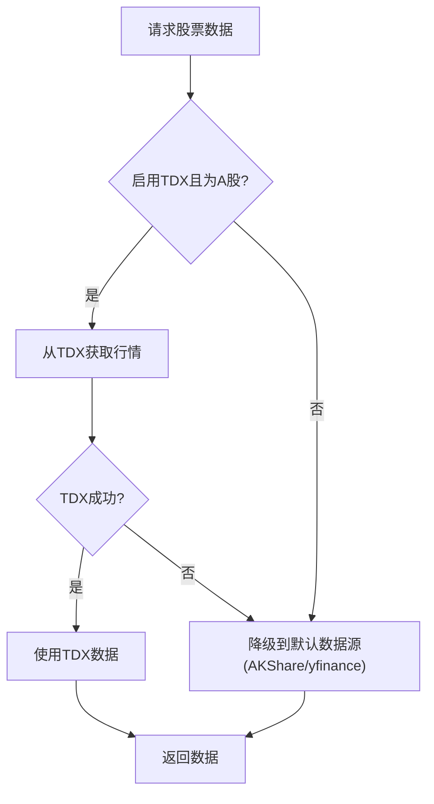
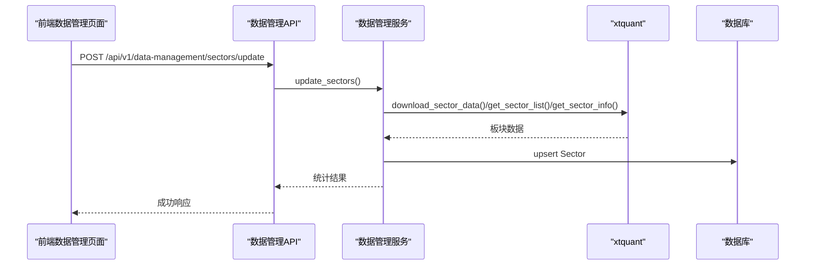
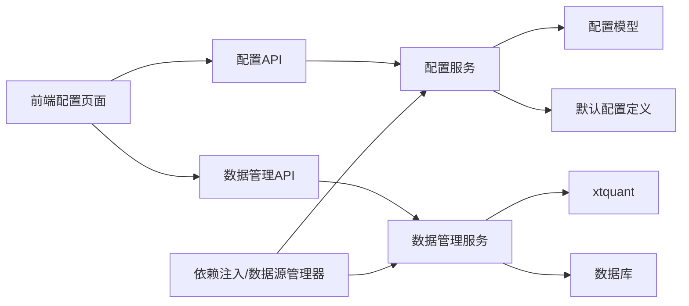

# 系统配置与数据管理

<cite>
**本文引用的文件**
- [backend/app/services/config_service.py](file://backend/app/services/config_service.py)
- [backend/app/models/config.py](file://backend/app/models/config.py)
- [backend/app/core/config_defaults.py](file://backend/app/core/config_defaults.py)
- [backend/app/config.py](file://backend/app/config.py)
- [backend/app/api/v1/config.py](file://backend/app/api/v1/config.py)
- [frontend/src/views/config/index.vue](file://frontend/src/views/config/index.vue)
- [frontend/src/api/config.js](file://frontend/src/api/config.js)
- [backend/app/services/data_management_service.py](file://backend/app/services/data_management_service.py)
- [backend/app/api/v1/data_management.py](file://backend/app/api/v1/data_management.py)
- [docs/TDX数据源配置指南.md](file://docs/TDX数据源配置指南.md)
- [docs/TDX数据源集成完成说明.md](file://docs/TDX数据源集成完成说明.md)
- [docs/Webhook通知配置指南.md](file://docs/Webhook通知配置指南.md)
- [docs/Webhook功能实现总结.md](file://docs/Webhook功能实现总结.md)
- [frontend/src/api/notification.js](file://frontend/src/api/notification.js)
- [backend/app/api/deps.py](file://backend/app/api/deps.py)
</cite>

## 目录
1. [简介](#简介)
2. [项目结构](#项目结构)
3. [核心组件](#核心组件)
4. [架构总览](#架构总览)
5. [详细组件分析](#详细组件分析)
6. [依赖关系分析](#依赖关系分析)
7. [性能考量](#性能考量)
8. [故障排查指南](#故障排查指南)
9. [结论](#结论)
10. [附录](#附录)

## 简介
本文件聚焦“系统配置与数据管理”主题，覆盖以下方面：
- 环境参数设置与持久化：后端通过数据库存储配置，前端提供可视化界面进行编辑、校验与预览。
- 数据源配置：支持TDX、Tushare、MySQL等多数据源，并具备冗余切换能力。
- 通知渠道管理：邮件与Webhook通知配置与测试。
- API接口文档：配置的读取、更新、校验与测试。
- 生效机制与重启需求：配置变更的持久化与系统重启要求。

## 项目结构
围绕配置与数据管理的关键文件分布如下：
- 后端服务层：配置服务、数据管理服务、API路由、数据库模型与默认配置。
- 前端视图层：配置页面、API封装。
- 文档：TDX与Webhook配置指南与实现总结。

图表来源
- [frontend/src/views/config/index.vue](file://frontend/src/views/config/index.vue#L1-L634)
- [frontend/src/api/config.js](file://frontend/src/api/config.js#L1-L38)
- [backend/app/api/v1/config.py](file://backend/app/api/v1/config.py#L1-L91)
- [backend/app/services/config_service.py](file://backend/app/services/config_service.py#L1-L182)
- [backend/app/models/config.py](file://backend/app/models/config.py#L1-L21)
- [backend/app/core/config_defaults.py](file://backend/app/core/config_defaults.py#L1-L154)
- [backend/app/config.py](file://backend/app/config.py#L1-L92)
- [backend/app/api/v1/data_management.py](file://backend/app/api/v1/data_management.py#L1-L94)
- [backend/app/services/data_management_service.py](file://backend/app/services/data_management_service.py#L1-L467)
- [backend/app/api/deps.py](file://backend/app/api/deps.py#L38-L58)
- [docs/TDX数据源配置指南.md](file://docs/TDX数据源配置指南.md#L202-L228)
- [docs/TDX数据源集成完成说明.md](file://docs/TDX数据源集成完成说明.md#L66-L109)
- [docs/Webhook通知配置指南.md](file://docs/Webhook通知配置指南.md#L421-L445)
- [docs/Webhook功能实现总结.md](file://docs/Webhook功能实现总结.md#L97-L134)

章节来源
- [backend/app/api/v1/config.py](file://backend/app/api/v1/config.py#L1-L91)
- [backend/app/services/config_service.py](file://backend/app/services/config_service.py#L1-L182)
- [backend/app/models/config.py](file://backend/app/models/config.py#L1-L21)
- [backend/app/core/config_defaults.py](file://backend/app/core/config_defaults.py#L1-L154)
- [backend/app/config.py](file://backend/app/config.py#L1-L92)
- [frontend/src/views/config/index.vue](file://frontend/src/views/config/index.vue#L1-L634)
- [frontend/src/api/config.js](file://frontend/src/api/config.js#L1-L38)
- [backend/app/api/v1/data_management.py](file://backend/app/api/v1/data_management.py#L1-L94)
- [backend/app/services/data_management_service.py](file://backend/app/services/data_management_service.py#L1-L467)
- [backend/app/api/deps.py](file://backend/app/api/deps.py#L38-L58)
- [docs/TDX数据源配置指南.md](file://docs/TDX数据源配置指南.md#L202-L228)
- [docs/TDX数据源集成完成说明.md](file://docs/TDX数据源集成完成说明.md#L66-L109)
- [docs/Webhook通知配置指南.md](file://docs/Webhook通知配置指南.md#L421-L445)
- [docs/Webhook功能实现总结.md](file://docs/Webhook功能实现总结.md#L97-L134)

## 核心组件
- 配置服务：负责配置的读取、更新、校验与测试，支持默认值回退与数据库持久化。
- 配置模型：键值型配置表，支持描述与更新时间。
- 默认配置定义：集中定义必填项、类型、选项与默认值。
- 运行时配置：从环境文件加载的系统级配置。
- 配置API：提供获取、更新、校验与测试接口。
- 前端配置页面：提供基础配置、数据源配置、量化交易配置、通知配置的表单与校验。
- 数据管理服务：对接xtquant，维护板块、成分股与股票合约信息，并支持MySQL持久化。
- 数据管理API：提供板块、成分股与股票信息的增删改查与批量更新接口。
- 依赖注入与数据源管理器：根据配置动态选择数据源（含TDX与Tushare的冗余切换）。

章节来源
- [backend/app/services/config_service.py](file://backend/app/services/config_service.py#L1-L182)
- [backend/app/models/config.py](file://backend/app/models/config.py#L1-L21)
- [backend/app/core/config_defaults.py](file://backend/app/core/config_defaults.py#L1-L154)
- [backend/app/config.py](file://backend/app/config.py#L1-L92)
- [backend/app/api/v1/config.py](file://backend/app/api/v1/config.py#L1-L91)
- [frontend/src/views/config/index.vue](file://frontend/src/views/config/index.vue#L1-L634)
- [frontend/src/api/config.js](file://frontend/src/api/config.js#L1-L38)
- [backend/app/services/data_management_service.py](file://backend/app/services/data_management_service.py#L1-L467)
- [backend/app/api/v1/data_management.py](file://backend/app/api/v1/data_management.py#L1-L94)
- [backend/app/api/deps.py](file://backend/app/api/deps.py#L38-L58)

## 架构总览
系统配置与数据管理采用前后端分离架构：
- 前端通过API封装调用后端配置API，完成配置的读取、更新与校验。
- 后端配置服务从数据库读取配置，结合默认定义进行校验与测试。
- 数据管理服务通过xtquant与数据库协同，维护板块与股票信息。
- 依赖注入模块根据配置动态选择数据源，实现TDX与Tushare的冗余切换。

图表来源
- [frontend/src/views/config/index.vue](file://frontend/src/views/config/index.vue#L383-L504)
- [frontend/src/api/config.js](file://frontend/src/api/config.js#L1-L38)
- [backend/app/api/v1/config.py](file://backend/app/api/v1/config.py#L14-L41)
- [backend/app/services/config_service.py](file://backend/app/services/config_service.py#L23-L41)
- [backend/app/models/config.py](file://backend/app/models/config.py#L1-L21)
- [backend/app/core/config_defaults.py](file://backend/app/core/config_defaults.py#L1-L154)

## 详细组件分析

### 配置服务与持久化
- 持久化机制：使用键值型配置表，首次启动自动创建表并写入默认配置；后续更新采用upsert策略。
- 动态加载：从数据库读取配置，缺失项回退到默认定义；支持按需测试与校验。
- 校验规则：基于默认定义进行必填项与格式校验；对特定键（如DeepSeek API Key）进行长度校验。
- 测试能力：支持DeepSeek、邮件、Webhook、MySQL等配置类型的测试。

图表来源
- [backend/app/services/config_service.py](file://backend/app/services/config_service.py#L14-L182)
- [backend/app/models/config.py](file://backend/app/models/config.py#L1-L21)

章节来源
- [backend/app/services/config_service.py](file://backend/app/services/config_service.py#L1-L182)
- [backend/app/models/config.py](file://backend/app/models/config.py#L1-L21)
- [backend/app/core/config_defaults.py](file://backend/app/core/config_defaults.py#L1-L154)

### 前端配置界面（config.vue）
- 表单组织：基础配置（DeepSeek）、数据源配置（Tushare、MySQL）、量化交易配置（MiniQMT）、通知配置（邮件、Webhook）。
- 表单验证：前端将布尔值转换为字符串，禁用项不参与校验；提供“校验配置”按钮调用后端校验接口。
- 提交处理：保存配置后更新.env预览文本；提示“保存配置后需要重启后端/重新部署服务才会生效”。

图表来源
- [frontend/src/views/config/index.vue](file://frontend/src/views/config/index.vue#L383-L545)
- [frontend/src/api/config.js](file://frontend/src/api/config.js#L1-L38)

章节来源
- [frontend/src/views/config/index.vue](file://frontend/src/views/config/index.vue#L1-L634)
- [frontend/src/api/config.js](file://frontend/src/api/config.js#L1-L38)

### API接口文档（配置）
- GET /api/v1/config：返回当前配置字典。
- PUT /api/v1/config：更新配置并返回最新配置；失败返回400/500。
- POST /api/v1/config/validate：校验配置有效性，返回成功/失败与消息。
- GET /api/v1/config/test：测试配置（兼容GET），POST /api/v1/config/test：推荐使用POST，携带config_type。

章节来源
- [backend/app/api/v1/config.py](file://backend/app/api/v1/config.py#L1-L91)

### 数据源集成与冗余切换（TDX、Tushare）
- 配置项：TDX_ENABLED、TDX_BASE_URL、TUSHARE_TOKEN等。
- 冗余切换：优先使用TDX（A股），失败自动降级到默认数据源；Tushare作为备用数据源。
- 文档指引：提供TDX部署、配置与性能对比说明，以及Webhook通知配置与问题排查。

图表来源
- [docs/TDX数据源集成完成说明.md](file://docs/TDX数据源集成完成说明.md#L66-L109)
- [docs/TDX数据源配置指南.md](file://docs/TDX数据源配置指南.md#L202-L228)
- [backend/app/api/deps.py](file://backend/app/api/deps.py#L38-L58)

章节来源
- [docs/TDX数据源配置指南.md](file://docs/TDX数据源配置指南.md#L202-L228)
- [docs/TDX数据源集成完成说明.md](file://docs/TDX数据源集成完成说明.md#L66-L109)
- [backend/app/api/deps.py](file://backend/app/api/deps.py#L38-L58)

### 通知渠道管理（邮件、Webhook）
- 邮件：SMTP服务器、端口、发件人、授权码、收件人等字段；启用开关控制。
- Webhook：类型（钉钉/飞书）、URL、关键词（钉钉安全验证）；启用开关控制。
- 前端提示：提供配置说明与测试建议；Webhook常见问题与解决方案。

章节来源
- [frontend/src/views/config/index.vue](file://frontend/src/views/config/index.vue#L172-L253)
- [docs/Webhook通知配置指南.md](file://docs/Webhook通知配置指南.md#L421-L445)
- [docs/Webhook功能实现总结.md](file://docs/Webhook功能实现总结.md#L97-L134)

### 数据管理服务（板块、成分股、股票合约）
- 功能：从xtquant下载并同步板块、成分股与股票合约信息至数据库。
- 依赖：xtquant初始化与可用性检测；数据库事务与回滚。
- 接口：批量更新板块、批量更新成分股、批量更新股票信息、查询板块与股票列表。

图表来源
- [frontend/src/api/notification.js](file://frontend/src/api/notification.js#L1-L38)
- [backend/app/api/v1/data_management.py](file://backend/app/api/v1/data_management.py#L1-L94)
- [backend/app/services/data_management_service.py](file://backend/app/services/data_management_service.py#L1-L467)

章节来源
- [backend/app/api/v1/data_management.py](file://backend/app/api/v1/data_management.py#L1-L94)
- [backend/app/services/data_management_service.py](file://backend/app/services/data_management_service.py#L1-L467)

## 依赖关系分析
- 配置服务依赖默认配置定义与数据库模型，提供统一的配置读取、更新、校验与测试能力。
- 前端通过API封装调用配置API，实现配置的可视化管理。
- 数据管理服务依赖xtquant与数据库，提供板块与股票信息的同步与查询。
- 依赖注入模块根据配置动态选择数据源，实现TDX与Tushare的冗余切换。

图表来源
- [frontend/src/views/config/index.vue](file://frontend/src/views/config/index.vue#L1-L634)
- [frontend/src/api/config.js](file://frontend/src/api/config.js#L1-L38)
- [backend/app/api/v1/config.py](file://backend/app/api/v1/config.py#L1-L91)
- [backend/app/services/config_service.py](file://backend/app/services/config_service.py#L1-L182)
- [backend/app/models/config.py](file://backend/app/models/config.py#L1-L21)
- [backend/app/core/config_defaults.py](file://backend/app/core/config_defaults.py#L1-L154)
- [backend/app/api/v1/data_management.py](file://backend/app/api/v1/data_management.py#L1-L94)
- [backend/app/services/data_management_service.py](file://backend/app/services/data_management_service.py#L1-L467)
- [backend/app/api/deps.py](file://backend/app/api/deps.py#L38-L58)

章节来源
- [backend/app/services/config_service.py](file://backend/app/services/config_service.py#L1-L182)
- [backend/app/models/config.py](file://backend/app/models/config.py#L1-L21)
- [backend/app/core/config_defaults.py](file://backend/app/core/config_defaults.py#L1-L154)
- [backend/app/api/v1/config.py](file://backend/app/api/v1/config.py#L1-L91)
- [frontend/src/views/config/index.vue](file://frontend/src/views/config/index.vue#L1-L634)
- [frontend/src/api/config.js](file://frontend/src/api/config.js#L1-L38)
- [backend/app/api/v1/data_management.py](file://backend/app/api/v1/data_management.py#L1-L94)
- [backend/app/services/data_management_service.py](file://backend/app/services/data_management_service.py#L1-L467)
- [backend/app/api/deps.py](file://backend/app/api/deps.py#L38-L58)

## 性能考量
- TDX数据源：本地部署可显著降低延迟，提高成功率；建议优先启用并配置。
- Tushare作为备用：配置Token以提升数据完整性与稳定性。
- 数据管理服务：批量更新板块与股票信息时注意数据库事务与回滚，避免部分失败导致脏数据。
- 通知渠道：Webhook与邮件发送失败不影响核心功能，但建议在配置阶段进行测试验证。

[本节为通用指导，不直接分析具体文件]

## 故障排查指南
- 配置保存后未生效：前端明确提示“保存配置后需要重启后端/重新部署服务才会生效”，请按提示执行。
- Webhook问题：检查URL、关键词（钉钉）、类型（钉钉/飞书）；参考常见问题与解决方案。
- 邮件问题：确认SMTP端口、授权码、收件人等字段；参考旧版配置说明。
- 数据源问题：检查TDX服务连通性与可用性；若失败将自动降级到默认数据源。

章节来源
- [frontend/src/views/config/index.vue](file://frontend/src/views/config/index.vue#L16-L21)
- [docs/Webhook通知配置指南.md](file://docs/Webhook通知配置指南.md#L421-L445)
- [docs/Webhook功能实现总结.md](file://docs/Webhook功能实现总结.md#L97-L134)
- [docs/TDX数据源配置指南.md](file://docs/TDX数据源配置指南.md#L202-L228)
- [docs/TDX数据源集成完成说明.md](file://docs/TDX数据源集成完成说明.md#L66-L109)

## 结论
本系统通过数据库持久化的配置服务与前端可视化界面，实现了对AI、数据源、量化交易与通知渠道的集中管理。配置API提供了完善的读取、更新、校验与测试能力；数据管理服务打通了xtquant与数据库，支撑板块与股票信息的同步；依赖注入模块实现了TDX与Tushare的冗余切换。配置变更需重启后端/重新部署以完全生效，建议在变更前做好备份与测试。

[本节为总结性内容，不直接分析具体文件]

## 附录
- API一览
  - GET /api/v1/config：获取配置
  - PUT /api/v1/config：更新配置
  - POST /api/v1/config/validate：校验配置
  - GET /api/v1/config/test：测试配置（兼容GET）
  - POST /api/v1/config/test：测试配置（推荐POST）

章节来源
- [backend/app/api/v1/config.py](file://backend/app/api/v1/config.py#L1-L91)