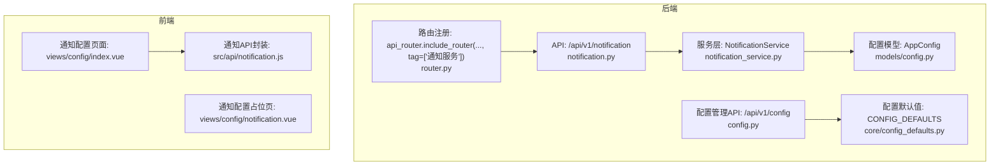
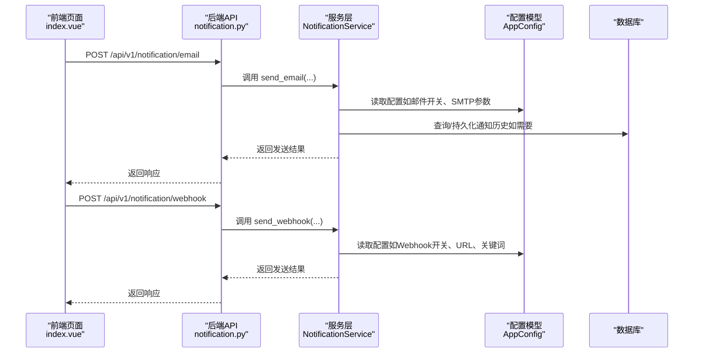
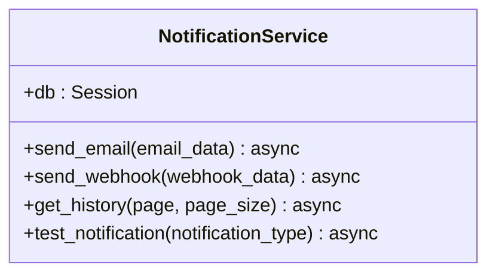
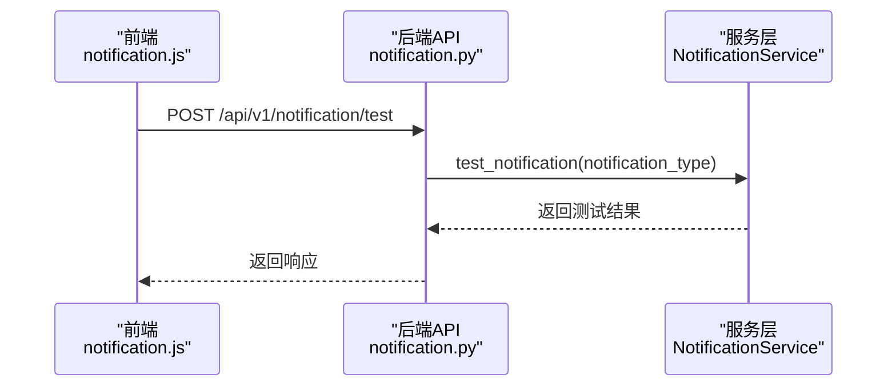
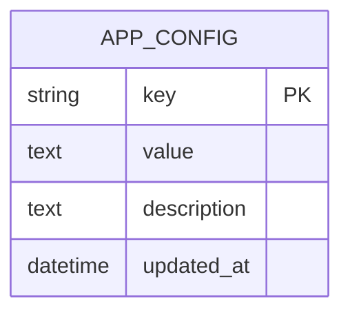
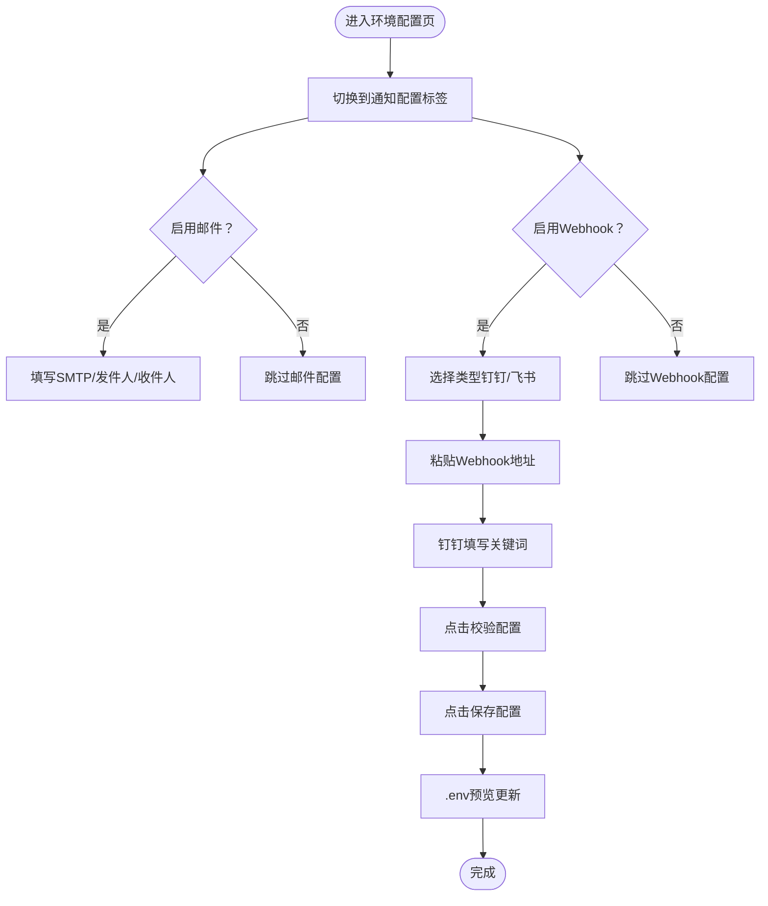
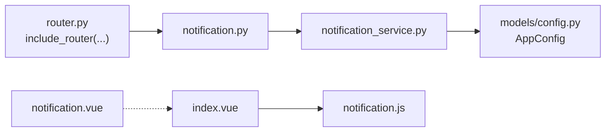

# 通知配置

<cite>
**本文引用的文件列表**
- [notification_service.py](file://backend/app/services/notification_service.py)
- [notification.py](file://backend/app/api/v1/notification.py)
- [router.py](file://backend/app/api/v1/router.py)
- [config.py](file://backend/app/api/v1/config.py)
- [config_defaults.py](file://backend/app/core/config_defaults.py)
- [config.py](file://backend/app/models/config.py)
- [notification.js](file://frontend/src/api/notification.js)
- [notification.vue](file://frontend/src/views/config/notification.vue)
- [index.vue](file://frontend/src/views/config/index.vue)
- [Webhook通知配置指南.md](file://docs/Webhook通知配置指南.md)
- [Webhook自定义关键词功能说明.md](file://docs/Webhook自定义关键词功能说明.md)
- [Webhook钉钉关键词配置更新说明.md](file://docs/Webhook钉钉关键词配置更新说明.md)
- [notification_service.py（旧版）](file://old/notification_service.py)
</cite>

## 目录
1. [引言](#引言)
2. [项目结构](#项目结构)
3. [核心组件](#核心组件)
4. [架构总览](#架构总览)
5. [组件详解](#组件详解)
6. [依赖关系分析](#依赖关系分析)
7. [性能与可靠性](#性能与可靠性)
8. [故障排查指南](#故障排查指南)
9. [结论](#结论)
10. [附录](#附录)

## 引言
本文件面向“通知配置”模块，系统梳理邮件与Webhook（支持钉钉、企业微信等）两类通知渠道的配置方法与使用场景，解释后端服务层如何封装不同通知协议的发送逻辑，并通过模板引擎支持消息内容自定义。文档还详细说明Webhook关键词过滤机制的实现原理（正则匹配与消息路由策略），提供API接口文档（新增、测试、更新、删除与全局通知开关控制），结合前端notification.vue组件说明多渠道配置表单设计与测试按钮交互逻辑，并给出典型配置示例与消息发送失败的重试与日志追踪方案。

## 项目结构
通知配置涉及后端API、服务层、配置模型与前端配置页面、API封装等模块。下图概览了通知相关的关键文件与职责分工。

图表来源
- [notification.py](file://backend/app/api/v1/notification.py#L1-L70)
- [notification_service.py](file://backend/app/services/notification_service.py#L1-L34)
- [router.py](file://backend/app/api/v1/router.py#L1-L36)
- [config.py](file://backend/app/models/config.py#L1-L21)
- [config_defaults.py](file://backend/app/core/config_defaults.py#L1-L154)
- [config.py](file://backend/app/api/v1/config.py#L1-L91)
- [index.vue](file://frontend/src/views/config/index.vue#L210-L280)
- [notification.vue](file://frontend/src/views/config/notification.vue#L1-L14)
- [notification.js](file://frontend/src/api/notification.js#L1-L39)

章节来源
- [notification.py](file://backend/app/api/v1/notification.py#L1-L70)
- [notification_service.py](file://backend/app/services/notification_service.py#L1-L34)
- [router.py](file://backend/app/api/v1/router.py#L1-L36)
- [config.py](file://backend/app/models/config.py#L1-L21)
- [config_defaults.py](file://backend/app/core/config_defaults.py#L1-L154)
- [config.py](file://backend/app/api/v1/config.py#L1-L91)
- [index.vue](file://frontend/src/views/config/index.vue#L210-L280)
- [notification.vue](file://frontend/src/views/config/notification.vue#L1-L14)
- [notification.js](file://frontend/src/api/notification.js#L1-L39)

## 核心组件
- 后端服务层：NotificationService负责封装邮件与Webhook发送逻辑、通知历史查询与测试通知能力（当前为待实现的占位方法）。
- 后端API层：提供邮件发送、Webhook发送、通知历史查询、测试通知等接口。
- 配置模型与默认值：AppConfig键值配置模型与CONFIG_DEFAULTS默认配置项，支撑全局通知开关与Webhook关键词等配置。
- 前端配置页面：index.vue提供邮件与Webhook配置表单，notification.vue为通知配置占位页；notification.js封装通知相关请求。

章节来源
- [notification_service.py](file://backend/app/services/notification_service.py#L1-L34)
- [notification.py](file://backend/app/api/v1/notification.py#L1-L70)
- [config.py](file://backend/app/models/config.py#L1-L21)
- [config_defaults.py](file://backend/app/core/config_defaults.py#L1-L154)
- [index.vue](file://frontend/src/views/config/index.vue#L210-L280)
- [notification.vue](file://frontend/src/views/config/notification.vue#L1-L14)
- [notification.js](file://frontend/src/api/notification.js#L1-L39)

## 架构总览
通知模块采用“前端表单 + 后端API + 服务层 + 配置模型”的分层架构。前端通过API封装发起请求，后端API路由到服务层，服务层基于配置模型与默认值进行通知发送与状态管理。

图表来源
- [notification.py](file://backend/app/api/v1/notification.py#L1-L70)
- [notification_service.py](file://backend/app/services/notification_service.py#L1-L34)
- [config.py](file://backend/app/models/config.py#L1-L21)

## 组件详解

### 后端服务层：NotificationService
- 职责：封装邮件与Webhook发送、通知历史查询、测试通知等逻辑。
- 当前状态：方法为占位实现，具体发送逻辑尚未落地。
- 建议扩展方向：
  - 邮件发送：基于SMTP参数（来自配置模型或默认值）构造邮件内容并通过模板引擎渲染。
  - Webhook发送：根据Webhook类型（钉钉/飞书）构造消息体，必要时加入关键词前缀；支持失败重试与日志记录。
  - 通知历史：按分页查询通知记录，支持过滤与排序。
  - 测试通知：针对邮件与Webhook分别构造测试消息并返回结果。

图表来源
- [notification_service.py](file://backend/app/services/notification_service.py#L1-L34)

章节来源
- [notification_service.py](file://backend/app/services/notification_service.py#L1-L34)

### 后端API层：通知接口
- 邮件发送：POST /api/v1/notification/email
- Webhook发送：POST /api/v1/notification/webhook
- 通知历史：GET /api/v1/notification/history?page&page_size
- 测试通知：POST /api/v1/notification/test?notification_type

图表来源
- [notification.py](file://backend/app/api/v1/notification.py#L1-L70)
- [notification.js](file://frontend/src/api/notification.js#L1-L39)

章节来源
- [notification.py](file://backend/app/api/v1/notification.py#L1-L70)
- [notification.js](file://frontend/src/api/notification.js#L1-L39)

### 配置模型与默认值
- 配置模型：AppConfig键值型配置表，支持key/value/description/updated_at等字段。
- 默认配置：CONFIG_DEFAULTS包含邮件与Webhook相关键（如EMAIL_ENABLED、WEBHOOK_ENABLED、WEBHOOK_TYPE、WEBHOOK_URL、WEBHOOK_KEYWORD等），并定义类型与选项。

图表来源
- [config.py](file://backend/app/models/config.py#L1-L21)

章节来源
- [config.py](file://backend/app/models/config.py#L1-L21)
- [config_defaults.py](file://backend/app/core/config_defaults.py#L1-L154)

### 前端配置页面与交互
- 通知配置占位页：notification.vue当前仅显示“功能开发中”，后续将承载通知配置表单。
- 环境配置页：index.vue提供邮件与Webhook配置表单，包含开关、类型选择、URL输入、关键词输入等控件；提供“校验配置”“重置”“保存配置”等操作；预览.env内容。
- 通知API封装：notification.js封装邮件、Webhook、通知历史、测试通知等请求。

图表来源
- [index.vue](file://frontend/src/views/config/index.vue#L210-L280)
- [notification.vue](file://frontend/src/views/config/notification.vue#L1-L14)
- [notification.js](file://frontend/src/api/notification.js#L1-L39)

章节来源
- [index.vue](file://frontend/src/views/config/index.vue#L210-L280)
- [notification.vue](file://frontend/src/views/config/notification.vue#L1-L14)
- [notification.js](file://frontend/src/api/notification.js#L1-L39)

### Webhook关键词过滤机制与消息路由
- 关键词配置：WEBHOOK_KEYWORD用于钉钉机器人安全验证，需与钉钉机器人设置保持一致。
- 消息路由策略：根据WEBHOOK_TYPE区分钉钉与飞书，分别构造消息体；若启用关键词，则在标题与内容中自动包含关键词，以满足钉钉关键词过滤。
- 文档参考：Webhook通知配置指南、Webhook自定义关键词功能说明、Webhook钉钉关键词配置更新说明均强调关键词一致性与测试流程。

章节来源
- [config_defaults.py](file://backend/app/core/config_defaults.py#L1-L154)
- [Webhook通知配置指南.md](file://docs/Webhook通知配置指南.md#L245-L308)
- [Webhook自定义关键词功能说明.md](file://docs/Webhook自定义关键词功能说明.md#L1-L252)
- [Webhook钉钉关键词配置更新说明.md](file://docs/Webhook钉钉关键词配置更新说明.md#L1-L136)

### 模板引擎与消息内容自定义
- 邮件：可通过模板引擎渲染HTML与纯文本内容，支持标题、正文、表格、颜色等样式。
- Webhook：根据平台类型（钉钉/飞书）选择Markdown或卡片格式，支持标题、分节、列表、链接等富文本元素。
- 旧版实现参考：notification_service.py（旧版）展示了邮件HTML正文构建与Webhook发送流程，可作为模板引擎与消息格式化的参考。

章节来源
- [notification_service.py（旧版）](file://old/notification_service.py#L520-L679)
- [Webhook通知配置指南.md](file://docs/Webhook通知配置指南.md#L86-L201)

### API接口文档
- 邮件发送
  - 方法：POST
  - 路径：/api/v1/notification/email
  - 请求体：包含邮件相关字段（如收件人、主题、正文等）
  - 响应：成功返回消息发送成功
- Webhook发送
  - 方法：POST
  - 路径：/api/v1/notification/webhook
  - 请求体：包含Webhook相关字段（如URL、类型、消息内容等）
  - 响应：成功返回消息发送成功
- 通知历史
  - 方法：GET
  - 路径：/api/v1/notification/history?page&pageSize
  - 响应：返回分页的历史记录
- 测试通知
  - 方法：POST
  - 路径：/api/v1/notification/test?notification_type
  - 响应：返回测试结果（成功/失败及原因）

章节来源
- [notification.py](file://backend/app/api/v1/notification.py#L1-L70)

### 全局通知开关控制
- 邮件开关：EMAIL_ENABLED
- Webhook开关：WEBHOOK_ENABLED
- Webhook类型：WEBHOOK_TYPE（dingtalk/feishu）
- Webhook地址：WEBHOOK_URL
- Webhook关键词：WEBHOOK_KEYWORD（仅钉钉）
- 配置来源：ENV与前端配置页，最终写入后端.env文件（需重启生效）

章节来源
- [config_defaults.py](file://backend/app/core/config_defaults.py#L1-L154)
- [index.vue](file://frontend/src/views/config/index.vue#L210-L280)

## 依赖关系分析
- 路由注册：router.py将通知API路由挂载到/api/v1/notification路径下。
- 服务依赖：notification.py依赖NotificationService，后者依赖数据库Session与配置模型。
- 前端依赖：index.vue依赖config.js与notification.js；notification.vue为占位页。

图表来源
- [router.py](file://backend/app/api/v1/router.py#L1-L36)
- [notification.py](file://backend/app/api/v1/notification.py#L1-L70)
- [notification_service.py](file://backend/app/services/notification_service.py#L1-L34)
- [config.py](file://backend/app/models/config.py#L1-L21)
- [index.vue](file://frontend/src/views/config/index.vue#L210-L280)
- [notification.vue](file://frontend/src/views/config/notification.vue#L1-L14)
- [notification.js](file://frontend/src/api/notification.js#L1-L39)

章节来源
- [router.py](file://backend/app/api/v1/router.py#L1-L36)
- [notification.py](file://backend/app/api/v1/notification.py#L1-L70)
- [notification_service.py](file://backend/app/services/notification_service.py#L1-L34)
- [config.py](file://backend/app/models/config.py#L1-L21)
- [index.vue](file://frontend/src/views/config/index.vue#L210-L280)
- [notification.vue](file://frontend/src/views/config/notification.vue#L1-L14)
- [notification.js](file://frontend/src/api/notification.js#L1-L39)

## 性能与可靠性
- 发送频率限制：钉钉每分钟最多20条，飞书每分钟最多50条。建议在服务层实现速率限制与退避重试。
- 失败重试：对Webhook发送失败进行指数退避重试，最大重试次数与超时时间可配置。
- 日志追踪：统一记录发送请求、响应状态、错误码与堆栈信息，便于定位问题。
- 并发控制：在高并发场景下，建议引入队列与异步任务，避免阻塞主流程。

[本节为通用指导，不直接分析具体文件]

## 故障排查指南
- Webhook未收到消息
  - 检查WEBHOOK_ENABLED是否开启、URL是否正确、网络是否可用、机器人是否被移出群聊、关键词设置是否正确。
- Webhook发送失败
  - 常见错误：errcode: 310000（关键词不匹配）、连接超时、URL无效。建议使用“测试Webhook”功能验证配置。
- 邮件发送失败
  - 检查SMTP服务器地址与端口、账号与密码、是否开启SMTP服务、网络与防火墙设置。
- 日志查看
  - 查看终端输出与系统日志，定位具体错误原因。

章节来源
- [Webhook通知配置指南.md](file://docs/Webhook通知配置指南.md#L299-L341)
- [Webhook自定义关键词功能说明.md](file://docs/Webhook自定义关键词功能说明.md#L118-L183)
- [Webhook钉钉关键词配置更新说明.md](file://docs/Webhook钉钉关键词配置更新说明.md#L1-L136)

## 结论
通知配置模块目前在后端API与前端页面层面已完成基础布局，服务层仍处于占位阶段。建议优先完善NotificationService的邮件与Webhook发送逻辑，引入模板引擎、关键词过滤与消息路由策略，并配套实现通知历史、测试通知与全局开关控制。前端配置页应补齐占位内容，完善关键词与URL的校验与测试流程，确保用户能够便捷、安全地完成通知配置。

[本节为总结性内容，不直接分析具体文件]

## 附录

### 典型配置示例
- 钉钉机器人Webhook URL配置与安全验证
  - 在钉钉群设置中创建机器人，选择“自定义关键词”，设置关键词（如“aiagents通知”），复制Webhook地址。
  - 在系统中启用Webhook，选择类型为钉钉，粘贴URL并填写关键词，保存后测试连通。
- 同时使用邮件与Webhook
  - 在.env中同时配置邮件与Webhook参数，实现双重保障。

章节来源
- [Webhook通知配置指南.md](file://docs/Webhook通知配置指南.md#L245-L308)
- [Webhook自定义关键词功能说明.md](file://docs/Webhook自定义关键词功能说明.md#L1-L117)
- [Webhook钉钉关键词配置更新说明.md](file://docs/Webhook钉钉关键词配置更新说明.md#L36-L81)

### 服务层扩展建议（基于旧版实现参考）
- 邮件发送：构建HTML与纯文本双版本，支持模板渲染与附件。
- Webhook发送：区分钉钉/飞书，自动注入关键词，支持Markdown与卡片格式。
- 通知历史：按时间倒序分页查询，支持按类型与关键词过滤。
- 测试通知：构造测试消息并返回结果，支持实时反馈。

章节来源
- [notification_service.py（旧版）](file://old/notification_service.py#L480-L520)
- [notification_service.py（旧版）](file://old/notification_service.py#L520-L679)