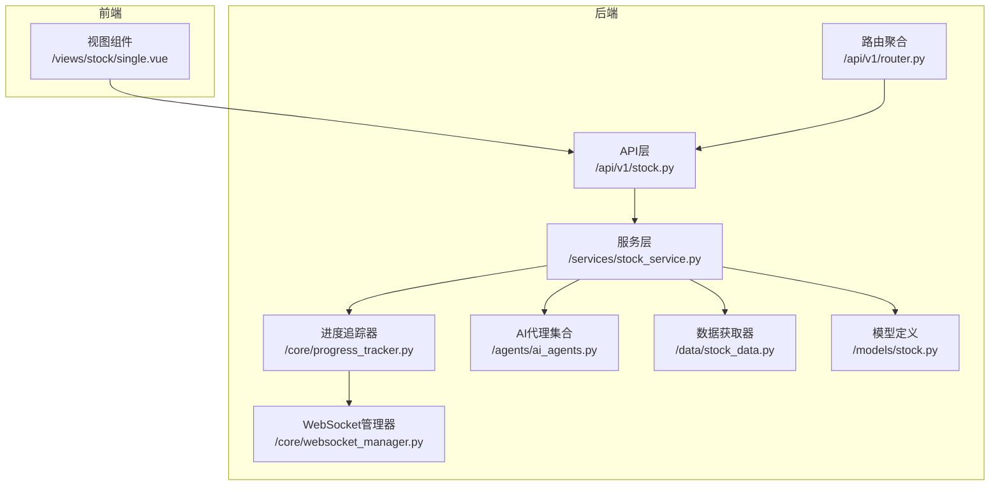
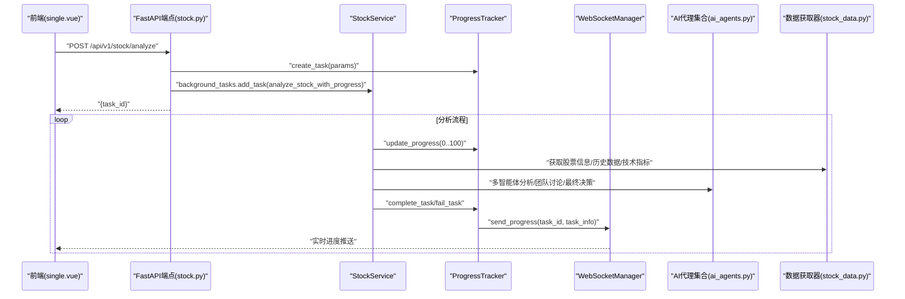
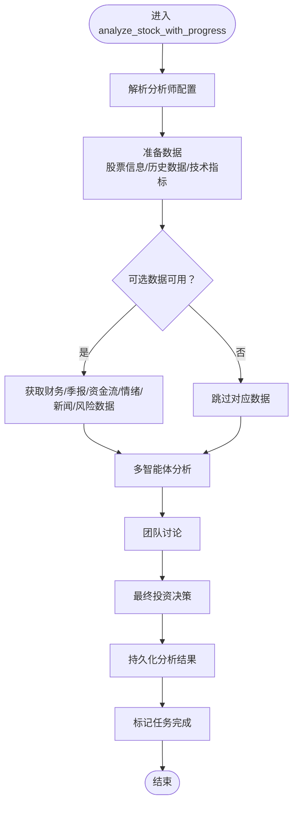
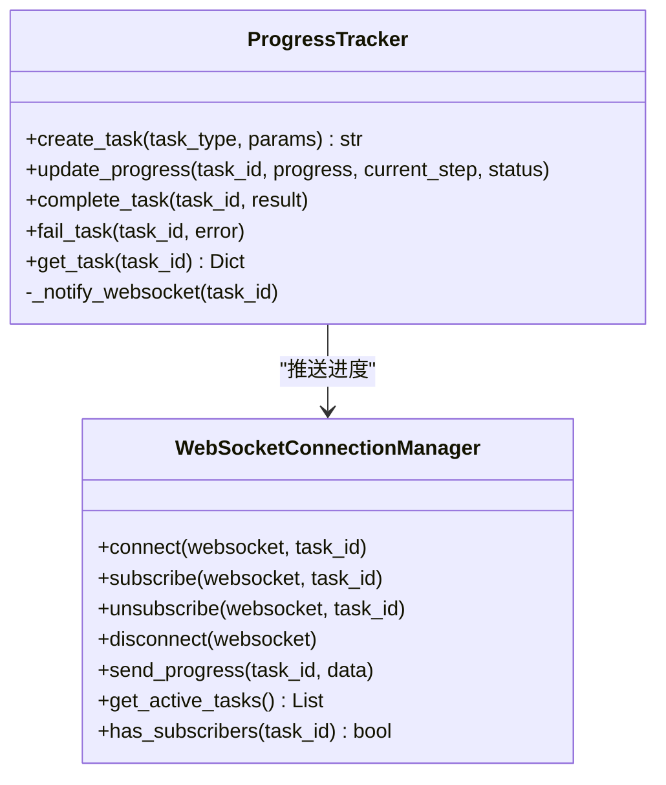
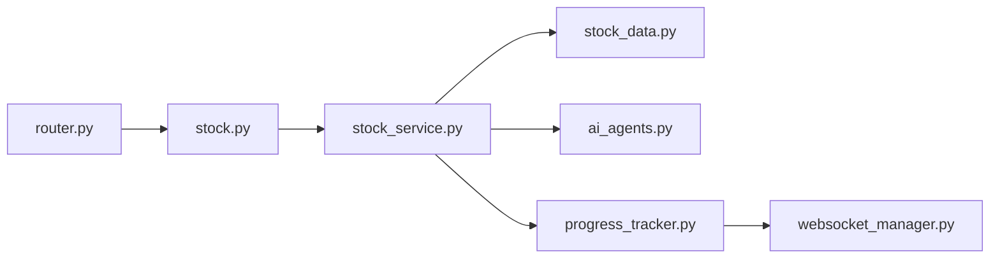

# 单股分析

<cite>
**本文引用的文件**
- [backend/app/api/v1/stock.py](file://backend/app/api/v1/stock.py)
- [backend/app/schemas/stock.py](file://backend/app/schemas/stock.py)
- [backend/app/services/stock_service.py](file://backend/app/services/stock_service.py)
- [backend/app/core/progress_tracker.py](file://backend/app/core/progress_tracker.py)
- [backend/app/core/websocket_manager.py](file://backend/app/core/websocket_manager.py)
- [backend/app/agents/ai_agents.py](file://backend/app/agents/ai_agents.py)
- [backend/app/data/stock_data.py](file://backend/app/data/stock_data.py)
- [backend/app/models/stock.py](file://backend/app/models/stock.py)
- [backend/app/api/v1/router.py](file://backend/app/api/v1/router.py)
- [frontend/src/views/stock/single.vue](file://frontend/src/views/stock/single/single.vue)
</cite>

## 目录
1. [简介](#简介)
2. [项目结构](#项目结构)
3. [核心组件](#核心组件)
4. [架构总览](#架构总览)
5. [详细组件分析](#详细组件分析)
6. [依赖关系分析](#依赖关系分析)
7. [性能考虑](#性能考虑)
8. [故障排查指南](#故障排查指南)
9. [结论](#结论)
10. [附录](#附录)

## 简介
本文件围绕“单股分析”功能进行深入文档化，聚焦后端API端点POST /api/v1/stock/analyze的设计与实现，解释请求体StockAnalyzeRequest的字段定义与业务含义；阐述后端如何通过BackgroundTasks异步启动分析任务并立即返回task_id；说明StockService.analyze_stock_with_progress如何协调数据获取、AI代理调用与结果整合，并通过ProgressTracker更新任务状态；同时提供前端single.vue组件的用户输入验证、参数配置表单与进度轮询逻辑的实现思路；最后给出使用WebSocket（/ws/analyze/{task_id}）实时获取分析进度的客户端示例代码，并讨论错误处理机制。

## 项目结构
后端采用FastAPI + SQLAlchemy + 自研AI代理与数据源管理器的架构，前端使用Vue。单股分析功能位于后端API层的stock模块，服务层封装分析流程，核心进度追踪与WebSocket管理器负责任务状态广播。

**图表来源**
- [backend/app/api/v1/stock.py](file://backend/app/api/v1/stock.py#L1-L190)
- [backend/app/services/stock_service.py](file://backend/app/services/stock_service.py#L1-L573)
- [backend/app/core/progress_tracker.py](file://backend/app/core/progress_tracker.py#L1-L171)
- [backend/app/core/websocket_manager.py](file://backend/app/core/websocket_manager.py#L1-L119)
- [backend/app/agents/ai_agents.py](file://backend/app/agents/ai_agents.py#L1-L546)
- [backend/app/data/stock_data.py](file://backend/app/data/stock_data.py#L1-L318)
- [backend/app/models/stock.py](file://backend/app/models/stock.py#L1-L26)
- [backend/app/api/v1/router.py](file://backend/app/api/v1/router.py#L1-L36)

**章节来源**
- [backend/app/api/v1/router.py](file://backend/app/api/v1/router.py#L1-L36)
- [backend/app/api/v1/stock.py](file://backend/app/api/v1/stock.py#L1-L190)

## 核心组件
- 请求体与响应模型
  - StockAnalyzeRequest：定义stock_code、period、model、analysts、agents等字段，支持前端symbol兼容转换。
  - StockAnalyzeResponse：定义分析结果的标准输出字段。
- API端点
  - POST /api/v1/stock/analyze：创建任务并异步执行分析，立即返回task_id。
  - GET /api/v1/stock/analyze-progress/{task_id}：查询任务进度。
  - GET /api/v1/stock/active-tasks：获取进行中的任务列表。
  - WEBSOCKET /api/v1/stock/ws/analyze/{task_id}：实时推送任务进度。
- 服务层
  - StockService.analyze_stock_with_progress：协调数据获取、AI代理调用、结果整合与持久化。
- 进度追踪与WebSocket
  - ProgressTracker：维护任务状态、步骤与结果，触发WebSocket推送。
  - WebSocketConnectionManager：管理连接、订阅与广播。

**章节来源**
- [backend/app/schemas/stock.py](file://backend/app/schemas/stock.py#L1-L100)
- [backend/app/api/v1/stock.py](file://backend/app/api/v1/stock.py#L1-L190)
- [backend/app/services/stock_service.py](file://backend/app/services/stock_service.py#L1-L573)
- [backend/app/core/progress_tracker.py](file://backend/app/core/progress_tracker.py#L1-L171)
- [backend/app/core/websocket_manager.py](file://backend/app/core/websocket_manager.py#L1-L119)

## 架构总览
下图展示从HTTP请求到WebSocket实时进度的完整链路。

**图表来源**
- [backend/app/api/v1/stock.py](file://backend/app/api/v1/stock.py#L21-L131)
- [backend/app/services/stock_service.py](file://backend/app/services/stock_service.py#L63-L107)
- [backend/app/core/progress_tracker.py](file://backend/app/core/progress_tracker.py#L27-L109)
- [backend/app/core/websocket_manager.py](file://backend/app/core/websocket_manager.py#L84-L102)
- [backend/app/agents/ai_agents.py](file://backend/app/agents/ai_agents.py#L407-L546)
- [backend/app/data/stock_data.py](file://backend/app/data/stock_data.py#L1-L318)

## 详细组件分析

### API端点：POST /api/v1/stock/analyze
- 设计要点
  - 使用BackgroundTasks异步执行分析，避免阻塞请求。
  - 通过ProgressTracker创建任务并返回task_id，前端凭此轮询或WebSocket订阅进度。
  - 请求体为StockAnalyzeRequest，支持analysts字典与agents列表两种配置方式。
- 关键实现路径
  - 端点定义与任务创建：[backend/app/api/v1/stock.py](file://backend/app/api/v1/stock.py#L21-L51)
  - 进度查询端点：[backend/app/api/v1/stock.py](file://backend/app/api/v1/stock.py#L54-L63)
  - 进行中任务查询：[backend/app/api/v1/stock.py](file://backend/app/api/v1/stock.py#L66-L74)
  - WebSocket端点：[backend/app/api/v1/stock.py](file://backend/app/api/v1/stock.py#L77-L131)

**章节来源**
- [backend/app/api/v1/stock.py](file://backend/app/api/v1/stock.py#L21-L131)
- [backend/app/schemas/stock.py](file://backend/app/schemas/stock.py#L12-L28)

### 请求体StockAnalyzeRequest字段定义与业务含义
- 字段说明
  - stock_code：股票代码，支持前端symbol参数兼容转换。
  - period：分析周期，默认“1y”，用于历史数据拉取。
  - model：AI模型标识，默认“deepseek-chat”，用于代理调用。
  - analysts：布尔字典，控制启用的技术面、基本面、资金流、风险、情绪、新闻等分析师。
  - agents：旧版兼容字段，内部转换为analysts配置。
- 校验与兼容
  - 使用Pydantic字段校验器将symbol映射为stock_code，便于前端传参兼容。

**章节来源**
- [backend/app/schemas/stock.py](file://backend/app/schemas/stock.py#L12-L28)

### 服务层：StockService.analyze_stock_with_progress
- 协调流程
  - 解析analysts配置，兼容agents列表，填充默认分析师开关。
  - 准备数据：获取股票信息、历史数据、技术指标。
  - 可选数据：财务数据、季报数据、资金流向、市场情绪、新闻、风险数据。
  - AI代理：多智能体并行分析、团队讨论、最终决策。
  - 结果整合：持久化到数据库，构建响应对象。
  - 进度追踪：通过ProgressTracker更新状态与步骤，触发WebSocket推送。
- 关键实现路径
  - 异步分析入口：[backend/app/services/stock_service.py](file://backend/app/services/stock_service.py#L63-L107)
  - 数据准备与指标计算：[backend/app/services/stock_service.py](file://backend/app/services/stock_service.py#L442-L460)
  - 多智能体分析与决策：[backend/app/services/stock_service.py](file://backend/app/services/stock_service.py#L319-L349)
  - 响应构建与持久化：[backend/app/services/stock_service.py](file://backend/app/services/stock_service.py#L461-L511)

**图表来源**
- [backend/app/services/stock_service.py](file://backend/app/services/stock_service.py#L63-L107)
- [backend/app/services/stock_service.py](file://backend/app/services/stock_service.py#L319-L349)
- [backend/app/services/stock_service.py](file://backend/app/services/stock_service.py#L442-L511)

**章节来源**
- [backend/app/services/stock_service.py](file://backend/app/services/stock_service.py#L63-L107)
- [backend/app/services/stock_service.py](file://backend/app/services/stock_service.py#L319-L349)
- [backend/app/services/stock_service.py](file://backend/app/services/stock_service.py#L442-L511)

### 进度追踪与WebSocket推送
- ProgressTracker
  - 维护任务状态、进度、步骤历史与结果。
  - 提供create_task、update_progress、complete_task、fail_task等方法。
  - 通过WebSocketManager异步推送任务状态。
- WebSocketManager
  - 管理连接、订阅与广播，按task_id向订阅者推送进度。
- 关键实现路径
  - 进度追踪器：[backend/app/core/progress_tracker.py](file://backend/app/core/progress_tracker.py#L1-L171)
  - WebSocket管理器：[backend/app/core/websocket_manager.py](file://backend/app/core/websocket_manager.py#L1-L119)

**图表来源**
- [backend/app/core/progress_tracker.py](file://backend/app/core/progress_tracker.py#L1-L171)
- [backend/app/core/websocket_manager.py](file://backend/app/core/websocket_manager.py#L1-L119)

**章节来源**
- [backend/app/core/progress_tracker.py](file://backend/app/core/progress_tracker.py#L1-L171)
- [backend/app/core/websocket_manager.py](file://backend/app/core/websocket_manager.py#L1-L119)

### 前端single.vue组件实现思路
- 用户输入验证
  - 校验stock_code格式与有效性；校验period合法值；校验analysts字典键值。
- 参数配置表单
  - 提供analysts开关（技术面、基本面、资金流、风险、情绪、新闻）与model选择。
- 进度轮询逻辑
  - 发起POST /api/v1/stock/analyze后，保存task_id。
  - 定时轮询GET /api/v1/stock/analyze-progress/{task_id}，更新UI进度条与状态。
  - 或使用WebSocket /api/v1/stock/ws/analyze/{task_id}接收实时进度。
- 示例（概念性伪代码）
  - 轮询示例：定时请求进度接口，根据返回的progress与current_step更新界面。
  - WebSocket示例：连接ws://host:port/api/v1/stock/ws/analyze/{task_id}，接收JSON任务状态并渲染。

**章节来源**
- [frontend/src/views/stock/single.vue](file://frontend/src/views/stock/single.vue#L1-L14)

### WebSocket实时进度客户端示例
- 连接地址：ws://host:port/api/v1/stock/ws/analyze/{task_id}
- 客户端要点
  - 建立连接后立即收到当前任务状态。
  - 可发送{"action":"ping"}或{"action":"get_status"}请求以确认连接与获取状态。
  - 监听服务器推送的JSON任务状态，解析progress、current_step、status等字段。
- 错误处理
  - 连接失败或断开时重连；任务不存在时提示错误。

**章节来源**
- [backend/app/api/v1/stock.py](file://backend/app/api/v1/stock.py#L77-L131)
- [backend/app/core/websocket_manager.py](file://backend/app/core/websocket_manager.py#L23-L102)

### 错误处理机制
- 无效股票代码或数据获取失败
  - 数据获取器在异常时返回错误字典，服务层抛出异常并由ProgressTracker标记失败。
- 模型服务不可用
  - AI代理调用失败时，服务层捕获异常并记录，最终任务失败。
- API层异常
  - 查询进度时任务不存在返回404；其他异常统一包装为HTTP 500。
- 关键实现路径
  - 数据获取器异常处理：[backend/app/data/stock_data.py](file://backend/app/data/stock_data.py#L60-L63)
  - 服务层异常捕获与任务失败：[backend/app/services/stock_service.py](file://backend/app/services/stock_service.py#L104-L107)
  - 进度追踪器失败状态：[backend/app/core/progress_tracker.py](file://backend/app/core/progress_tracker.py#L98-L109)
  - API层HTTP异常：[backend/app/api/v1/stock.py](file://backend/app/api/v1/stock.py#L54-L63)

**章节来源**
- [backend/app/data/stock_data.py](file://backend/app/data/stock_data.py#L60-L63)
- [backend/app/services/stock_service.py](file://backend/app/services/stock_service.py#L104-L107)
- [backend/app/core/progress_tracker.py](file://backend/app/core/progress_tracker.py#L98-L109)
- [backend/app/api/v1/stock.py](file://backend/app/api/v1/stock.py#L54-L63)

## 依赖关系分析
- 组件耦合
  - API层仅依赖服务层与核心组件（ProgressTracker、WebSocketManager），保持薄层职责。
  - 服务层依赖数据获取器与AI代理集合，通过配置控制分析师启用与否。
  - 进度追踪器与WebSocket管理器通过回调与广播解耦，避免直接耦合业务逻辑。
- 外部依赖
  - 数据源管理器与第三方库（如yfinance）用于跨市场数据获取。
  - AI代理依赖DeepSeekClient，最终决策由LLM完成。

**图表来源**
- [backend/app/api/v1/stock.py](file://backend/app/api/v1/stock.py#L1-L190)
- [backend/app/services/stock_service.py](file://backend/app/services/stock_service.py#L1-L573)
- [backend/app/data/stock_data.py](file://backend/app/data/stock_data.py#L1-L318)
- [backend/app/agents/ai_agents.py](file://backend/app/agents/ai_agents.py#L1-L546)
- [backend/app/core/progress_tracker.py](file://backend/app/core/progress_tracker.py#L1-L171)
- [backend/app/core/websocket_manager.py](file://backend/app/core/websocket_manager.py#L1-L119)
- [backend/app/api/v1/router.py](file://backend/app/api/v1/router.py#L1-L36)

**章节来源**
- [backend/app/api/v1/stock.py](file://backend/app/api/v1/stock.py#L1-L190)
- [backend/app/services/stock_service.py](file://backend/app/services/stock_service.py#L1-L573)
- [backend/app/api/v1/router.py](file://backend/app/api/v1/router.py#L1-L36)

## 性能考虑
- 异步与线程池
  - 使用asyncio.to_thread将耗时的数据获取与分析放入线程池，避免阻塞事件循环。
- 并行与节流
  - 多智能体分析按配置并行执行，合理设置最大并发，避免资源争用。
- 缓存与降级
  - 对可选数据（季报、资金流、情绪、新闻、风险）采用安全调用与降级策略，保证主流程稳定。
- WebSocket广播
  - 仅向订阅该任务的客户端推送，减少无效广播。

[本节为通用性能建议，无需特定文件引用]

## 故障排查指南
- 常见问题
  - 任务不存在：检查task_id是否正确，或先发起分析获取task_id。
  - 数据获取失败：确认数据源配置与网络连通性，查看日志定位具体模块。
  - WebSocket连接异常：检查URL、防火墙与反向代理配置。
- 定位手段
  - 查看ProgressTracker任务详情与步骤历史。
  - 检查服务层日志与异常栈，定位具体环节。
  - 使用GET /api/v1/stock/active-tasks核对任务状态。

**章节来源**
- [backend/app/api/v1/stock.py](file://backend/app/api/v1/stock.py#L54-L74)
- [backend/app/core/progress_tracker.py](file://backend/app/core/progress_tracker.py#L110-L146)

## 结论
单股分析功能通过清晰的分层设计与异步执行实现了高可用与良好的用户体验。API层负责任务创建与进度查询，服务层协调数据与AI代理，进度追踪器与WebSocket管理器保障实时反馈。前端可通过轮询或WebSocket获取进度，结合合理的输入验证与错误处理，能够稳定地完成从请求到结果的全链路体验。

[本节为总结性内容，无需特定文件引用]

## 附录

### API定义摘要
- POST /api/v1/stock/analyze
  - 请求体：StockAnalyzeRequest
  - 响应：{task_id, message}
- GET /api/v1/stock/analyze-progress/{task_id}
  - 响应：任务状态详情
- GET /api/v1/stock/active-tasks
  - 响应：进行中任务列表
- WebSocket /api/v1/stock/ws/analyze/{task_id}
  - 实时推送任务状态

**章节来源**
- [backend/app/api/v1/stock.py](file://backend/app/api/v1/stock.py#L21-L131)
- [backend/app/schemas/stock.py](file://backend/app/schemas/stock.py#L12-L28)