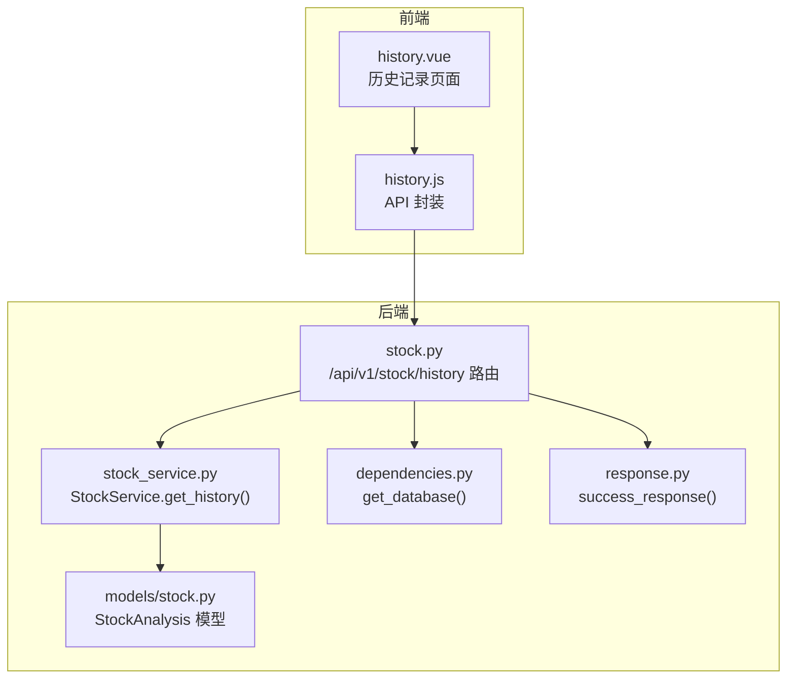
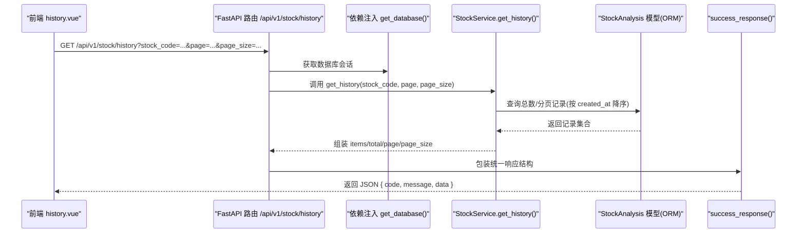
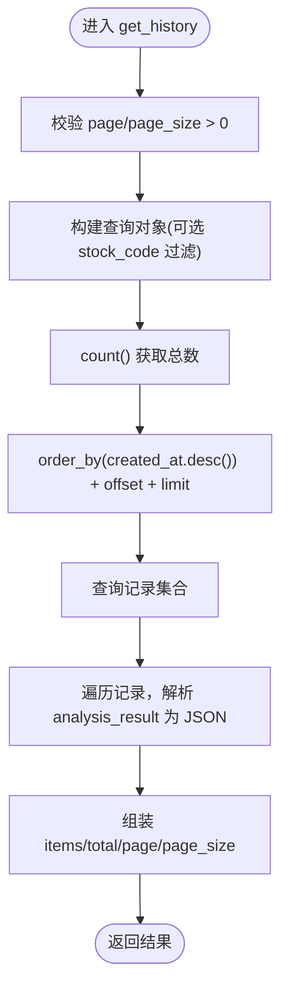
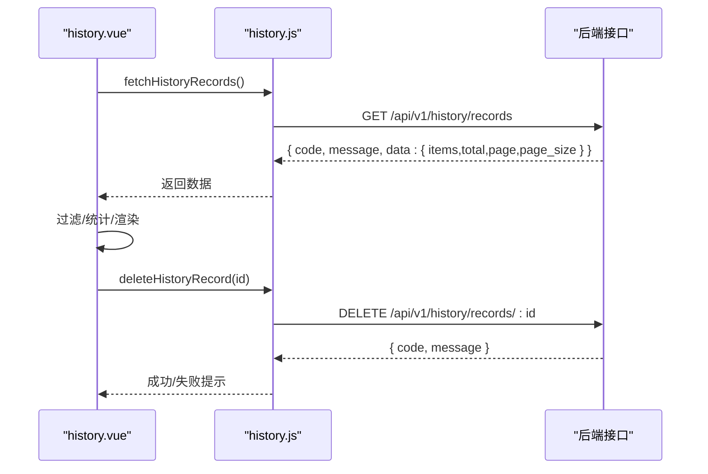
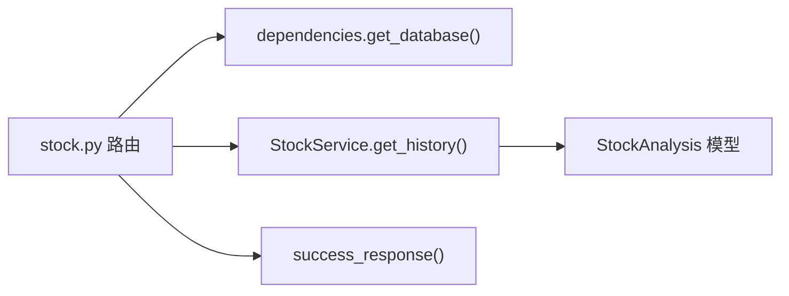

# 历史记录管理

<cite>
**本文引用的文件**
- [backend/app/api/v1/stock.py](file://backend/app/api/v1/stock.py)
- [backend/app/services/stock_service.py](file://backend/app/services/stock_service.py)
- [backend/app/models/stock.py](file://backend/app/models/stock.py)
- [backend/app/database.py](file://backend/app/database.py)
- [backend/app/dependencies.py](file://backend/app/dependencies.py)
- [backend/app/api/response.py](file://backend/app/api/response.py)
- [frontend/src/views/history/index.vue](file://frontend/src/views/history/index.vue)
- [frontend/src/api/history.js](file://frontend/src/api/history.js)
- [docs/前后端拆分规划文档.md](file://docs/前后端拆分规划文档.md)
</cite>

## 目录
1. [简介](#简介)
2. [项目结构](#项目结构)
3. [核心组件](#核心组件)
4. [架构总览](#架构总览)
5. [详细组件分析](#详细组件分析)
6. [依赖关系分析](#依赖关系分析)
7. [性能考量](#性能考量)
8. [故障排查指南](#故障排查指南)
9. [结论](#结论)
10. [附录](#附录)

## 简介
本文件围绕“历史记录管理”功能进行全面说明，重点覆盖：
- GET /api/v1/stock/history 接口的查询参数（stock_code、page、page_size）与分页机制
- 后端 StockService.get_history 方法如何从数据库检索历史分析记录并支持按股票代码过滤
- 前端 history.vue 组件的分页表格、搜索框与结果展示布局
- 数据库 stock_db.py 中相关查询方法的实现要点（当前文件为空，后续迁移）
- 数据存储策略（分析结果的持久化结构与索引优化建议）
- 使用示例：通过 API 获取特定股票的历史分析列表
- 可能的问题与性能优化建议（如数据量过大导致的性能瓶颈）

## 项目结构
该功能涉及后端 FastAPI 路由、服务层、数据库模型与前端页面/接口封装。下图展示了与历史记录相关的模块关系与数据流。

图表来源
- [backend/app/api/v1/stock.py](file://backend/app/api/v1/stock.py#L147-L161)
- [backend/app/services/stock_service.py](file://backend/app/services/stock_service.py#L170-L221)
- [backend/app/models/stock.py](file://backend/app/models/stock.py#L9-L26)
- [backend/app/dependencies.py](file://backend/app/dependencies.py#L11-L14)
- [backend/app/api/response.py](file://backend/app/api/response.py#L10-L17)
- [frontend/src/views/history/index.vue](file://frontend/src/views/history/index.vue#L1-L120)
- [frontend/src/api/history.js](file://frontend/src/api/history.js#L1-L10)

章节来源
- [backend/app/api/v1/stock.py](file://backend/app/api/v1/stock.py#L147-L161)
- [backend/app/services/stock_service.py](file://backend/app/services/stock_service.py#L170-L221)
- [backend/app/models/stock.py](file://backend/app/models/stock.py#L9-L26)
- [backend/app/dependencies.py](file://backend/app/dependencies.py#L11-L14)
- [backend/app/api/response.py](file://backend/app/api/response.py#L10-L17)
- [frontend/src/views/history/index.vue](file://frontend/src/views/history/index.vue#L1-L120)
- [frontend/src/api/history.js](file://frontend/src/api/history.js#L1-L10)

## 核心组件
- 后端路由：/api/v1/stock/history，接收 stock_code、page、page_size 参数，返回分页历史记录
- 服务层：StockService.get_history(stock_code, page, page_size)，负责查询与组装返回数据
- 数据模型：StockAnalysis，定义分析记录的字段与索引
- 数据库：SQLAlchemy ORM，提供查询、计数、排序与分页
- 前端页面：history.vue，提供搜索、统计卡片与详情抽屉
- 前端 API：history.js，封装历史记录的 GET/DELETE/POST 请求

章节来源
- [backend/app/api/v1/stock.py](file://backend/app/api/v1/stock.py#L147-L161)
- [backend/app/services/stock_service.py](file://backend/app/services/stock_service.py#L170-L221)
- [backend/app/models/stock.py](file://backend/app/models/stock.py#L9-L26)
- [frontend/src/views/history/index.vue](file://frontend/src/views/history/index.vue#L1-L120)
- [frontend/src/api/history.js](file://frontend/src/api/history.js#L1-L10)

## 架构总览
下面以序列图展示 GET /api/v1/stock/history 的调用链路与数据处理流程。

图表来源
- [backend/app/api/v1/stock.py](file://backend/app/api/v1/stock.py#L147-L161)
- [backend/app/services/stock_service.py](file://backend/app/services/stock_service.py#L170-L221)
- [backend/app/models/stock.py](file://backend/app/models/stock.py#L9-L26)
- [backend/app/api/response.py](file://backend/app/api/response.py#L10-L17)
- [backend/app/dependencies.py](file://backend/app/dependencies.py#L11-L14)

## 详细组件分析

### 后端路由与分页参数
- 路由定义：/api/v1/stock/history
- 查询参数：
  - stock_code：可选，用于按股票代码过滤
  - page：页码，默认 1，必须为正整数
  - page_size：每页数量，默认 20，必须为正整数
- 返回结构：统一响应包装，包含 data.items、data.total、data.page、data.page_size

章节来源
- [backend/app/api/v1/stock.py](file://backend/app/api/v1/stock.py#L147-L161)
- [backend/app/api/response.py](file://backend/app/api/response.py#L10-L17)
- [docs/前后端拆分规划文档.md](file://docs/前后端拆分规划文档.md#L669-L683)

### 服务层 StockService.get_history 实现
- 输入校验：page 与 page_size 必须为正整数
- 过滤条件：若提供 stock_code，则按 stock_code 精确过滤
- 分页策略：
  - 先 count() 获取总数
  - 再按 created_at 降序排序，使用 offset((page-1)*page_size) + limit(page_size) 获取当前页数据
- 结果组装：遍历记录，解析 analysis_result 字段为 JSON 对象，输出标准化字段集
- 返回结构：包含 total、page、page_size、items

图表来源
- [backend/app/services/stock_service.py](file://backend/app/services/stock_service.py#L170-L221)

章节来源
- [backend/app/services/stock_service.py](file://backend/app/services/stock_service.py#L170-L221)

### 数据模型与索引
- 表名：stock_analysis
- 关键字段：
  - id：主键
  - stock_code：字符串，非空，已建立索引
  - created_at：服务器默认时间戳，建议建立索引以优化排序与范围查询
- 建议索引：
  - stock_code：支持按股票代码过滤
  - created_at：支持按时间倒序排序与分页
  - stock_code + created_at：复合索引可进一步提升过滤+排序性能

章节来源
- [backend/app/models/stock.py](file://backend/app/models/stock.py#L9-L26)

### 数据库连接与依赖注入
- 数据库引擎与会话工厂：基于 settings.DATABASE_URL 创建
- 依赖注入：get_database() 提供 Session，路由函数通过 Depends(get_database) 注入
- SQLite 特性：自动创建目录与绝对路径，避免“无法打开数据库文件”

章节来源
- [backend/app/database.py](file://backend/app/database.py#L1-L45)
- [backend/app/dependencies.py](file://backend/app/dependencies.py#L11-L14)

### 前端 history.vue 组件
- 页面布局：
  - 顶部卡片标题与副标题
  - 工具栏：搜索框（支持清空与回车触发）、刷新按钮、示例数据提示
  - 统计卡片：总记录数、买入/持有/卖出数量
  - 列表卡片：每条记录包含股票名称/代码、评级标签、分析日期/周期、概要指标（当前价、涨跌幅、信心度、目标价）、操作按钮（查看详情、加入监测、删除）
  - 详情抽屉：展示最终决策、分析师报告等
- 交互逻辑：
  - 初始加载：调用 fetchHistoryRecords()，失败时回退到示例数据
  - 搜索：按股票代码或名称模糊匹配
  - 刷新：重新拉取数据
  - 删除：调用 deleteHistoryRecord(record.id)
  - 加入监测：调用 addHistoryRecordToMonitor(record.id, {})
- API 调用：
  - 历史记录列表：GET /api/v1/history/records
  - 单条详情：GET /api/v1/history/records/:id
  - 删除：DELETE /api/v1/history/records/:id
  - 加入监测：POST /api/v1/history/records/:id/monitor

图表来源
- [frontend/src/views/history/index.vue](file://frontend/src/views/history/index.vue#L1-L120)
- [frontend/src/api/history.js](file://frontend/src/api/history.js#L1-L37)

章节来源
- [frontend/src/views/history/index.vue](file://frontend/src/views/history/index.vue#L1-L120)
- [frontend/src/api/history.js](file://frontend/src/api/history.js#L1-L37)

### 数据访问层（stock_db.py）现状与迁移建议
- 当前状态：stock_db.py 文件中尚未实现具体的历史记录查询方法（仅注释说明待迁移）
- 迁移建议：
  - 若仍采用 SQLAlchemy ORM，可在 stock_db.py 中新增方法，封装 StockAnalysis 的查询、计数与分页
  - 或直接在 StockService 中维持现有 ORM 查询逻辑（当前已实现）
  - 无论采用哪种方式，均需确保：
    - stock_code 索引存在
    - created_at 索引存在
    - 大数据量场景下避免 N+1 查询，尽量一次性加载所需字段

章节来源
- [backend/app/db/stock_db.py](file://backend/app/db/stock_db.py#L1-L6)
- [backend/app/services/stock_service.py](file://backend/app/services/stock_service.py#L170-L221)

## 依赖关系分析
- 路由依赖数据库会话：通过 Depends(get_database) 注入 Session
- 服务层依赖数据库会话：直接使用传入的 Session 执行查询
- 模型依赖 SQLAlchemy Base：继承 Base 并声明字段与索引
- 响应层依赖统一返回结构：success_response 包装 data

图表来源
- [backend/app/api/v1/stock.py](file://backend/app/api/v1/stock.py#L147-L161)
- [backend/app/dependencies.py](file://backend/app/dependencies.py#L11-L14)
- [backend/app/services/stock_service.py](file://backend/app/services/stock_service.py#L170-L221)
- [backend/app/models/stock.py](file://backend/app/models/stock.py#L9-L26)
- [backend/app/api/response.py](file://backend/app/api/response.py#L10-L17)

章节来源
- [backend/app/api/v1/stock.py](file://backend/app/api/v1/stock.py#L147-L161)
- [backend/app/dependencies.py](file://backend/app/dependencies.py#L11-L14)
- [backend/app/services/stock_service.py](file://backend/app/services/stock_service.py#L170-L221)
- [backend/app/models/stock.py](file://backend/app/models/stock.py#L9-L26)
- [backend/app/api/response.py](file://backend/app/api/response.py#L10-L17)

## 性能考量
- 分页实现复杂度
  - count() + offset + limit：时间复杂度 O(N)（N 为满足过滤条件的记录数），适合中小规模数据
  - 大数据量建议：使用游标分页或基于 created_at 的范围分页，减少 offset 开销
- 索引优化
  - stock_code 已有索引，建议为 created_at 建立索引，或建立 stock_code + created_at 复合索引
- JSON 字段解析
  - analysis_result 为 Text(JSON)，解析成本与字段大小相关，建议在入库时控制 JSON 规模，或在查询时仅取必要字段
- I/O 与并发
  - 前端搜索为内存过滤，建议在后端增加模糊搜索索引或全文检索（如 MySQL 全文索引、PostgreSQL tsvector）
- 缓存策略
  - 对高频查询（如最近 N 条）可引入 Redis 缓存，设置合理过期时间

[本节为通用性能建议，不直接分析具体文件]

## 故障排查指南
- 常见错误与定位
  - 参数非法：page/page_size 非正整数会触发异常，检查前端传参
  - 数据库连接失败：SQLite 路径问题或权限不足，检查 DATABASE_URL 与目录权限
  - JSON 解析失败：analysis_result 非法 JSON，服务层已捕获并回退为空对象
- 前端问题
  - 历史记录接口不可用：前端已内置示例数据回退逻辑，查看控制台警告信息
  - 搜索无效：确认搜索关键字大小写不敏感匹配逻辑是否生效
- 后端问题
  - 路由未注册：确认 /api/v1/stock/history 是否正确挂载
  - 统一响应结构：确认 success_response 返回结构与前端期望一致

章节来源
- [backend/app/services/stock_service.py](file://backend/app/services/stock_service.py#L170-L221)
- [frontend/src/views/history/index.vue](file://frontend/src/views/history/index.vue#L276-L311)
- [backend/app/api/response.py](file://backend/app/api/response.py#L10-L17)

## 结论
- GET /api/v1/stock/history 已实现按 stock_code 过滤与标准分页，返回结构统一
- StockService.get_history 采用 ORM 查询 + count() + offset/limit 的经典分页策略
- 前端 history.vue 提供完整的搜索、统计与详情展示能力
- 数据库层建议补充 created_at 索引与复合索引，以提升大数据量下的查询性能
- 当前 stock_db.py 尚未实现具体查询方法，可直接沿用服务层 ORM 查询逻辑，或迁移到独立的数据访问层

[本节为总结性内容，不直接分析具体文件]

## 附录

### 使用示例：通过 API 获取特定股票的历史分析列表
- 请求
  - 方法：GET
  - 路径：/api/v1/stock/history
  - 查询参数：
    - stock_code：可选，如 600519
    - page：可选，默认 1
    - page_size：可选，默认 20
- 响应
  - data.items：当前页记录数组
  - data.total：满足过滤条件的总记录数
  - data.page：当前页码
  - data.page_size：每页数量

章节来源
- [backend/app/api/v1/stock.py](file://backend/app/api/v1/stock.py#L147-L161)
- [docs/前后端拆分规划文档.md](file://docs/前后端拆分规划文档.md#L669-L683)

### 数据存储策略与索引优化建议
- 存储结构
  - 表：stock_analysis
  - 字段：id、stock_code、stock_name、analysis_type、analysis_result、rating、confidence_level、entry_range、take_profit、stop_loss、target_price、created_at
- 索引建议
  - 单列索引：stock_code（过滤）、created_at（排序/分页）
  - 复合索引：stock_code + created_at（过滤+排序）
- JSON 字段
  - analysis_result 建议控制体积，避免超大 JSON 导致解析与传输开销
  - 如需检索 JSON 内容，可考虑拆分字段或引入文档型数据库

章节来源
- [backend/app/models/stock.py](file://backend/app/models/stock.py#L9-L26)