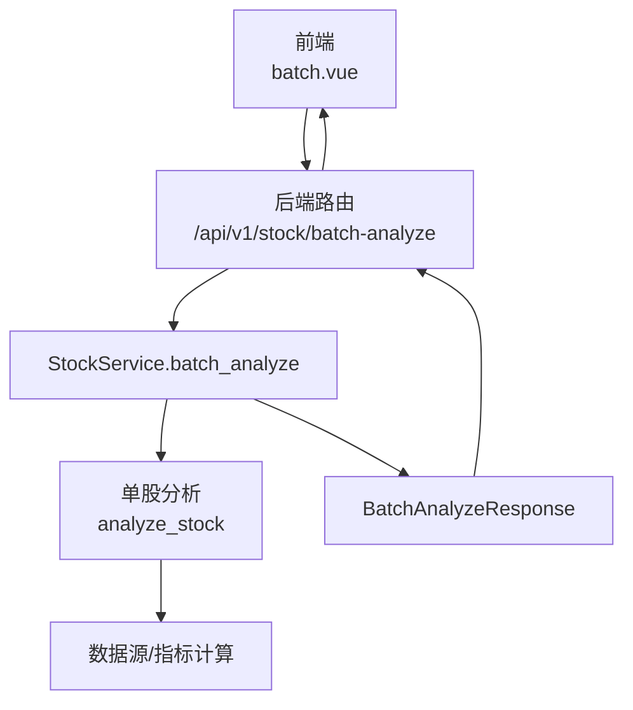
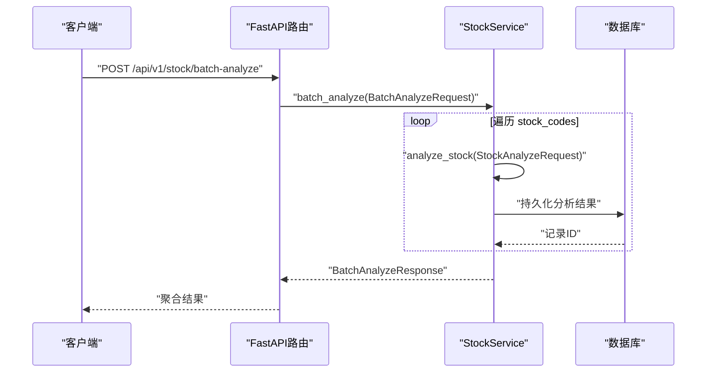
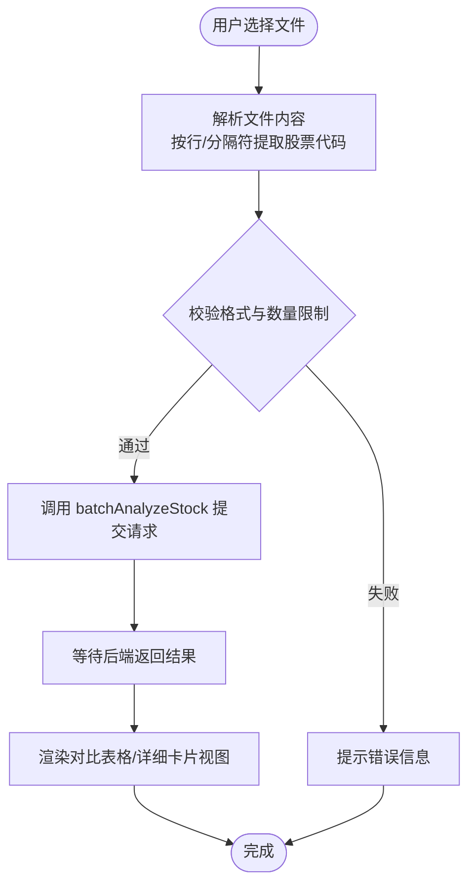
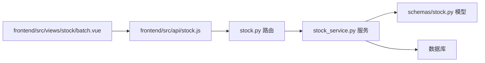

# 批量分析

<cite>
**本文引用的文件**
- [backend/app/api/v1/stock.py](file://backend/app/api/v1/stock.py)
- [backend/app/services/stock_service.py](file://backend/app/services/stock_service.py)
- [backend/app/schemas/stock.py](file://backend/app/schemas/stock.py)
- [frontend/src/api/stock.js](file://frontend/src/api/stock.js)
- [frontend/src/views/stock/batch.vue](file://frontend/src/views/stock/batch.vue)
- [docs/批量分析功能说明.md](file://docs/批量分析功能说明.md)
- [docs/UNIFIED_ANALYSIS_SPEC.md](file://docs/UNIFIED_ANALYSIS_SPEC.md)
</cite>

## 目录
1. [简介](#简介)
2. [项目结构](#项目结构)
3. [核心组件](#核心组件)
4. [架构总览](#架构总览)
5. [详细组件分析](#详细组件分析)
6. [依赖关系分析](#依赖关系分析)
7. [性能考量](#性能考量)
8. [故障排查指南](#故障排查指南)
9. [结论](#结论)
10. [附录](#附录)

## 简介
本文件面向“批量分析”功能，围绕后端接口 POST /api/v1/stock/batch-analyze 的请求体结构、参数配置与响应格式，结合前端 batch.vue 页面的交互设计，系统性阐述：
- 请求体 BatchAnalyzeRequest 的字段与约束
- 支持的分析周期与模型参数配置
- 后端 StockService.batch_analyze 的串行/并行处理策略与错误隔离
- 前端批量上传、文件解析（CSV/Excel）、任务提交与结果汇总展示的实现思路
- 实际调用示例与响应结构说明
- 性能优化与常见问题处理方案

## 项目结构
后端采用 FastAPI + SQLAlchemy 架构，前端使用 Vue + Element-UI。批量分析的核心链路如下：
- 前端通过 /api/v1/stock/batch-analyze 提交批量分析请求
- 后端路由层接收请求并调用 StockService.batch_analyze
- 服务层对每个股票代码串行或并行执行单股分析
- 聚合成功与失败结果，返回 BatchAnalyzeResponse

图表来源
- [backend/app/api/v1/stock.py](file://backend/app/api/v1/stock.py#L133-L145)
- [backend/app/services/stock_service.py](file://backend/app/services/stock_service.py#L140-L169)
- [backend/app/schemas/stock.py](file://backend/app/schemas/stock.py#L44-L60)

章节来源
- [backend/app/api/v1/stock.py](file://backend/app/api/v1/stock.py#L133-L145)
- [backend/app/services/stock_service.py](file://backend/app/services/stock_service.py#L140-L169)
- [backend/app/schemas/stock.py](file://backend/app/schemas/stock.py#L44-L60)

## 核心组件
- 后端路由：负责接收请求、调用服务层并返回统一响应
- 服务层：实现批量分析的调度与聚合
- 模型定义：BatchAnalyzeRequest/BatchAnalyzeResponse 的字段与默认值
- 前端接口封装：提供 batchAnalyzeStock 方法
- 前端页面：batch.vue（当前处于占位状态）

章节来源
- [backend/app/api/v1/stock.py](file://backend/app/api/v1/stock.py#L133-L145)
- [backend/app/services/stock_service.py](file://backend/app/services/stock_service.py#L140-L169)
- [backend/app/schemas/stock.py](file://backend/app/schemas/stock.py#L44-L60)
- [frontend/src/api/stock.js](file://frontend/src/api/stock.js#L87-L94)
- [frontend/src/views/stock/batch.vue](file://frontend/src/views/stock/batch.vue#L1-L14)

## 架构总览
POST /api/v1/stock/batch-analyze 的端到端流程如下：

图表来源
- [backend/app/api/v1/stock.py](file://backend/app/api/v1/stock.py#L133-L145)
- [backend/app/services/stock_service.py](file://backend/app/services/stock_service.py#L140-L169)
- [backend/app/schemas/stock.py](file://backend/app/schemas/stock.py#L12-L43)

## 详细组件分析

### 后端接口与请求体定义
- 接口路径：POST /api/v1/stock/batch-analyze
- 请求体：BatchAnalyzeRequest
- 响应体：BatchAnalyzeResponse

BatchAnalyzeRequest 字段说明
- stock_codes: 股票代码列表（必填）
- period: 分析周期，默认 "1y"
- mode: 分析模式，默认 "sequential"（当前代码未使用该字段，仍为串行）
- max_workers: 并发线程数，默认 3（当前代码未使用该字段，仍为串行）
- agents: 分析师团队配置（agents 列表）

BatchAnalyzeResponse 字段说明
- total: 总数
- success: 成功数
- failed: 失败数
- results: 成功结果列表（StockAnalyzeResponse）
- failed_stocks: 失败记录列表（包含 stock_code 与 error）

章节来源
- [backend/app/api/v1/stock.py](file://backend/app/api/v1/stock.py#L133-L145)
- [backend/app/schemas/stock.py](file://backend/app/schemas/stock.py#L44-L60)

### 后端服务层：批量分析实现
StockService.batch_analyze 的处理逻辑要点
- 参数校验：stock_codes 非空
- 串行遍历：对每个股票代码调用 analyze_stock
- 成功聚合：收集 StockAnalyzeResponse
- 失败聚合：记录 {stock_code, error}
- 返回聚合结果：BatchAnalyzeResponse

注意
- 当前实现为串行处理，未使用 mode 与 max_workers 字段
- 单股分析内部使用线程池包装同步分析逻辑，避免阻塞事件循环

章节来源
- [backend/app/services/stock_service.py](file://backend/app/services/stock_service.py#L140-L169)

### 单股分析与数据流
单股分析内部流程（简化）
- 解析分析师配置（analysts/agents），填充默认项
- 准备数据：股票信息、K线、技术指标
- 可选数据：财务、资金流、情绪、新闻、风险
- AI 团队分析与讨论，生成最终决策
- 持久化分析结果至数据库

章节来源
- [backend/app/services/stock_service.py](file://backend/app/services/stock_service.py#L63-L107)
- [backend/app/services/stock_service.py](file://backend/app/services/stock_service.py#L361-L440)

### 前端交互与调用
- 前端接口封装：提供 batchAnalyzeStock(data) 方法
- 前端页面：stock/batch.vue 当前为占位页面，尚未实现批量上传、解析与展示逻辑

章节来源
- [frontend/src/api/stock.js](file://frontend/src/api/stock.js#L87-L94)
- [frontend/src/views/stock/batch.vue](file://frontend/src/views/stock/batch.vue#L1-L14)

### 前端批量上传与文件解析（概念性说明）
根据官方文档，批量分析支持多种输入格式（每行一个、逗号/空格分隔、混合），并提供双模式分析（顺序/并行）。前端可参考以下流程进行实现（概念性，非现有代码）：

图表来源
- [docs/批量分析功能说明.md](file://docs/批量分析功能说明.md#L1-L120)

## 依赖关系分析
- 路由层依赖服务层：/api/v1/stock/batch-analyze -> StockService.batch_analyze
- 服务层依赖模型定义：BatchAnalyzeRequest/BatchAnalyzeResponse
- 服务层内部依赖数据源与 AI 分析组件，最终持久化到数据库
- 前端通过封装的 API 方法调用后端接口

图表来源
- [backend/app/api/v1/stock.py](file://backend/app/api/v1/stock.py#L133-L145)
- [backend/app/services/stock_service.py](file://backend/app/services/stock_service.py#L140-L169)
- [backend/app/schemas/stock.py](file://backend/app/schemas/stock.py#L44-L60)
- [frontend/src/api/stock.js](file://frontend/src/api/stock.js#L87-L94)
- [frontend/src/views/stock/batch.vue](file://frontend/src/views/stock/batch.vue#L1-L14)

## 性能考量
- 当前实现为串行处理，适合中小规模批量（如 3-5 只），稳定性高
- 文档建议的最大并发为 3，适用于大规模并行场景（6 只以上）
- 建议在服务层引入并发控制（如 ThreadPoolExecutor），并设置最大并发上限
- 异常隔离：单只股票失败不应阻断整体流程，当前实现已具备该能力
- 部分失败容忍：聚合成功与失败结果，便于后续重试与审计

章节来源
- [docs/批量分析功能说明.md](file://docs/批量分析功能说明.md#L1-L120)
- [backend/app/services/stock_service.py](file://backend/app/services/stock_service.py#L140-L169)

## 故障排查指南
常见问题与处理建议
- 文件格式错误
  - 现象：解析失败或股票代码为空
  - 处理：严格校验分隔符与换行，确保每行仅含一个股票代码
- 数量限制
  - 现象：请求过大或超时
  - 处理：建议前端限制输入数量，后端增加请求体大小限制
- 网络中断
  - 现象：请求未完成或响应异常
  - 处理：前端重试与超时处理；后端幂等与重试策略（如需）
- 单只股票分析失败
  - 现象：失败记录出现在 failed_stocks
  - 处理：记录错误原因，支持单独重试与历史查看

章节来源
- [docs/批量分析功能说明.md](file://docs/批量分析功能说明.md#L163-L176)
- [backend/app/services/stock_service.py](file://backend/app/services/stock_service.py#L140-L169)

## 结论
- 当前后端已实现批量分析的串行处理与聚合返回，满足中小规模需求
- 前端 batch.vue 尚未实现批量上传与展示逻辑，建议参考官方文档的输入格式与双模式说明进行开发
- 若扩展为并行模式，应在服务层引入并发控制与错误隔离，确保稳定性与可观测性
- 统一分析规范有助于前后端一致性与可维护性

## 附录

### 请求与响应示例（路径引用）
- 请求体示例（BatchAnalyzeRequest）
  - 字段：stock_codes（必填）、period（默认 "1y"）、mode（默认 "sequential"）、max_workers（默认 3）、agents（可选）
  - 参考路径：[backend/app/schemas/stock.py](file://backend/app/schemas/stock.py#L44-L51)
- 响应体示例（BatchAnalyzeResponse）
  - 字段：total、success、failed、results、failed_stocks
  - 参考路径：[backend/app/schemas/stock.py](file://backend/app/schemas/stock.py#L53-L60)
- 接口调用示例（前端）
  - 方法：batchAnalyzeStock(data)
  - 参考路径：[frontend/src/api/stock.js](file://frontend/src/api/stock.js#L87-L94)
- 后端路由
  - 路径：POST /api/v1/stock/batch-analyze
  - 参考路径：[backend/app/api/v1/stock.py](file://backend/app/api/v1/stock.py#L133-L145)

### 统一分析规范参考
- 统一字段名与解析方式，确保跨模块一致性
- 参考路径：[docs/UNIFIED_ANALYSIS_SPEC.md](file://docs/UNIFIED_ANALYSIS_SPEC.md#L1-L131)