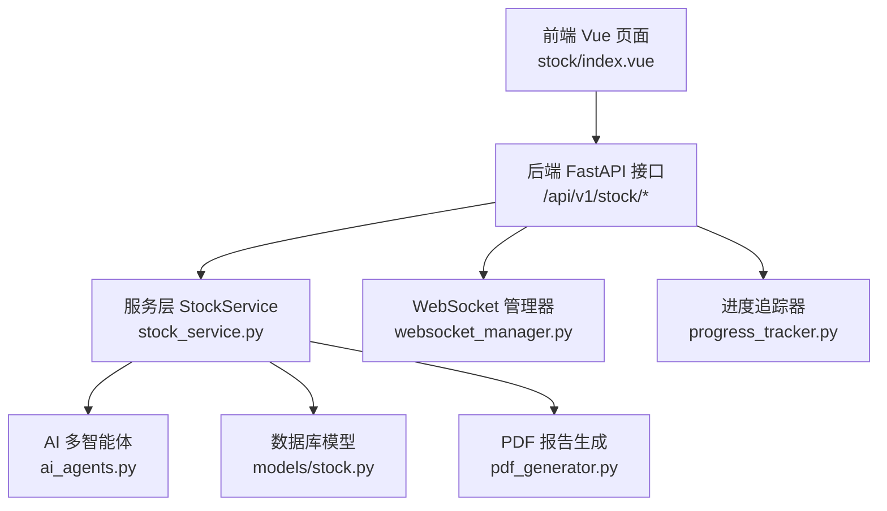
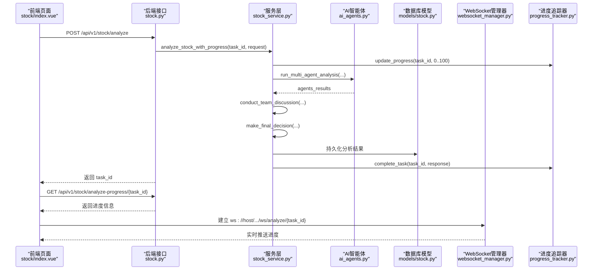
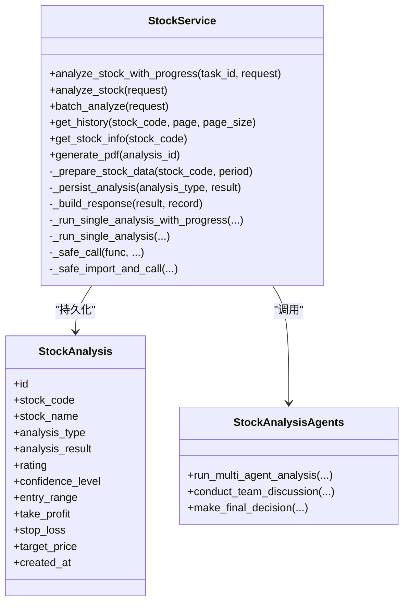
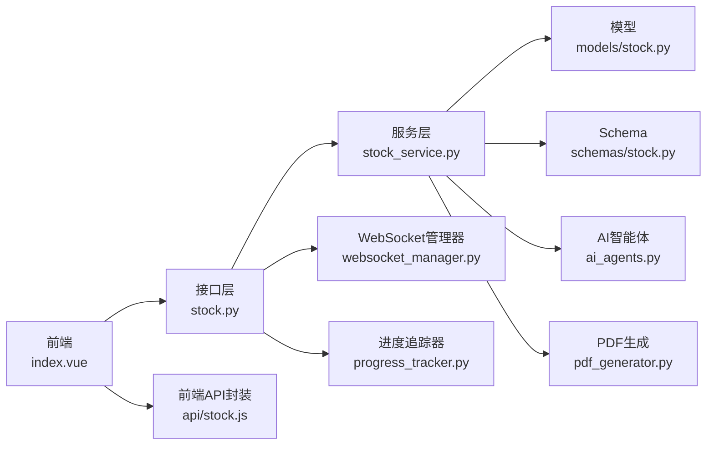
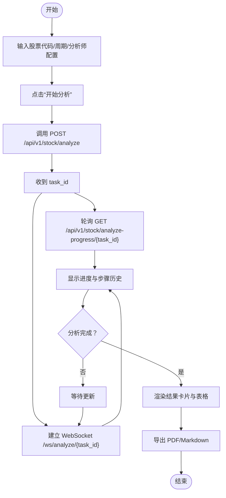

# 股票分析功能

<cite>
**本文引用的文件**
- [backend/app/api/v1/stock.py](file://backend/app/api/v1/stock.py)
- [backend/app/services/stock_service.py](file://backend/app/services/stock_service.py)
- [backend/app/schemas/stock.py](file://backend/app/schemas/stock.py)
- [backend/app/models/stock.py](file://backend/app/models/stock.py)
- [backend/app/core/progress_tracker.py](file://backend/app/core/progress_tracker.py)
- [backend/app/core/websocket_manager.py](file://backend/app/core/websocket_manager.py)
- [backend/app/agents/ai_agents.py](file://backend/app/agents/ai_agents.py)
- [backend/app/utils/pdf_generator.py](file://backend/app/utils/pdf_generator.py)
- [frontend/src/api/stock.js](file://frontend/src/api/stock.js)
- [frontend/src/views/stock/index.vue](file://frontend/src/views/stock/index.vue)
</cite>

## 目录
1. [简介](#简介)
2. [项目结构](#项目结构)
3. [核心组件](#核心组件)
4. [架构总览](#架构总览)
5. [详细组件分析](#详细组件分析)
6. [依赖关系分析](#依赖关系分析)
7. [性能考虑](#性能考虑)
8. [故障排查指南](#故障排查指南)
9. [结论](#结论)
10. [附录](#附录)

## 简介
本文件面向“股票分析功能”的深入开发文档，覆盖单股分析与批量分析两种模式，解释后端API设计（如 GET /api/v1/stock/analyze）、前端页面交互（stock/index.vue）、服务层协调（stock_service.py），并提供调用示例与性能优化策略。同时，针对常见错误（如无效股票代码、网络超时）给出解决方案。

## 项目结构
- 后端采用 FastAPI + SQLAlchemy，提供股票分析的 REST 与 WebSocket 接口，以及任务进度追踪与报告导出能力。
- 前端使用 Vue + Element Plus，提供单股与批量分析界面、实时进度展示与历史记录浏览。
- 数据与AI分析通过服务层统一编排，支持多智能体协同与多数据源融合。

图表来源
- [backend/app/api/v1/stock.py](file://backend/app/api/v1/stock.py#L1-L190)
- [backend/app/services/stock_service.py](file://backend/app/services/stock_service.py#L1-L200)
- [backend/app/agents/ai_agents.py](file://backend/app/agents/ai_agents.py#L1-L120)
- [backend/app/models/stock.py](file://backend/app/models/stock.py#L1-L26)
- [backend/app/core/websocket_manager.py](file://backend/app/core/websocket_manager.py#L1-L119)
- [backend/app/core/progress_tracker.py](file://backend/app/core/progress_tracker.py#L1-L171)
- [backend/app/utils/pdf_generator.py](file://backend/app/utils/pdf_generator.py#L1-L120)
- [frontend/src/views/stock/index.vue](file://frontend/src/views/stock/index.vue#L1-L120)

章节来源
- [backend/app/api/v1/stock.py](file://backend/app/api/v1/stock.py#L1-L190)
- [frontend/src/views/stock/index.vue](file://frontend/src/views/stock/index.vue#L1-L120)

## 核心组件
- 后端接口层：提供分析启动、进度查询、活动任务、WebSocket 实时推送、批量分析、历史查询与PDF生成等接口。
- 服务层：封装数据获取、AI代理调用、结果聚合、持久化与响应构建。
- 模型与Schema：定义数据库表结构与请求/响应的数据契约。
- 进度追踪与WebSocket：支持异步任务进度的实时推送。
- 前端API与页面：封装HTTP/WebSocket调用，渲染分析结果与历史记录。

章节来源
- [backend/app/api/v1/stock.py](file://backend/app/api/v1/stock.py#L1-L190)
- [backend/app/services/stock_service.py](file://backend/app/services/stock_service.py#L1-L200)
- [backend/app/schemas/stock.py](file://backend/app/schemas/stock.py#L1-L100)
- [backend/app/models/stock.py](file://backend/app/models/stock.py#L1-L26)
- [backend/app/core/progress_tracker.py](file://backend/app/core/progress_tracker.py#L1-L171)
- [backend/app/core/websocket_manager.py](file://backend/app/core/websocket_manager.py#L1-L119)
- [frontend/src/api/stock.js](file://frontend/src/api/stock.js#L1-L123)
- [frontend/src/views/stock/index.vue](file://frontend/src/views/stock/index.vue#L1-L120)

## 架构总览
后端通过 FastAPI 提供 REST 接口，服务层在后台任务中执行分析，期间通过进度追踪器更新状态并通过 WebSocket 推送。前端通过 HTTP 发起分析请求，使用 WebSocket 实时接收进度，完成后渲染结果并支持导出 PDF。

图表来源
- [backend/app/api/v1/stock.py](file://backend/app/api/v1/stock.py#L21-L131)
- [backend/app/services/stock_service.py](file://backend/app/services/stock_service.py#L63-L120)
- [backend/app/agents/ai_agents.py](file://backend/app/agents/ai_agents.py#L407-L546)
- [backend/app/models/stock.py](file://backend/app/models/stock.py#L9-L26)
- [backend/app/core/websocket_manager.py](file://backend/app/core/websocket_manager.py#L1-L119)
- [backend/app/core/progress_tracker.py](file://backend/app/core/progress_tracker.py#L45-L120)

## 详细组件分析

### 后端接口层（stock.py）
- 单股分析接口：POST /api/v1/stock/analyze
  - 输入：StockAnalyzeRequest（股票代码、周期、模型、分析师配置）
  - 输出：success_response，包含 task_id
  - 行为：创建任务、后台执行分析、立即返回 task_id
- 进度查询接口：GET /api/v1/stock/analyze-progress/{task_id}
  - 输出：任务进度与步骤历史
- 活动任务接口：GET /api/v1/stock/active-tasks
  - 输出：进行中的任务列表
- WebSocket 接口：/api/v1/stock/ws/analyze/{task_id}
  - 行为：建立连接、推送实时进度、支持 ping/状态查询
- 批量分析接口：POST /api/v1/stock/batch-analyze
  - 输入：BatchAnalyzeRequest（股票列表、周期、模式、并发参数）
  - 输出：BatchAnalyzeResponse（总数、成功数、失败数、结果列表、失败明细）
- 历史查询接口：GET /api/v1/stock/history
  - 参数：stock_code、page、page_size
  - 输出：历史记录分页
- 股票信息接口：GET /api/v1/stock/{stock_code}
  - 输出：股票基础信息
- PDF 生成接口：POST /api/v1/stock/generate-pdf
  - 输入：analysis_id
  - 输出：PDF 文件（Base64编码）

章节来源
- [backend/app/api/v1/stock.py](file://backend/app/api/v1/stock.py#L21-L190)
- [backend/app/schemas/stock.py](file://backend/app/schemas/stock.py#L12-L60)

### 服务层（stock_service.py）
- 分析入口
  - analyze_stock_with_progress：带进度追踪的异步分析流程
  - analyze_stock：单次分析（阻塞式，供内部调用）
- 批量分析
  - batch_analyze：遍历股票列表，逐个分析并汇总结果
- 数据准备与持久化
  - _prepare_stock_data：获取股票信息、K线、技术指标
  - _persist_analysis：写入数据库，返回记录ID
  - _build_response：构建对外响应对象
- AI代理编排
  - run_multi_agent_analysis：按 enabled_analysts 并行/串行调度
  - conduct_team_discussion：团队讨论整合
  - make_final_decision：最终投资决策
- PDF 报告
  - generate_pdf：读取历史记录，生成PDF并返回二进制内容

图表来源
- [backend/app/services/stock_service.py](file://backend/app/services/stock_service.py#L45-L200)
- [backend/app/models/stock.py](file://backend/app/models/stock.py#L9-L26)
- [backend/app/agents/ai_agents.py](file://backend/app/agents/ai_agents.py#L407-L546)

章节来源
- [backend/app/services/stock_service.py](file://backend/app/services/stock_service.py#L1-L200)
- [backend/app/models/stock.py](file://backend/app/models/stock.py#L1-L26)
- [backend/app/agents/ai_agents.py](file://backend/app/agents/ai_agents.py#L1-L120)

### Schema 与模型
- 请求/响应模型
  - StockAnalyzeRequest：单股分析请求
  - StockAnalyzeResponse：单股分析响应
  - BatchAnalyzeRequest：批量分析请求
  - BatchAnalyzeResponse：批量分析响应
- 数据库模型
  - StockAnalysis：分析记录表，包含评级、置信度、目标价、止盈止损等字段

章节来源
- [backend/app/schemas/stock.py](file://backend/app/schemas/stock.py#L1-L100)
- [backend/app/models/stock.py](file://backend/app/models/stock.py#L1-L26)

### 前端页面（stock/index.vue）
- 功能模块
  - 单股分析：输入股票代码/名称、周期、AI模型、分析师团队开关
  - 批量分析：支持顺序/并行模式，输入多只股票，展示汇总结果
  - 实时进度：显示百分比、步骤历史、WebSocket 推送
  - 历史记录：分页查看历史分析摘要与详情
  - 报告导出：Markdown/PDF 导出
- 交互逻辑
  - 通过前端 API 库发起分析请求，订阅 WebSocket 获取进度，完成后渲染结果卡片与表格
  - 支持刷新缓存、清除输入、切换分析模式与周期

章节来源
- [frontend/src/views/stock/index.vue](file://frontend/src/views/stock/index.vue#L1-L200)
- [frontend/src/api/stock.js](file://frontend/src/api/stock.js#L1-L123)

### WebSocket 与进度追踪
- 进度追踪器
  - create_task/update_progress/complete_task/fail_task/get_task/get_active_tasks
  - 通过 WebSocket 管理器异步推送进度
- WebSocket 管理器
  - 连接、订阅、取消订阅、广播进度、清理断连

章节来源
- [backend/app/core/progress_tracker.py](file://backend/app/core/progress_tracker.py#L1-L171)
- [backend/app/core/websocket_manager.py](file://backend/app/core/websocket_manager.py#L1-L119)

### PDF 报告生成
- 生成流程：从数据库读取分析记录，拼装股票信息、各分析师报告、团队讨论与最终决策，生成PDF并返回二进制内容
- 字体注册：自动检测系统中文字体，若不可用则回退至默认字体

章节来源
- [backend/app/utils/pdf_generator.py](file://backend/app/utils/pdf_generator.py#L1-L120)

## 依赖关系分析
- 接口层依赖服务层与进度追踪器/WebSocket 管理器
- 服务层依赖模型、Schema、AI智能体、PDF生成器与数据源管理（通过 StockDataFetcher）
- 前端依赖接口层提供的 HTTP/WebSocket 方法

图表来源
- [backend/app/api/v1/stock.py](file://backend/app/api/v1/stock.py#L1-L190)
- [backend/app/services/stock_service.py](file://backend/app/services/stock_service.py#L1-L200)
- [backend/app/schemas/stock.py](file://backend/app/schemas/stock.py#L1-L100)
- [backend/app/models/stock.py](file://backend/app/models/stock.py#L1-L26)
- [backend/app/agents/ai_agents.py](file://backend/app/agents/ai_agents.py#L1-L120)
- [backend/app/utils/pdf_generator.py](file://backend/app/utils/pdf_generator.py#L1-L120)
- [frontend/src/api/stock.js](file://frontend/src/api/stock.js#L1-L123)
- [frontend/src/views/stock/index.vue](file://frontend/src/views/stock/index.vue#L1-L120)

## 性能考虑
- 异步与后台任务
  - 单股分析通过后台任务启动，立即返回 task_id，避免阻塞请求线程
  - 批量分析支持顺序/并行模式，可通过 agents 与 max_workers 控制并发
- 进度追踪与 WebSocket
  - 使用内存存储任务进度，减少数据库压力；WebSocket 推送降低轮询成本
- 数据获取与缓存
  - 前端提供“刷新数据”入口，便于重新拉取最新行情
  - 服务层对辅助数据（财务、资金流、情绪、新闻、风险）采用安全调用与降级策略
- I/O 与 CPU
  - 技术指标计算与AI调用在独立线程池执行，避免阻塞事件循环
- PDF 生成
  - 生成过程在独立线程执行，避免阻塞主线程

章节来源
- [backend/app/api/v1/stock.py](file://backend/app/api/v1/stock.py#L21-L131)
- [backend/app/services/stock_service.py](file://backend/app/services/stock_service.py#L120-L200)
- [backend/app/core/progress_tracker.py](file://backend/app/core/progress_tracker.py#L1-L171)
- [backend/app/utils/pdf_generator.py](file://backend/app/utils/pdf_generator.py#L1-L120)

## 故障排查指南
- 常见错误与定位
  - 无效股票代码：服务层在准备数据阶段会抛出异常，前端应捕获并提示
  - 网络超时/数据源不可用：辅助数据获取采用安全调用，会记录日志并降级处理
  - WebSocket 连接失败：检查代理与跨域配置，确认 ws URL 与 host 一致
  - 任务不存在：进度查询返回 404，前端应提示用户检查 task_id 或重新发起分析
- 建议处理
  - 前端增加重试与错误提示，提供“清除结果/刷新数据”按钮
  - 后端记录详细日志，区分业务异常与系统异常
  - 批量分析时限制并发，避免资源争用

章节来源
- [backend/app/services/stock_service.py](file://backend/app/services/stock_service.py#L442-L573)
- [backend/app/api/v1/stock.py](file://backend/app/api/v1/stock.py#L54-L131)
- [frontend/src/api/stock.js](file://frontend/src/api/stock.js#L1-L123)

## 结论
该股票分析功能以“多智能体 + 多数据源 + 多维度分析”为核心，通过异步任务与 WebSocket 实现实时进度反馈，前后端配合完善。服务层承担数据准备、AI编排与结果聚合，具备良好的扩展性与稳定性。建议在生产环境中结合缓存与限流策略进一步优化性能与可靠性。

## 附录

### API 接口定义与调用示例

- 单股分析（POST /api/v1/stock/analyze）
  - 请求体：StockAnalyzeRequest
    - stock_code：股票代码
    - period：周期（默认 1y）
    - model：AI模型（默认 deepseek-chat）
    - analysts：布尔开关（技术/基本面/资金面/风险/情绪/新闻）
    - agents：兼容字段（字符串数组）
  - 响应：success_response，包含 task_id
  - 前端调用：通过前端 API 封装函数发起请求

- 查询进度（GET /api/v1/stock/analyze-progress/{task_id}）
  - 响应：任务进度与步骤历史

- 活动任务（GET /api/v1/stock/active-tasks）
  - 响应：进行中的任务列表

- WebSocket 实时进度（/api/v1/stock/ws/analyze/{task_id}）
  - 前端通过 connectTaskWebSocket 建立连接，接收进度更新

- 批量分析（POST /api/v1/stock/batch-analyze）
  - 请求体：BatchAnalyzeRequest
    - stock_codes：股票列表
    - period：周期
    - mode：sequential/parallel
    - max_workers：并发数
    - agents：分析师列表
  - 响应：BatchAnalyzeResponse（总数、成功数、失败数、结果列表、失败明细）

- 历史记录（GET /api/v1/stock/history）
  - 参数：stock_code、page、page_size
  - 响应：历史记录分页

- 股票信息（GET /api/v1/stock/{stock_code}）
  - 响应：股票基础信息

- PDF 生成（POST /api/v1/stock/generate-pdf）
  - 请求体：analysis_id
  - 响应：PDF 文件（Base64编码）

章节来源
- [backend/app/api/v1/stock.py](file://backend/app/api/v1/stock.py#L21-L190)
- [backend/app/schemas/stock.py](file://backend/app/schemas/stock.py#L12-L60)
- [frontend/src/api/stock.js](file://frontend/src/api/stock.js#L1-L123)

### 前端交互流程（单股分析）

图表来源
- [frontend/src/views/stock/index.vue](file://frontend/src/views/stock/index.vue#L1-L200)
- [frontend/src/api/stock.js](file://frontend/src/api/stock.js#L1-L123)
- [backend/app/api/v1/stock.py](file://backend/app/api/v1/stock.py#L21-L131)