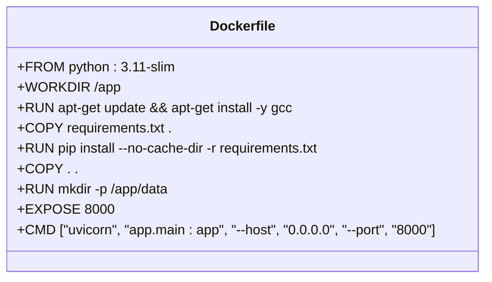
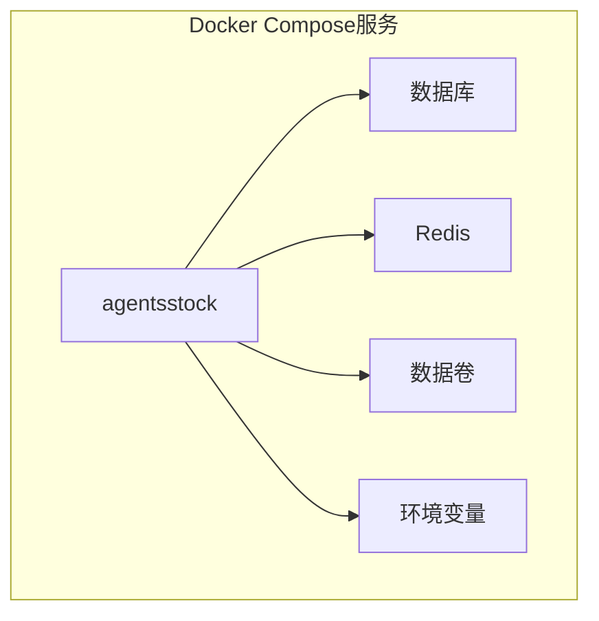
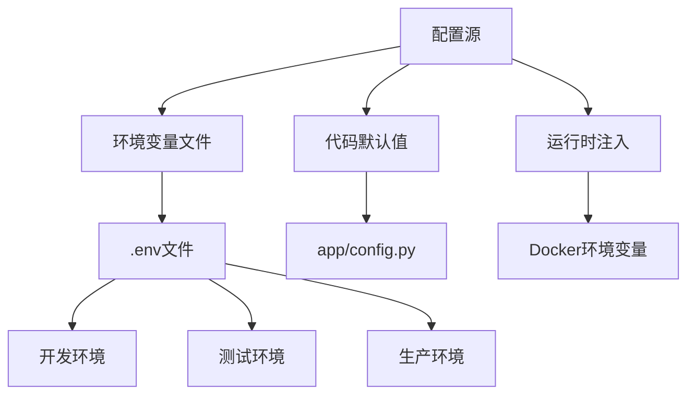

# 部署与运维

<cite>
**本文档引用的文件**   
- [Dockerfile](file://backend/Dockerfile)
- [docker-compose.yml](file://old/docker-compose.yml)
- [requirements.txt](file://backend/requirements.txt)
- [app.config.py](file://backend/app/config.py)
- [main.py](file://backend/app/main.py)
- [.env.example](file://.env.example)
- [start_server.bat](file://backend/start_server.bat)
- [init_db.py](file://backend/init_db.py)
- [migrate_db.py](file://backend/migrate_db.py)
- [alembic.ini](file://backend/alembic.ini)
- [config.py](file://backend/app/config.py)
</cite>

## 目录
1. [简介](#简介)
2. [本地开发部署](#本地开发部署)
3. [生产环境容器化部署](#生产环境容器化部署)
4. [多环境配置策略](#多环境配置策略)
5. [性能调优建议](#性能调优建议)
6. [日志管理方案](#日志管理方案)
7. [健康检查配置](#健康检查配置)
8. [备份与恢复流程](#备份与恢复流程)
9. [版本升级指南](#版本升级指南)
10. [故障排查](#故障排查)

## 简介
本文档提供AI股票分析系统的详细部署与运维指南，涵盖本地开发环境部署和生产环境容器化部署两种场景。系统采用FastAPI作为后端框架，通过Docker容器化部署，支持多种数据源和量化交易接口。文档详细说明了Docker镜像构建、服务编排、环境配置管理、性能优化等关键运维操作。

**Section sources**
- [Dockerfile](file://backend/Dockerfile)
- [docker-compose.yml](file://old/docker-compose.yml)

## 本地开发部署

### 开发环境准备
本地开发部署主要通过直接运行Python应用实现，适用于开发和调试阶段。系统提供了批处理脚本简化启动流程。

#### 依赖安装
1. 创建并激活Python虚拟环境：
```bash
python -m venv venv
source venv/bin/activate  # Linux/Mac
venv\Scripts\activate     # Windows
```

2. 安装Python依赖：
```bash
pip install -r backend/requirements.txt
```

#### 启动后端服务
系统提供批处理脚本`start_server.bat`用于启动后端服务：
```bash
cd backend
start_server.bat
```

该脚本会激活conda环境`ai-agent`，并使用uvicorn启动FastAPI应用，监听8000端口，启用热重载模式。

#### 数据库初始化
首次部署需要初始化数据库：
```bash
python backend/init_db.py
```

此脚本会创建所有必要的数据库表，包括股票分析、监控任务、投资组合等核心数据表。

#### 数据库迁移
当数据模型发生变化时，执行数据库迁移：
```bash
python backend/migrate_db.py
```

该脚本会为监控任务表添加新的字段，如进场区间、止盈止损价位等。

**Section sources**
- [start_server.bat](file://backend/start_server.bat)
- [init_db.py](file://backend/init_db.py)
- [migrate_db.py](file://backend/migrate_db.py)
- [requirements.txt](file://backend/requirements.txt)

## 生产环境容器化部署

### Docker镜像构建
系统通过Dockerfile构建后端镜像，实现环境一致性。



**Diagram sources**
- [Dockerfile](file://backend/Dockerfile)

#### Dockerfile详解
- **基础镜像**：使用`python:3.11-slim`精简版Python镜像
- **系统依赖**：安装gcc编译器用于编译Python包
- **依赖安装**：复制requirements.txt并安装Python依赖
- **代码复制**：将应用代码复制到容器中
- **数据目录**：创建`/app/data`目录用于数据持久化
- **端口暴露**：暴露8000端口
- **启动命令**：使用uvicorn启动FastAPI应用

### Docker Compose服务编排
生产环境使用docker-compose.yml进行多服务编排。



**Diagram sources**
- [docker-compose.yml](file://old/docker-compose.yml)

#### docker-compose.yml配置
```yaml
version: '3.8'

services:
  agentsstock:
    build:
      context: .
      dockerfile: Dockerfile
    container_name: agentsstock1
    ports:
      - "8503:8503"
    volumes:
      - ./data:/app/data
      - ./.env:/app/.env
    environment:
      - TZ=Asia/Shanghai
    restart: unless-stopped
    networks:
      - agentsstock-network
    healthcheck:
      test: ["CMD", "curl", "-f", "http://localhost:8503/_stcore/health"]
      interval: 30s
      timeout: 10s
      retries: 3
      start_period: 60s

networks:
  agentsstock-network:
    driver: bridge
```

#### 服务配置说明
- **构建配置**：基于项目根目录的Dockerfile构建镜像
- **端口映射**：将容器8503端口映射到主机8503端口
- **数据持久化**：通过卷挂载实现数据和配置文件持久化
- **环境变量**：设置时区为亚洲/上海
- **重启策略**：除非手动停止，否则自动重启
- **网络配置**：使用bridge网络模式
- **健康检查**：通过curl检查健康端点

**Section sources**
- [Dockerfile](file://backend/Dockerfile)
- [docker-compose.yml](file://old/docker-compose.yml)

## 多环境配置策略

### 配置管理架构
系统采用分层配置管理策略，支持开发、测试、生产等多种环境。



**Diagram sources**
- [app/config.py](file://backend/app/config.py)
- [.env.example](file://.env.example)

### 配置文件结构
系统使用Pydantic Settings进行配置管理，支持环境变量覆盖。

#### 核心配置项
- **应用配置**：应用名称、版本、调试模式
- **数据库配置**：SQLite连接字符串
- **API密钥**：DeepSeek API密钥
- **数据源配置**：Tushare、TDX数据源开关
- **量化交易配置**：MiniQMT账户信息
- **通知配置**：邮件、Webhook通知设置

#### 环境变量优先级
1. Docker运行时环境变量
2. .env文件中的环境变量
3. 代码中的默认值

### 环境配置示例
```bash
# AI股票分析系统环境配置
DEEPSEEK_API_KEY="sk-867410930e1e428d881e1ddf5ec056eb"
DEEPSEEK_BASE_URL="https://api.deepseek.com/v1"
TUSHARE_TOKEN=""
MYSQL_ENABLED="true"
MYSQL_HOST="82.156.239.131"
MYSQL_PORT="3306"
MYSQL_USER="root"
MYSQL_PASSWORD="1q2w#E$R"
MINIQMT_ENABLED="false"
EMAIL_ENABLED="false"
WEBHOOK_ENABLED="false"
```

**Section sources**
- [app/config.py](file://backend/app/config.py)
- [.env.example](file://.env.example)

## 性能调优建议

### 数据库优化
- 使用SQLite作为默认数据库，适用于中小规模数据
- 考虑在生产环境迁移到PostgreSQL或MySQL以支持更大规模数据
- 定期执行数据库维护任务，如VACUUM操作

### 缓存策略
- 启用Redis缓存以提高数据访问性能
- 配置合理的缓存过期时间
- 对频繁访问的数据进行缓存

### 并发处理
- 调整uvicorn工作进程数以匹配CPU核心数
- 配置适当的连接池大小
- 使用异步IO处理I/O密集型操作

### 资源限制
- 在Docker中设置内存和CPU限制
- 监控应用资源使用情况
- 根据负载动态调整资源配置

**Section sources**
- [app/config.py](file://backend/app/config.py)
- [Dockerfile](file://backend/Dockerfile)

## 日志管理方案

### 日志级别配置
系统使用loguru进行日志管理，支持多种日志级别：
- DEBUG：调试信息
- INFO：一般信息
- WARNING：警告信息
- ERROR：错误信息
- CRITICAL：严重错误

### 日志输出
- 控制台输出：便于开发调试
- 文件输出：用于生产环境日志持久化
- 结构化日志：JSON格式便于日志分析

### 日志轮转
- 按大小轮转：当日志文件达到指定大小时创建新文件
- 按时间轮转：按天或按小时创建新日志文件
- 保留策略：保留最近N天的日志文件

**Section sources**
- [requirements.txt](file://backend/requirements.txt)

## 健康检查配置

### 健康检查端点
系统提供`/health`端点用于健康检查：
```python
@app.get("/health")
async def health_check():
    """健康检查"""
    return success_response({"status": "healthy"}, msg="healthy")
```

### Docker健康检查
docker-compose.yml中配置了详细的健康检查策略：
- **检查命令**：使用curl访问健康端点
- **检查间隔**：30秒
- **超时时间**：10秒
- **重试次数**：3次
- **启动等待期**：60秒

### 健康检查监控
- 集成到监控系统（如Prometheus）
- 设置告警规则
- 定期检查健康状态

**Section sources**
- [main.py](file://backend/app/main.py)
- [docker-compose.yml](file://old/docker-compose.yml)

## 备份与恢复流程

### 数据备份
#### 自动备份
- 配置定时任务每日备份数据库
- 备份文件命名包含时间戳
- 保留最近7天的备份

#### 手动备份
```bash
# 备份数据库
cp backend/data/stock_analysis.db backup/stock_analysis_$(date +%Y%m%d_%H%M%S).db

# 备份配置文件
cp .env backup/.env_$(date +%Y%m%d_%H%M%S)
```

### 数据恢复
#### 从备份恢复
```bash
# 停止服务
docker-compose down

# 恢复数据库
cp backup/stock_analysis_20240101_120000.db backend/data/stock_analysis.db

# 恢复配置
cp backup/.env_20240101_120000 .env

# 启动服务
docker-compose up -d
```

#### 备份策略
- 本地备份：保留最近7天
- 远程备份：同步到云存储
- 备份验证：定期验证备份文件完整性

**Section sources**
- [init_db.py](file://backend/init_db.py)

## 版本升级指南

### 升级前准备
1. 备份当前数据库和配置文件
2. 检查新版本的变更日志
3. 在测试环境验证升级流程

### 数据库迁移
当版本升级涉及数据库结构变更时：
```bash
# 执行数据库迁移
python backend/migrate_db.py
```

### 应用升级
#### 容器化部署升级
```bash
# 拉取最新代码
git pull origin main

# 重新构建镜像
docker-compose build

# 重启服务
docker-compose up -d
```

#### 本地部署升级
```bash
# 更新依赖
pip install -r backend/requirements.txt --upgrade

# 重启应用
# Windows: 重新运行start_server.bat
# Linux/Mac: 重启uvicorn进程
```

**Section sources**
- [migrate_db.py](file://backend/migrate_db.py)
- [requirements.txt](file://backend/requirements.txt)

## 故障排查

### 常见问题及解决方案
#### 服务无法启动
- **检查Docker日志**：
```bash
docker logs agentsstock1
```
- **检查端口占用**：
```bash
netstat -an | grep 8503
```
- **检查依赖安装**：确保所有Python包正确安装

#### 数据库连接失败
- **检查数据库文件权限**：
```bash
ls -la backend/data/
```
- **检查SQLite文件完整性**：
```bash
sqlite3 backend/data/stock_analysis.db ".tables"
```

#### API调用失败
- **检查健康状态**：
```bash
curl http://localhost:8503/health
```
- **检查CORS配置**：确保前端域名在允许列表中

### 监控与诊断
- 查看应用日志
- 监控资源使用情况
- 使用健康检查端点验证服务状态

**Section sources**
- [main.py](file://backend/app/main.py)
- [docker-compose.yml](file://old/docker-compose.yml)