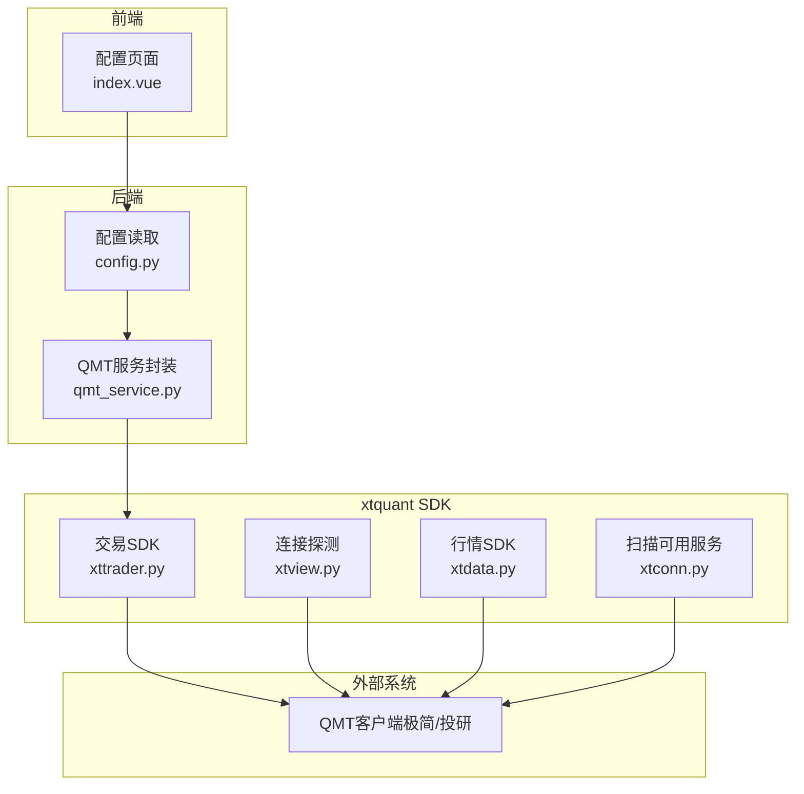
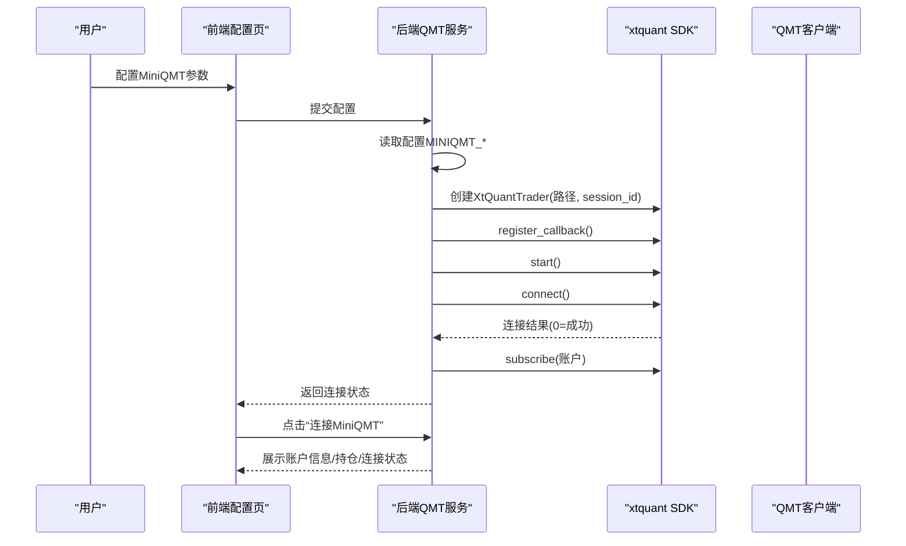
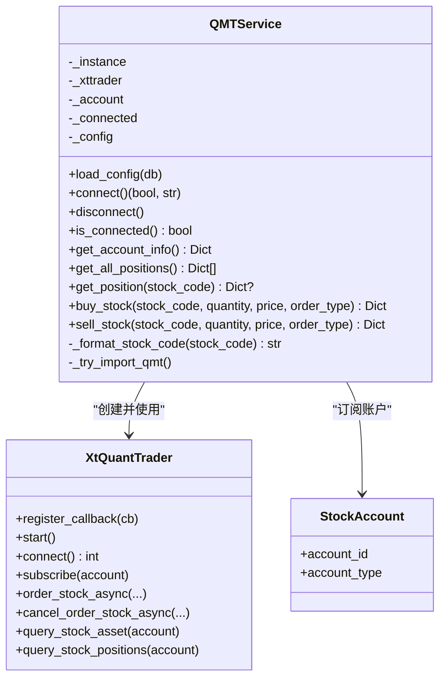
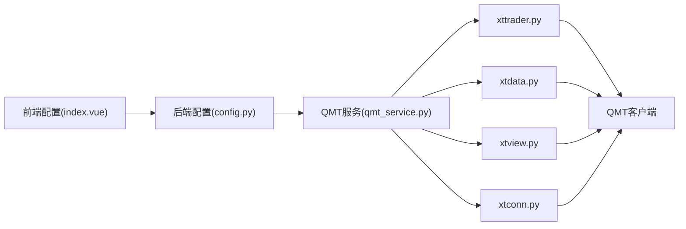

# QMT环境配置与接入指南

<cite>
**本文引用的文件**
- [MINIQMT集成指南.md](file://docs/MINIQMT_INTEGRATION_GUIDE.md)
- [qmt_service.py](file://backend/app/services/qmt_service.py)
- [xttrader.py](file://xtquant/xttrader.py)
- [xtview.py](file://xtquant/xtview.py)
- [xtdata.py](file://xtquant/xtdata.py)
- [xtconn.py](file://xtquant/xtconn.py)
- [config.py](file://backend/app/config.py)
- [.env.example](file://.env.example)
- [frontend/views/config/index.vue](file://frontend/src/views/config/index.vue)
</cite>

## 目录
1. [引言](#引言)
2. [项目结构](#项目结构)
3. [核心组件](#核心组件)
4. [架构总览](#架构总览)
5. [详细组件分析](#详细组件分析)
6. [依赖关系分析](#依赖关系分析)
7. [性能与稳定性考量](#性能与稳定性考量)
8. [故障排查指南](#故障排查指南)
9. [结论](#结论)
10. [附录](#附录)

## 引言
本指南面向需要在本系统中接入MiniQMT（迅投极简版或投研版）的用户，围绕“QMT客户端安装、API权限开启、账户授权”等前置步骤，以及“xtquant相关参数文件（如config.lua、env.lua）的配置要点”，系统讲解如何加载QMT SDK并初始化xttrader实例，涵盖依赖库安装与路径配置、常见配置错误排查、防火墙与网络设置要求，以及成功连接后的状态验证步骤。文档同时结合后端服务层的QMT服务封装与前端配置界面，帮助您从零完成MiniQMT接入。

## 项目结构
本仓库包含后端FastAPI服务、前端Vue界面、xtquant SDK与配置样例、以及完整的MiniQMT集成说明文档。与MiniQMT接入最相关的模块分布如下：
- 后端服务层：负责加载MiniQMT Python SDK、建立交易连接、订阅账户、查询资产与持仓、执行下单与撤单。
- 前端配置界面：提供MiniQMT开关、账户ID、账户类型、用户数据目录等配置项。
- xtquant SDK：提供xttrader、xtdata、xtview等模块，用于交易、行情与连接探测。
- 文档：MiniQMT集成指南，包含环境变量配置、使用流程与故障排查。

图表来源
- [qmt_service.py](file://backend/app/services/qmt_service.py#L130-L214)
- [xttrader.py](file://xtquant/xttrader.py#L120-L210)
- [xtview.py](file://xtquant/xtview.py#L11-L57)
- [xtdata.py](file://xtquant/xtdata.py#L103-L144)
- [xtconn.py](file://xtquant/xtconn.py#L54-L106)
- [config.py](file://backend/app/config.py#L69-L74)
- [frontend/views/config/index.vue](file://frontend/src/views/config/index.vue#L135-L164)

章节来源
- [qmt_service.py](file://backend/app/services/qmt_service.py#L130-L214)
- [xttrader.py](file://xtquant/xttrader.py#L120-L210)
- [xtview.py](file://xtquant/xtview.py#L11-L57)
- [xtdata.py](file://xtquant/xtdata.py#L103-L144)
- [xtconn.py](file://xtquant/xtconn.py#L54-L106)
- [config.py](file://backend/app/config.py#L69-L74)
- [frontend/views/config/index.vue](file://frontend/src/views/config/index.vue#L135-L164)

## 核心组件
- 后端QMT服务封装（QMTService）
  - 负责MiniQMT模块导入、配置加载、连接建立、回调注册、账户订阅、资产与持仓查询、下单与撤单等。
  - 关键流程：导入xtquant模块 → 创建XtQuantTrader实例（携带userdata路径与session_id）→ 注册回调 → start() → connect() → 订阅账户 → 连接成功。
- 前端MiniQMT配置界面
  - 提供“启用MiniQMT”、“账户ID”、“账户类型（STOCK/CREDIT）”、“用户数据目录（userdata路径）”等配置项。
- xtquant SDK
  - xttrader：交易API（下单、撤单、查询资产/持仓/成交/委托回报等）。
  - xtdata：行情API（连接、订阅、查询等）。
  - xtview：连接探测（扫描可用服务地址，默认端口58610）。
  - xtconn：扫描本地运行的xtquant服务配置，辅助连接。

章节来源
- [qmt_service.py](file://backend/app/services/qmt_service.py#L130-L214)
- [xttrader.py](file://xtquant/xttrader.py#L408-L519)
- [xtview.py](file://xtquant/xtview.py#L11-L57)
- [xtdata.py](file://xtquant/xtdata.py#L103-L144)
- [frontend/views/config/index.vue](file://frontend/src/views/config/index.vue#L135-L164)

## 架构总览
MiniQMT接入的整体流程如下：
- 前端配置MiniQMT参数（启用、账户ID、账户类型、用户数据目录）。
- 后端读取配置并初始化QMT服务。
- 后端通过xtquant SDK创建XtQuantTrader实例，启动事件循环并连接QMT客户端。
- 连接成功后订阅账户，随后可查询资产、持仓并执行下单/撤单。
- 前端展示MiniQMT状态面板，用户可点击“连接MiniQMT”进行连接与状态验证。

图表来源
- [qmt_service.py](file://backend/app/services/qmt_service.py#L130-L214)
- [xttrader.py](file://xtquant/xttrader.py#L392-L419)
- [frontend/views/config/index.vue](file://frontend/src/views/config/index.vue#L135-L164)

## 详细组件分析

### 后端QMT服务封装（QMTService）
- 模块导入与降级
  - 优先尝试导入xtquant的xttrader、xtdata与xttype；若失败则记录警告并进入模拟模式。
- 配置加载
  - 从数据库读取MINIQMT_ENABLED、MINIQMT_ACCOUNT_ID、MINIQMT_ACCOUNT_TYPE、MINIQMT_USERDATA_PATH等键值，设置默认值。
- 连接流程
  - 创建回调类（on_disconnected/on_stock_order/on_stock_trade/on_order_error等）。
  - 使用当前时间戳构造session_id，创建XtQuantTrader实例。
  - 注册回调、start()、connect()。
  - connect()返回0表示连接成功，创建StockAccount并subscribe。
- 资产与持仓查询
  - query_stock_asset与query_stock_positions，结合xtdata获取实时行情与股票名称，计算盈亏与市值。
- 下单与撤单
  - order_stock_async/order_stock/cancel_order_stock_async等接口，支持市价/限价下单与撤单。
- 股票代码格式化
  - 自动补齐“.SH/.SZ”后缀，保证与QMT侧一致。

图表来源
- [qmt_service.py](file://backend/app/services/qmt_service.py#L130-L214)
- [qmt_service.py](file://backend/app/services/qmt_service.py#L403-L564)
- [xttrader.py](file://xtquant/xttrader.py#L408-L519)

章节来源
- [qmt_service.py](file://backend/app/services/qmt_service.py#L130-L214)
- [qmt_service.py](file://backend/app/services/qmt_service.py#L403-L564)
- [xttrader.py](file://xtquant/xttrader.py#L408-L519)

### 前端MiniQMT配置界面
- 配置项
  - 启用开关：MINIQMT_ENABLED
  - 账户ID：MINIQMT_ACCOUNT_ID
  - 账户类型：MINIQMT_ACCOUNT_TYPE（STOCK/CREDIT）
  - 用户数据目录：MINIQMT_USERDATA_PATH（如E:\zhongjin_qmt\userdata_mini）
- 使用提醒
  - MiniQMT客户端需已启动，账户ID、账户类型与客户端保持一致；用户数据目录应为绝对路径；量化交易涉及真实资金，建议先在沙盒或小额账户验证策略后再启用。

章节来源
- [frontend/views/config/index.vue](file://frontend/src/views/config/index.vue#L135-L164)

### xtquant SDK与连接探测
- 连接探测（xtview.connect）
  - 若未显式指定端口，会扫描可用服务地址并默认尝试localhost:58610；若无法连接则抛出异常，提示“请检查QMT-投研版或QMT-极简版是否开启”。
- 行情连接（xtdata.connect）
  - 与xtview类似，支持指定IP/端口或自动扫描；默认地址为127.0.0.1:58610。
- 本地服务扫描（xtconn.scan_available_server_addr）
  - 扫描用户配置目录下的xtdata.cfg，提取ip/port并判断运行状态，辅助连接。

章节来源
- [xtview.py](file://xtquant/xtview.py#L11-L57)
- [xtdata.py](file://xtquant/xtdata.py#L103-L144)
- [xtconn.py](file://xtquant/xtconn.py#L54-L106)

## 依赖关系分析
- 后端依赖
  - 后端通过Pydantic Settings读取MINIQMT_*配置，再调用QMTService完成连接与交易。
- 前端依赖
  - 前端表单提交配置，后端读取并持久化，最终影响QMTService行为。
- SDK依赖
  - QMTService依赖xtquant的xttrader、xtdata、xttype；xtview/xtdata用于连接探测与行情访问；xtconn用于扫描本地服务。

图表来源
- [config.py](file://backend/app/config.py#L69-L74)
- [qmt_service.py](file://backend/app/services/qmt_service.py#L130-L214)
- [xttrader.py](file://xtquant/xttrader.py#L120-L210)
- [xtdata.py](file://xtquant/xtdata.py#L103-L144)
- [xtview.py](file://xtquant/xtview.py#L11-L57)
- [xtconn.py](file://xtquant/xtconn.py#L54-L106)

章节来源
- [config.py](file://backend/app/config.py#L69-L74)
- [qmt_service.py](file://backend/app/services/qmt_service.py#L130-L214)
- [xttrader.py](file://xtquant/xttrader.py#L120-L210)
- [xtdata.py](file://xtquant/xtdata.py#L103-L144)
- [xtview.py](file://xtquant/xtview.py#L11-L57)
- [xtconn.py](file://xtquant/xtconn.py#L54-L106)

## 性能与稳定性考量
- 连接稳定性
  - 使用xtview/xtdata的自动扫描与默认端口策略，降低手动配置复杂度；若连接失败，优先检查QMT客户端是否启动及允许第三方连接。
- 交易吞吐
  - XtQuantTrader内部使用异步客户端与线程池，支持异步下单与回调处理；注意避免高频短间隔重复下单，遵循A股100股/手规则。
- 资源占用
  - start()启动事件循环与线程池，disconnect()时需停止事件循环并释放资源，避免进程悬挂。

[本节为通用建议，不直接分析具体文件]

## 故障排查指南

### 常见配置错误与解决
- QMT未启用
  - 现象：后端返回“QMT未启用”。
  - 处理：在前端开启MiniQMT开关，或在后端配置中设置MINIQMT_ENABLED=true。
- 账户ID未配置
  - 现象：后端返回“账户ID未配置，请在环境配置中设置”。
  - 处理：在前端填写MINIQMT_ACCOUNT_ID，或在.env中设置MINIQMT_ACCOUNT_ID。
- 用户数据目录不正确
  - 现象：连接失败或找不到userdata路径。
  - 处理：确保MINIQMT_USERDATA_PATH为QMT安装路径下的userdata_mini绝对路径。
- 账户类型不匹配
  - 现象：连接成功但无法查询资产/持仓。
  - 处理：确认MINIQMT_ACCOUNT_TYPE与QMT客户端账户类型一致（STOCK/CREDIT）。
- QMT客户端未启动或未允许第三方连接
  - 现象：xtview/xtdata连接失败，抛出“请检查QMT-投研版或QMT-极简版是否开启”。
  - 处理：启动QMT客户端，并确保允许第三方程序连接；必要时检查防火墙与端口。
- 端口冲突或网络不可达
  - 现象：连接超时或无法发现服务。
  - 处理：确认默认端口58610可用；若使用非默认端口，确保xtview/xtdata连接时指定端口。

### 网络与防火墙设置
- 默认端口
  - 默认连接端口为58610（xtview/xtdata默认地址为127.0.0.1:58610）。
- 防火墙
  - 确保防火墙放行本地回环地址127.0.0.1与端口58610；若跨机器访问，需开放相应端口并配置安全策略。
- 代理与网络
  - 若系统使用代理，确保代理不影响本地回环访问；必要时在QMT客户端中关闭代理或调整网络策略。

### 连接成功后的状态验证
- 后端验证
  - 调用QMTService.is_connected()返回True，get_account_info()返回可用资金、总资产、持仓数量等。
- 前端验证
  - 在前端MiniQMT状态面板查看“已连接”状态，点击“连接MiniQMT”后显示账户信息与持仓列表。
- SDK验证
  - 通过xtview.connect()与xtdata.connect()均能成功连接，xtconn.scan_available_server_addr()能扫描到本地服务。

章节来源
- [qmt_service.py](file://backend/app/services/qmt_service.py#L130-L214)
- [xtview.py](file://xtquant/xtview.py#L11-L57)
- [xtdata.py](file://xtquant/xtdata.py#L103-L144)
- [xtconn.py](file://xtquant/xtconn.py#L54-L106)
- [frontend/views/config/index.vue](file://frontend/src/views/config/index.vue#L135-L164)

## 结论
通过本指南，您可以完成MiniQMT的前置准备、配置与接入：在前端开启MiniQMT并填写账户信息与用户数据目录，后端读取配置并通过xtquant SDK初始化xttrader实例并建立连接，最终在前端验证连接状态与账户信息。遇到连接失败、登录超时等问题时，可依据本指南的故障排查步骤逐一核对QMT客户端状态、端口与防火墙设置、以及配置项是否正确。建议在沙盒或小额账户中充分验证策略后再启用实盘交易。

[本节为总结性内容，不直接分析具体文件]

## 附录

### 环境变量与配置文件要点
- 环境变量模板
  - MINIQMT_ENABLED、MINIQMT_ACCOUNT_ID、MINIQMT_ACCOUNT_TYPE、MINIQMT_USERDATA_PATH、MINIQMT_HOST、MINIQMT_PORT。
- 后端配置读取
  - Pydantic Settings中定义MINIQMT_*字段，从.env文件加载。

章节来源
- [.env.example](file://.env.example#L36-L51)
- [config.py](file://backend/app/config.py#L69-L74)

### MiniQMT集成指南要点摘录
- 使用流程
  - 安装MiniQMT客户端并登录账户，确保API服务已启动；在“实时监测”板块点击“连接MiniQMT”等待成功提示。
- 量化交易参数
  - 最大仓位比例、自动止损/止盈、最小交易金额等策略参数可在界面配置。
- 故障排查
  - 连接失败：检查MiniQMT客户端是否启动、账户已登录、账户ID正确、网络连接。
  - 下单失败：检查资金是否充足、股票代码格式正确、交易时间与T+1限制。
  - 交易未执行：确认量化功能已启用、MiniQMT连接状态、监测服务运行、查看通知记录中的错误信息。

章节来源
- [MINIQMT集成指南.md](file://docs/MINIQMT_INTEGRATION_GUIDE.md#L24-L48)
- [MINIQMT集成指南.md](file://docs/MINIQMT_INTEGRATION_GUIDE.md#L194-L213)