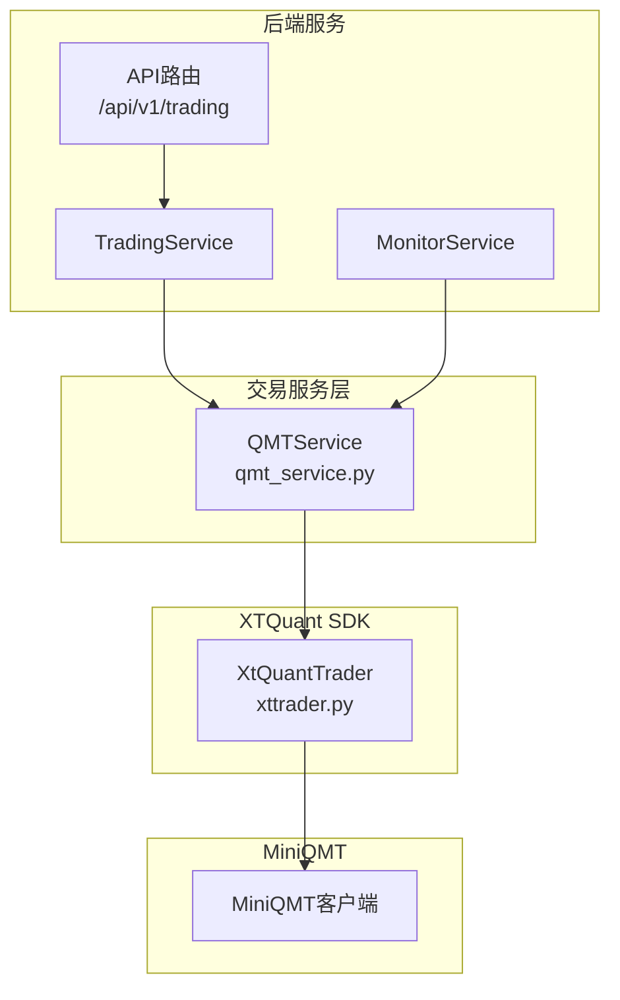
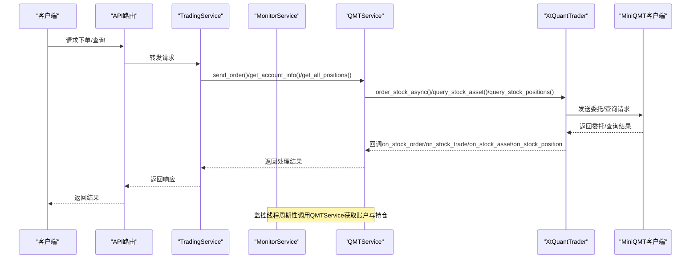
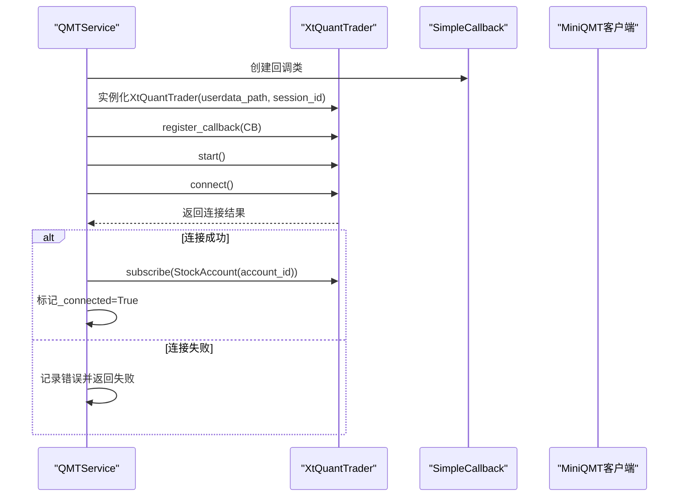
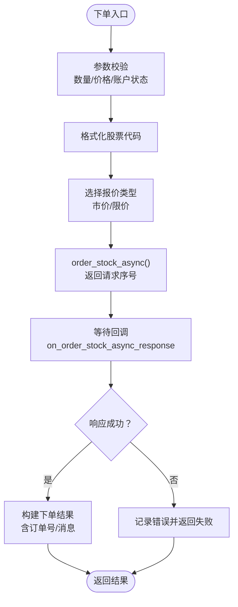
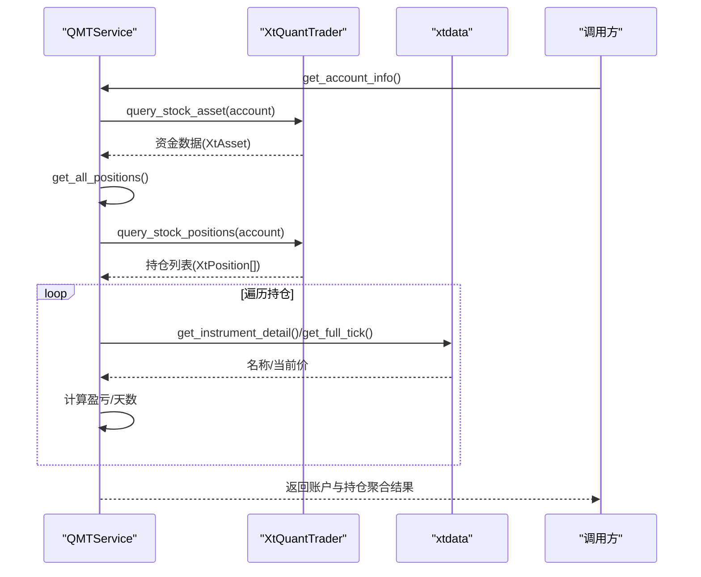
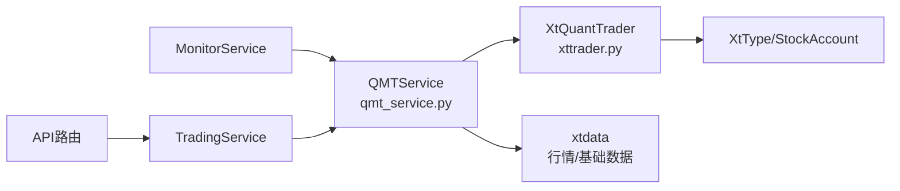

# QMT集成机制

<cite>
**本文引用的文件**
- [qmt_service.py](file://backend/app/services/qmt_service.py)
- [xttrader.py](file://xtquant/xttrader.py)
- [trading.py](file://backend/app/api/v1/trading.py)
- [monitor_service.py](file://backend/app/services/monitor_service.py)
- [trading_service.py](file://backend/app/services/trading_service.py)
- [test_qmt_service.py](file://backend/test_qmt_service.py)
- [MINIQMT_INTEGRATION_GUIDE.md](file://docs/MINIQMT_INTEGRATION_GUIDE.md)
</cite>

## 目录
1. [简介](#简介)
2. [项目结构](#项目结构)
3. [核心组件](#核心组件)
4. [架构总览](#架构总览)
5. [详细组件分析](#详细组件分析)
6. [依赖关系分析](#依赖关系分析)
7. [性能考量](#性能考量)
8. [故障排查指南](#故障排查指南)
9. [结论](#结论)
10. [附录](#附录)

## 简介
本文件系统性阐述如何通过 qmt_service.py 与 xtquant 的 xttrader.py 实现与 MiniQMT 平台的通信，覆盖交易服务初始化流程、会话管理、连接保持机制、异常与重连策略；并深入解析下单、撤单、查询账户与持仓等关键业务逻辑，包括参数映射、指令封装与响应解析。同时给出关键方法调用序列图、流程图与依赖关系图，帮助读者在高频交易场景下理解线程安全与异步调用的设计要点，并提供常见问题的排查建议与审计日志记录规范。

## 项目结构
- 后端服务层：提供交易服务封装与API路由，负责调用QMT服务层。
- QMT服务层：封装MiniQMT连接、下单、撤单、查询等核心能力。
- XTQuant底层SDK：xttrader.py 提供异步事件驱动的交易客户端与回调机制。
- 文档与测试：集成指南、测试脚本用于验证连接与基本交易能力。

图表来源
- [trading.py](file://backend/app/api/v1/trading.py#L1-L53)
- [trading_service.py](file://backend/app/services/trading_service.py#L1-L29)
- [monitor_service.py](file://backend/app/services/monitor_service.py#L438-L483)
- [qmt_service.py](file://backend/app/services/qmt_service.py#L130-L214)
- [xttrader.py](file://xtquant/xttrader.py#L120-L210)

章节来源
- [trading.py](file://backend/app/api/v1/trading.py#L1-L53)
- [trading_service.py](file://backend/app/services/trading_service.py#L1-L29)
- [monitor_service.py](file://backend/app/services/monitor_service.py#L438-L483)
- [qmt_service.py](file://backend/app/services/qmt_service.py#L130-L214)
- [xttrader.py](file://xtquant/xttrader.py#L120-L210)

## 核心组件
- QMTService：单例交易服务，负责MiniQMT连接、下单、撤单、查询账户与持仓等。
- XtQuantTrader：XTQuant SDK提供的异步交易客户端，提供回调注册、连接、订阅、下单/撤单、查询等接口。
- TradingService/API：对外提供交易状态、下单、订单查询等REST接口。
- MonitorService：监控线程中调用QMTService获取账户与持仓信息，支撑自动化交易执行。

章节来源
- [qmt_service.py](file://backend/app/services/qmt_service.py#L130-L214)
- [xttrader.py](file://xtquant/xttrader.py#L120-L210)
- [trading.py](file://backend/app/api/v1/trading.py#L1-L53)
- [monitor_service.py](file://backend/app/services/monitor_service.py#L438-L483)

## 架构总览
QMTService通过xttrader模块创建XtQuantTrader实例，注册回调，启动事件循环线程，建立连接并订阅账户。交易请求由QMTService封装参数后调用XtQuantTrader的下单/撤单接口，查询请求通过同步/异步查询接口获取账户与持仓数据。MonitorService在监控线程中周期性调用QMTService以获取账户与持仓信息，支撑自动化交易。

图表来源
- [qmt_service.py](file://backend/app/services/qmt_service.py#L403-L563)
- [xttrader.py](file://xtquant/xttrader.py#L450-L518)
- [monitor_service.py](file://backend/app/services/monitor_service.py#L438-L483)

## 详细组件分析

### QMTService 初始化与连接管理
- 单例模式：确保全局仅存在一个QMTService实例，避免重复连接与资源冲突。
- 配置加载：从数据库加载MiniQMT相关配置（启用开关、账户ID、账户类型、用户数据目录），并提供默认值。
- 连接流程：
  - 创建回调类（SimpleCallback），注册断线、委托回报、成交回报、委托失败等回调。
  - 创建XtQuantTrader实例，传入用户数据目录与会话ID（时间戳）。
  - 注册回调并启动交易线程（内部创建事件循环与线程池）。
  - connect() 建立连接，成功后创建StockAccount并subscribe()订阅账户。
  - 连接状态维护在类级变量中，is_connected()综合判断启用状态与连接状态。
- 断开连接：stop()停止事件循环与线程池，清理实例与账户对象。

图表来源
- [qmt_service.py](file://backend/app/services/qmt_service.py#L130-L198)
- [xttrader.py](file://xtquant/xttrader.py#L120-L210)

章节来源
- [qmt_service.py](file://backend/app/services/qmt_service.py#L71-L129)
- [qmt_service.py](file://backend/app/services/qmt_service.py#L130-L198)
- [qmt_service.py](file://backend/app/services/qmt_service.py#L199-L214)

### 会话管理与连接保持机制
- 会话ID：使用毫秒级时间戳作为会话ID，确保每次连接唯一。
- 事件循环与线程：XtQuantTrader内部创建异步事件循环与线程池，保证回调与响应处理的线程安全。
- 连接保持：通过回调on_disconnected感知断线，配合上层逻辑进行重连或降级处理。
- 订阅机制：connect()成功后订阅账户，确保后续委托回报与成交回报及时到达。

章节来源
- [qmt_service.py](file://backend/app/services/qmt_service.py#L130-L198)
- [xttrader.py](file://xtquant/xttrader.py#L120-L210)

### 异常与重连策略
- 导入失败降级：当xtquant模块不可用时，记录警告并进入模拟模式，不影响其他功能。
- 连接失败：捕获异常并返回失败消息，记录错误日志。
- 断线回调：SimpleCallback.on_disconnected()记录断线告警，便于上层感知并触发重连。
- 重连建议：在上层服务（如MonitorService）中定期检查is_connected()，若断开则重新执行connect()流程。

章节来源
- [qmt_service.py](file://backend/app/services/qmt_service.py#L47-L70)
- [qmt_service.py](file://backend/app/services/qmt_service.py#L130-L198)
- [xttrader.py](file://xtquant/xttrader.py#L23-L41)

### 下单与撤单实现
- 下单（buy_stock/sell_stock）：
  - 参数校验：A股买入数量需为100的整数倍；卖出需检查可卖数量与T+1限制。
  - 代码格式化：_format_stock_code()根据6/0/3开头规则补全市场后缀。
  - 价格类型映射：根据订单类型选择市价或限价报价类型。
  - 异步下单：order_stock_async()返回请求序号，委托成功后通过回调on_order_stock_async_response接收响应。
  - 响应解析：返回包含订单号、股票代码、数量、价格、订单类型与消息的结构化结果。
- 撤单（cancel_order_stock/cancel_order_stock_async）：
  - 同步撤单：cancel_order_stock()返回撤单结果（0表示成功）。
  - 异步撤单：cancel_order_stock_async()返回请求序号，通过回调on_cancel_order_stock_async_response接收响应。
  - 错误处理：对撤单失败的情况记录队列错误并在回调中统一处理。

图表来源
- [qmt_service.py](file://backend/app/services/qmt_service.py#L403-L563)
- [xttrader.py](file://xtquant/xttrader.py#L450-L518)

章节来源
- [qmt_service.py](file://backend/app/services/qmt_service.py#L403-L563)
- [xttrader.py](file://xtquant/xttrader.py#L450-L518)

### 查询账户与持仓
- 账户信息（get_account_info）：
  - 通过query_stock_asset()获取资金数据。
  - 聚合所有持仓并计算总浮动盈亏。
  - 返回结构化字段：可用资金、总资产、持仓市值、冻结资金、持仓数量、总浮动盈亏、连接状态等。
- 持仓列表（get_all_positions/get_position）：
  - 通过query_stock_positions()获取持仓列表。
  - 补充股票名称（xtdata.get_instrument_detail）、当前价（xtdata.get_full_tick）、持仓天数、盈亏与盈亏率等。
  - get_position()按股票代码查找指定持仓，支持带/不带市场后缀的匹配。

图表来源
- [qmt_service.py](file://backend/app/services/qmt_service.py#L215-L383)
- [xttrader.py](file://xtquant/xttrader.py#L652-L708)
- [xttrader.py](file://xtquant/xttrader.py#L797-L811)

章节来源
- [qmt_service.py](file://backend/app/services/qmt_service.py#L215-L383)
- [xttrader.py](file://xtquant/xttrader.py#L652-L708)
- [xttrader.py](file://xtquant/xttrader.py#L797-L811)

### 服务层与API交互
- API路由：提供交易状态、下单、订单查询等接口。
- TradingService：当前占位实现，未来可接入QMTService完成下单与订单查询。
- MonitorService：在监控线程中周期性调用QMTService获取账户与持仓信息，支撑自动化交易执行。

章节来源
- [trading.py](file://backend/app/api/v1/trading.py#L1-L53)
- [trading_service.py](file://backend/app/services/trading_service.py#L1-L29)
- [monitor_service.py](file://backend/app/services/monitor_service.py#L438-L483)

## 依赖关系分析
- QMTService依赖xtquant的xttrader模块与xttype模块，分别提供交易客户端与数据类型。
- XtQuantTrader内部依赖异步客户端与事件循环，提供回调注册、连接、订阅、下单/撤单、查询等能力。
- MonitorService在独立线程中调用QMTService，注意线程安全与异常捕获。
- API层通过TradingService间接调用QMTService，形成清晰的职责分离。

图表来源
- [qmt_service.py](file://backend/app/services/qmt_service.py#L47-L65)
- [xttrader.py](file://xtquant/xttrader.py#L120-L210)
- [monitor_service.py](file://backend/app/services/monitor_service.py#L438-L483)
- [trading.py](file://backend/app/api/v1/trading.py#L1-L53)
- [trading_service.py](file://backend/app/services/trading_service.py#L1-L29)

章节来源
- [qmt_service.py](file://backend/app/services/qmt_service.py#L47-L65)
- [xttrader.py](file://xtquant/xttrader.py#L120-L210)
- [monitor_service.py](file://backend/app/services/monitor_service.py#L438-L483)
- [trading.py](file://backend/app/api/v1/trading.py#L1-L53)
- [trading_service.py](file://backend/app/services/trading_service.py#L1-L29)

## 性能考量
- 异步回调与线程池：XtQuantTrader内部使用线程池处理回调，降低阻塞风险，适合高频交易场景。
- 事件循环：在主线程中切换事件循环，避免与现有框架事件循环冲突。
- 查询与计算：账户与持仓查询采用同步/异步组合，注意在高频场景下避免过度频繁查询，必要时引入缓存与去抖策略。
- 日志与审计：所有关键操作均记录日志，便于审计与问题定位。

章节来源
- [xttrader.py](file://xtquant/xttrader.py#L120-L210)
- [qmt_service.py](file://backend/app/services/qmt_service.py#L215-L383)

## 故障排查指南
- 连接失败
  - 检查MiniQMT客户端是否启动、账户是否登录、账户ID是否正确、用户数据目录是否有效。
  - 查看日志中的连接错误码与异常堆栈。
- 下单失败
  - 检查资金是否充足、股票代码格式是否正确、交易时间是否合规、数量是否为100的整数倍。
  - 关注委托失败回调on_order_error，记录错误消息。
- 交易未执行
  - 确认量化功能已启用、MiniQMT连接状态正常、监控服务运行正常。
  - 查看通知记录中的错误信息与日志。
- 断线与重连
  - 观察断线回调on_disconnected，必要时在上层服务中触发重连流程。
- 模拟模式
  - 当xtquant模块不可用时，系统进入模拟模式，下单不会实际执行，仅记录日志。

章节来源
- [MINIQMT_INTEGRATION_GUIDE.md](file://docs/MINIQMT_INTEGRATION_GUIDE.md#L178-L223)
- [qmt_service.py](file://backend/app/services/qmt_service.py#L47-L70)
- [qmt_service.py](file://backend/app/services/qmt_service.py#L130-L198)
- [test_qmt_service.py](file://backend/test_qmt_service.py#L41-L88)

## 结论
QMTService通过xttrader.py实现了与MiniQMT的稳定通信，具备完善的连接管理、异步回调、参数校验与响应解析能力。在高频交易场景下，其异步事件驱动与线程池设计有助于提升吞吐与稳定性。建议在生产环境中完善重连策略、增加超时与熔断机制，并持续记录交易日志以满足审计需求。

## 附录

### 关键方法调用路径参考
- 连接：[connect](file://backend/app/services/qmt_service.py#L130-L198) → [XtQuantTrader.__init__/register_callback/start/connect](file://xtquant/xttrader.py#L120-L210)
- 下单：[buy_stock/sell_stock](file://backend/app/services/qmt_service.py#L403-L563) → [order_stock_async/order_stock](file://xtquant/xttrader.py#L450-L518)
- 撤单：[cancel_order_stock/cancel_order_stock_async](file://xtquant/xttrader.py#L520-L598)
- 查询账户：[get_account_info](file://backend/app/services/qmt_service.py#L215-L273) → [query_stock_asset](file://xtquant/xttrader.py#L652-L669)
- 查询持仓：[get_all_positions/get_position](file://backend/app/services/qmt_service.py#L275-L402) → [query_stock_positions](file://xtquant/xttrader.py#L797-L811)

### 测试与验证
- 使用测试脚本验证连接、账户信息与持仓查询的基本流程，便于快速定位问题。

章节来源
- [test_qmt_service.py](file://backend/test_qmt_service.py#L41-L88)