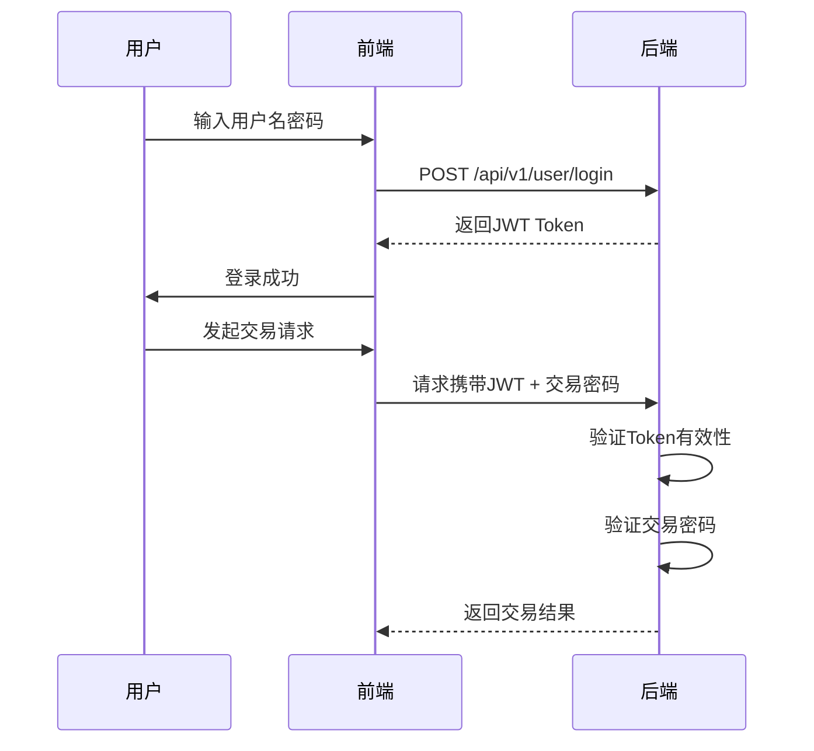

# 交易API接口规范

<cite>
**本文档引用的文件**  
- [trading.py](file://backend/app/api/v1/trading.py)
- [trading_service.py](file://backend/app/services/trading_service.py)
- [router.py](file://backend/app/api/v1/router.py)
- [deps.py](file://backend/app/api/deps.py)
- [response.py](file://backend/app/api/response.py)
- [user.py](file://backend/app/api/v1/user.py)
- [monitor_service.py](file://backend/app/services/monitor_service.py)
- [xttrader.md](file://xtquant/doc/xttrader.md)
- [xtconstant.py](file://xtquant/xtconstant.py)
- [miniqmt_interface.py](file://old/miniqmt_interface.py)
- [trading.js](file://frontend/src/api/trading.js)
</cite>

## 目录
1. [简介](#简介)
2. [认证机制](#认证机制)
3. [接口规范](#接口规范)
4. [错误码说明](#错误码说明)
5. [安全性与校验规则](#安全性与校验规则)
6. [调用频率限制](#调用频率限制)
7. [前端调用示例](#前端调用示例)

## 简介
本规范文档详细定义了量化交易平台中与交易相关的RESTful API接口，涵盖下单、撤单、查询持仓和资金等核心功能。所有接口均基于JWT身份验证，并结合交易密码进行二次确认，确保交易安全。

**Section sources**
- [trading.py](file://backend/app/api/v1/trading.py)
- [router.py](file://backend/app/api/v1/router.py)

## 认证机制
系统采用JWT（JSON Web Token）作为主要认证方式，用户登录后获取token，并在后续请求中通过Authorization头传递。同时，敏感操作需提供交易密码进行二次验证。



**Diagram sources**
- [user.py](file://backend/app/api/v1/user.py)
- [deps.py](file://backend/app/api/deps.py)

## 接口规范

### 下单接口
- **请求方法**: POST
- **URL路径**: `/api/v1/trading/order`
- **请求头**: 
  - `Authorization: Bearer <JWT Token>`
  - `Content-Type: application/json`
- **认证方式**: JWT + 交易密码
- **请求体结构**:
```json
{
  "stock_code": "600519",
  "volume": 100,
  "price": 1800.00,
  "order_type": "BUY",
  "trade_password": "交易密码"
}
```
- **字段说明**:
  - `stock_code`: 股票代码（字符串）
  - `volume`: 数量（整数，单位：股）
  - `price`: 价格（浮点数，单位：元）
  - `order_type`: 订单类型（BUY: 买入, SELL: 卖出）
  - `trade_password`: 交易密码（字符串）

- **响应格式**:
```json
{
  "code": 200,
  "message": "下单成功",
  "data": {
    "order_id": "202401010001",
    "status": "ORDER_REPORTED",
    "message": "已报"
  }
}
```

**Section sources**
- [trading.py](file://backend/app/api/v1/trading.py)
- [trading_service.py](file://backend/app/services/trading_service.py)

### 撤单接口
- **请求方法**: POST
- **URL路径**: `/api/v1/trading/cancel_order`
- **请求头**: 
  - `Authorization: Bearer <JWT Token>`
  - `Content-Type: application/json`
- **认证方式**: JWT + 交易密码
- **请求体结构**:
```json
{
  "order_id": "202401010001",
  "trade_password": "交易密码"
}
```
- **字段说明**:
  - `order_id`: 订单ID（字符串）
  - `trade_password`: 交易密码（字符串）

- **响应格式**:
```json
{
  "code": 200,
  "message": "撤单成功",
  "data": {
    "order_id": "202401010001",
    "status": "ORDER_CANCELED",
    "message": "已撤"
  }
}
```

**Section sources**
- [trading.py](file://backend/app/api/v1/trading.py)
- [trading_service.py](file://backend/app/services/trading_service.py)

### 查询持仓接口
- **请求方法**: GET
- **URL路径**: `/api/v1/trading/positions`
- **请求头**: 
  - `Authorization: Bearer <JWT Token>`
- **认证方式**: JWT
- **查询参数**:
  - `page`: 页码（可选，默认为1）
  - `page_size`: 每页数量（可选，默认为20）

- **响应格式**:
```json
{
  "code": 200,
  "message": "success",
  "data": {
    "account_info": {
      "account_id": "1000000365",
      "available_cash": 500000.00,
      "total_value": 1200000.00,
      "market_value": 700000.00,
      "frozen_cash": 20000.00,
      "positions_count": 3,
      "total_profit_loss": 150000.00,
      "connected": true
    },
    "positions": [
      {
        "stock_code": "600519",
        "stock_name": "贵州茅台",
        "quantity": 100,
        "cost_price": 1700.00,
        "current_price": 1800.00,
        "profit_loss": 10000.00,
        "profit_loss_pct": 5.88
      }
    ],
    "total_count": 1
  }
}
```

**Section sources**
- [monitor_service.py](file://backend/app/services/monitor_service.py)
- [xttrader.md](file://xtquant/doc/xttrader.md)

### 查询资金接口
- **请求方法**: GET
- **URL路径**: `/api/v1/trading/balance`
- **请求头**: 
  - `Authorization: Bearer <JWT Token>`
- **认证方式**: JWT
- **查询参数**: 无

- **响应格式**:
```json
{
  "code": 200,
  "message": "success",
  "data": {
    "current_balance": 500000.00,
    "enable_balance": 500000.00,
    "fetch_balance": 500000.00,
    "interest": 0.00,
    "asset_balance": 1200000.00,
    "fetch_cash": 500000.00,
    "market_value": 700000.00,
    "debt": 0.00
  }
}
```

**Section sources**
- [trading.py](file://backend/app/api/v1/trading.py)
- [xttrader.py](file://xtquant/xttrader.py)

## 错误码说明
| 错误码 | 含义 | 说明 |
|-------|------|------|
| -1 | 系统错误 | 服务器内部异常，无法完成请求 |
| -2 | 资金不足 | 账户可用资金不足以完成买入操作 |
| -3 | 持仓不足 | 当前持仓数量不足以完成卖出操作 |
| -4 | 交易时间限制 | 非交易时段或T+1限制导致无法交易 |
| -5 | 订单不存在 | 指定的订单ID在系统中不存在 |
| -6 | 交易密码错误 | 提供的交易密码不正确 |
| -7 | 风控校验失败 | 触发风险控制规则，交易被拒绝 |

**Section sources**
- [miniqmt_interface.py](file://old/miniqmt_interface.py)
- [trading_service.py](file://backend/app/services/trading_service.py)

## 安全性与校验规则
### 安全性验证流程
1. 所有交易类接口必须携带有效的JWT Token
2. 下单和撤单操作必须提供交易密码进行二次确认
3. 敏感操作记录日志并保留审计轨迹
4. 交易密码传输需加密处理

### 前后端数据校验规则
#### 前端校验
- 股票代码格式校验（6位数字）
- 交易数量必须为正整数且为100的倍数（A股）
- 交易价格必须大于0且符合涨跌停限制
- 交易密码长度不少于6位

#### 后端校验
- JWT Token有效性验证
- 用户权限校验
- 账户连接状态检查
- 实时资金与持仓验证
- 交易时间合规性检查
- 防重放攻击机制

**Section sources**
- [deps.py](file://backend/app/api/deps.py)
- [security.py](file://backend/app/core/security.py)
- [miniqmt_interface.py](file://old/miniqmt_interface.py)

## 调用频率限制
为防止滥用和保障系统稳定性，对交易相关接口实施以下调用频率限制：

| 接口 | 限制规则 | 备注 |
|------|---------|------|
| 下单接口 | 每分钟最多10次 | 防止高频刷单 |
| 撤单接口 | 每分钟最多10次 | 防止恶意撤单 |
| 查询持仓 | 每秒最多2次 | 保障数据一致性 |
| 查询资金 | 每秒最多2次 | 保障数据一致性 |

超过限制将返回HTTP 429状态码及相应错误信息。

**Section sources**
- [trading.py](file://backend/app/api/v1/trading.py)
- [trading_service.py](file://backend/app/services/trading_service.py)

## 前端调用示例
```javascript
// 下单请求示例
export function placeOrder(data) {
  return request({
    url: '/api/v1/trading/order',
    method: 'post',
    data
  })
}

// 撤单请求示例
export function cancelOrder(data) {
  return request({
    url: '/api/v1/trading/cancel_order',
    method: 'post',
    data
  })
}

// 查询持仓
export function getPositions(params) {
  return request({
    url: '/api/v1/trading/positions',
    method: 'get',
    params
  })
}

// 查询资金
export function getBalance() {
  return request({
    url: '/api/v1/trading/balance',
    method: 'get'
  })
}
```

**Section sources**
- [trading.js](file://frontend/src/api/trading.js)
- [request.js](file://frontend/src/utils/request.js)