# 交易风险控制与安全机制

<cite>
**本文档引用文件**  
- [security.py](file://backend/app/core/security.py)
- [user.py](file://backend/app/api/v1/user.py)
- [config.py](file://backend/app/config.py)
- [trading.py](file://backend/app/api/v1/trading.py)
- [qmt_service.py](file://backend/app/services/qmt_service.py)
- [login.vue](file://frontend/src/views/login/index.vue)
- [auth.js](file://frontend/src/utils/auth.js)
- [request.js](file://frontend/src/utils/request.js)
- [user.js](file://frontend/src/store/modules/user.js)
- [FunTrader.lua](file://xtquant/config/user/root2/lua/FunTrader.lua)
</cite>

## 目录
1. [引言](#引言)
2. [交易密码安全机制](#交易密码安全机制)
3. [身份认证与权限控制](#身份认证与权限控制)
4. [前端敏感操作安全设计](#前端敏感操作安全设计)
5. [后端交易权限验证](#后端交易权限验证)
6. [交易风控规则实现](#交易风控规则实现)
7. [日志审计功能](#日志审计功能)
8. [系统架构与数据流](#系统架构与数据流)
9. [结论](#结论)

## 引言
本系统为AI驱动的股票分析与交易系统，集成了智能选股、实时监测、量化交易等功能。系统采用前后端分离架构，前端基于Vue.js框架，后端采用FastAPI框架，通过MiniQMT接口与券商交易系统对接。系统特别注重交易安全与风险控制，建立了多层次的安全防护体系，包括密码加密存储、JWT令牌认证、权限控制、交易风控等机制，确保用户资产安全和系统稳定运行。

## 交易密码安全机制

### 密码加密存储
系统采用bcrypt算法对用户交易密码进行哈希加密存储，确保即使数据库泄露，攻击者也无法轻易获取原始密码。bcrypt是一种自适应哈希函数，具有盐值（salt）和成本因子（cost factor）特性，能够有效抵御彩虹表攻击和暴力破解。

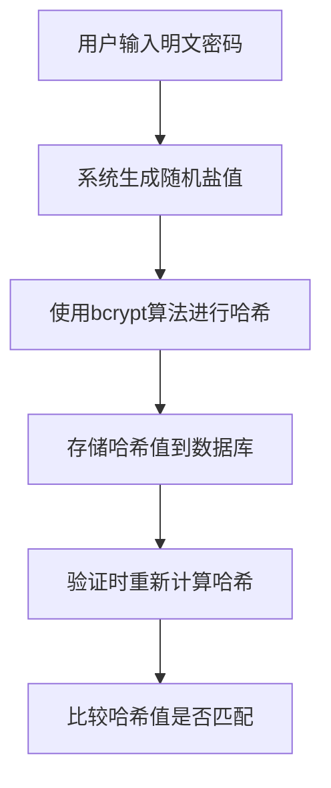

**图示来源**
- [security.py](file://backend/app/core/security.py#L13)

### HTTPS安全传输
系统通过HTTPS协议进行数据传输，确保用户密码等敏感信息在传输过程中不被窃听或篡改。前端与后端之间的所有通信都经过TLS加密，包括登录认证、交易指令等关键操作。

### 密码策略
系统实施基本的密码强度策略，要求用户密码长度不少于6位。前端在用户输入密码时进行实时验证，确保密码符合安全要求。

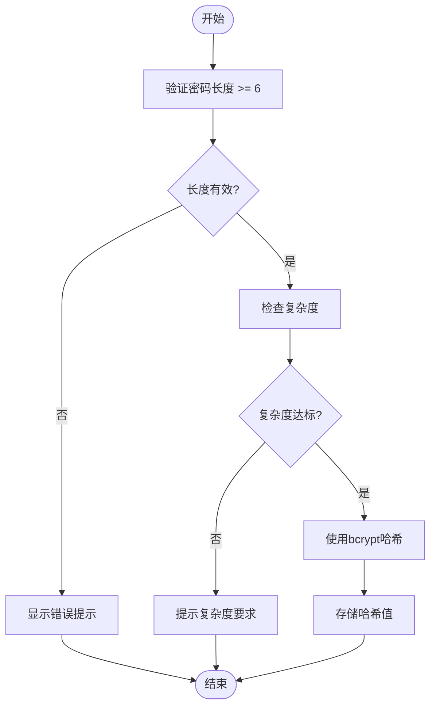

**图示来源**
- [login.vue](file://frontend/src/views/login/index.vue#L69-L70)

## 身份认证与权限控制

### JWT令牌验证流程
系统采用JSON Web Token（JWT）进行身份认证，实现无状态的会话管理。JWT令牌包含用户身份信息和过期时间，通过数字签名确保令牌的完整性和真实性。

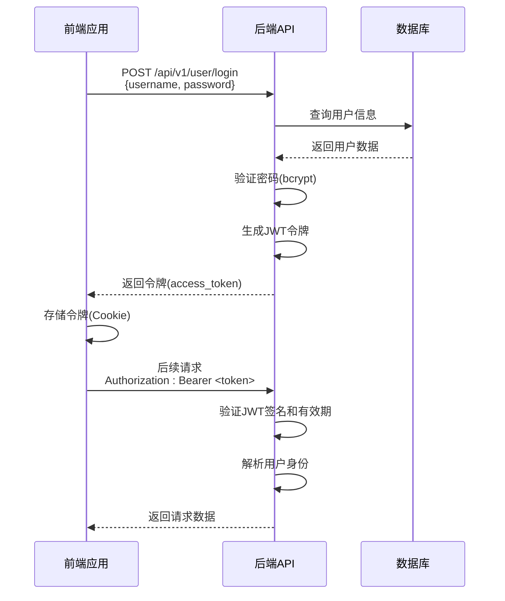

**图示来源**
- [security.py](file://backend/app/core/security.py#L17-L26)
- [user.py](file://backend/app/api/v1/user.py#L15-L24)

### 权限控制策略
系统实现了基于角色的访问控制（RBAC），不同用户角色拥有不同的操作权限。当前系统主要支持管理员角色，未来可扩展更多角色类型。

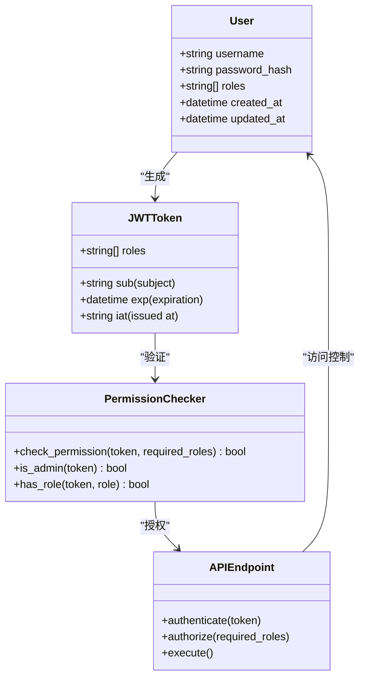

**图示来源**
- [user.py](file://backend/app/api/v1/user.py#L27-L34)
- [security.py](file://backend/app/core/security.py#L14)

## 前端敏感操作安全设计

### 二次确认机制
在执行下单、撤单等敏感交易操作时，系统实施二次确认机制，防止用户误操作。用户需要在确认对话框中再次确认操作意图，才能执行交易指令。

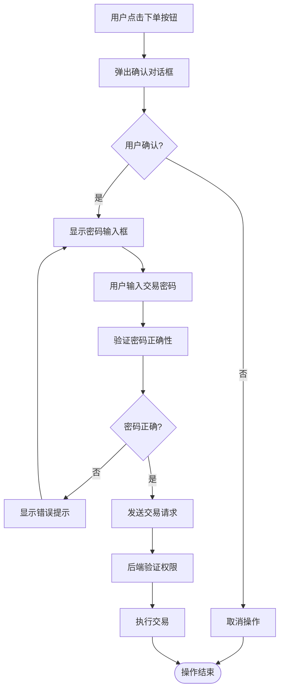

### 密码输入框安全设计
前端密码输入框采用安全设计，包括密码可见性切换功能，允许用户在输入时临时查看密码内容，减少输入错误。同时，密码输入框具有输入验证功能，确保密码符合安全要求。

```mermaid
classDiagram
class PasswordInput {
-string passwordValue
-boolean passwordVisible
+toggleVisibility() void
+validateLength() boolean
+validateComplexity() boolean
+onInput(event) void
+onBlur() void
}
class LoginForm {
+loginForm : {username, password}
+loginRules : ValidationRules
+handleLogin() void
+showPwd() void
}
PasswordInput --> LoginForm : "集成"
LoginForm --> PasswordInput : "调用"
```

**图示来源**
- [login.vue](file://frontend/src/views/login/index.vue#L40-L107)

## 后端交易权限验证

### 用户身份验证
后端通过JWT令牌验证用户身份，确保每个请求都来自合法用户。API端点使用OAuth2PasswordBearer依赖项自动验证令牌的有效性。

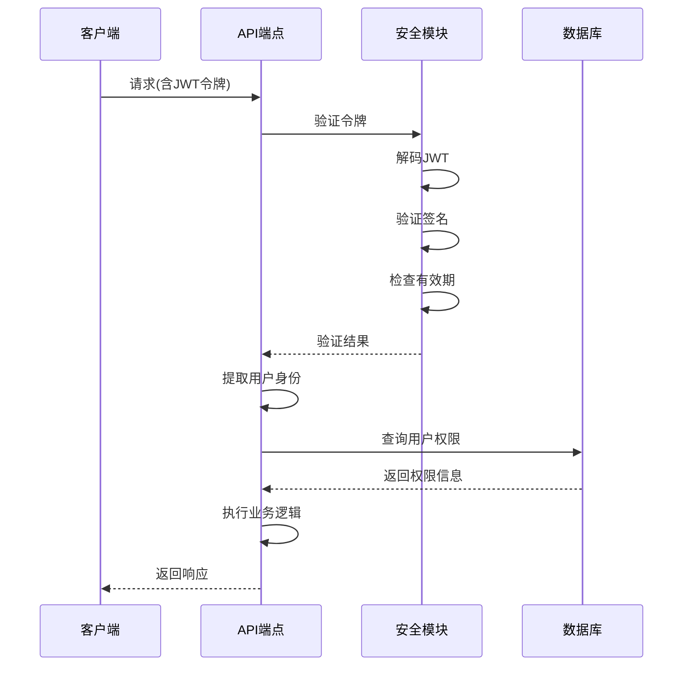

**图示来源**
- [user.py](file://backend/app/api/v1/user.py#L27-L34)
- [security.py](file://backend/app/core/security.py#L14)

### 交易权限控制
系统在执行交易操作前，会验证用户是否具有相应的交易权限。这包括账户状态检查、资金余额验证、持仓数量确认等，防止越权操作和异常交易。

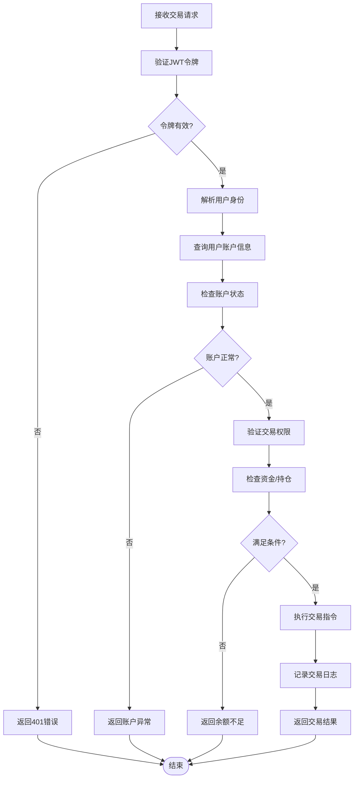

## 交易风控规则实现

### 交易额度限制
系统实施交易额度限制，控制单笔交易和累计交易的金额上限，防止异常大额交易。额度限制可根据用户风险等级动态调整。

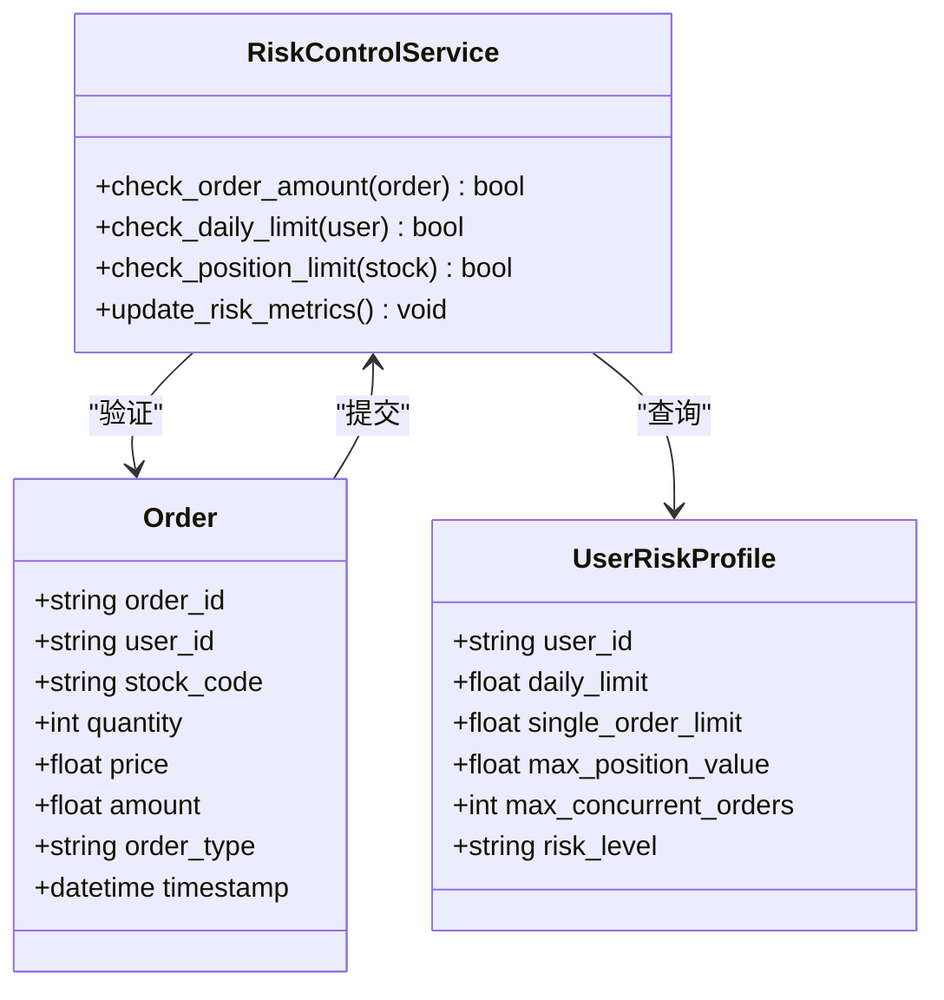

### 频率控制
系统实施交易频率控制，限制单位时间内的交易次数，防止高频交易和自动化脚本攻击。频率控制基于滑动窗口算法实现，确保交易行为的合理性。

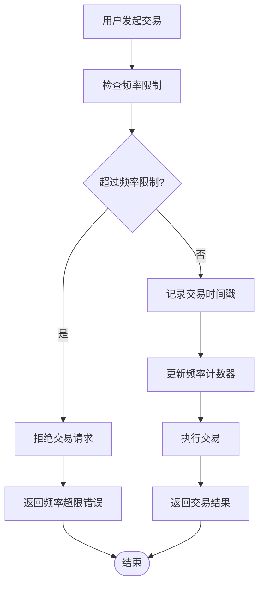

### 黑名单监控
系统维护交易黑名单，监控异常交易行为。当检测到可疑模式时，自动将相关账户加入黑名单，限制其交易权限，直至风险解除。

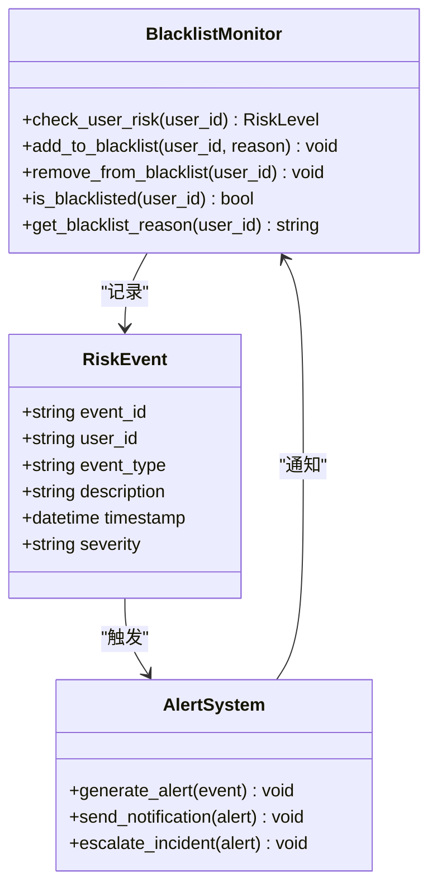

**图示来源**
- [qmt_service.py](file://backend/app/services/qmt_service.py#L508-L543)

## 日志审计功能

### 交易日志记录
系统详细记录所有交易请求的关键信息，包括IP地址、时间戳、操作类型、用户身份等，便于事后追溯和审计分析。

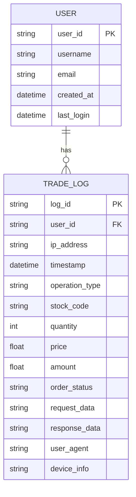

### 审计信息内容
交易日志记录以下关键信息：
- **IP地址**：记录请求来源的IP地址，用于追踪用户地理位置和网络环境
- **时间戳**：精确记录交易请求的时间，精确到毫秒
- **操作类型**：记录具体的操作类型，如下单、撤单、查询等
- **用户身份**：记录执行操作的用户ID和角色
- **设备信息**：记录用户使用的设备类型和浏览器信息
- **请求参数**：记录完整的请求参数，用于复现操作
- **响应结果**：记录服务器返回的结果和状态码

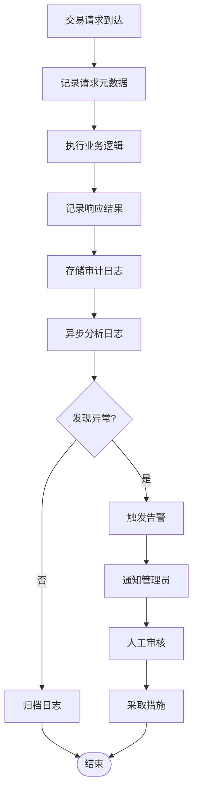

**图示来源**
- [trading.py](file://backend/app/api/v1/trading.py#L26-L36)

## 系统架构与数据流

### 整体架构
系统采用分层架构设计，包括前端展示层、API网关层、业务逻辑层和数据访问层，各层之间通过明确定义的接口进行通信。

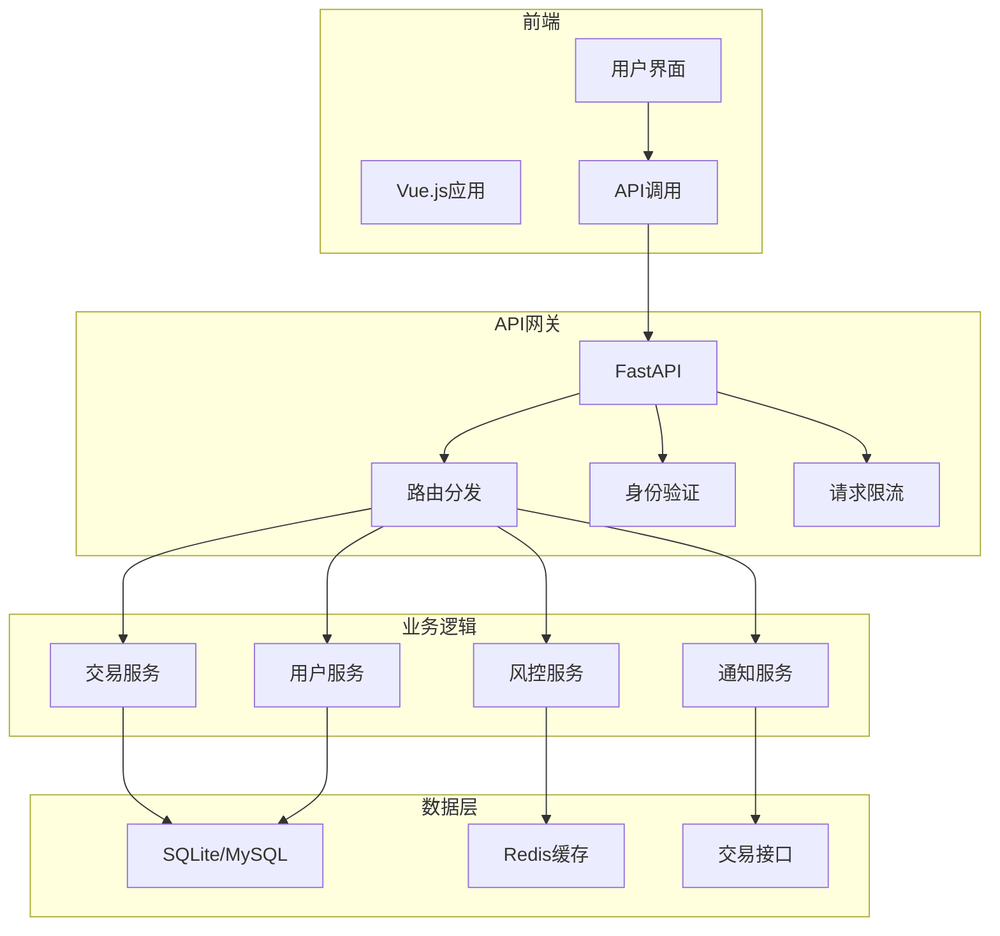

### 数据流分析
交易指令从用户发起，经过多层安全验证和风控检查，最终通过MiniQMT接口发送到券商交易系统。

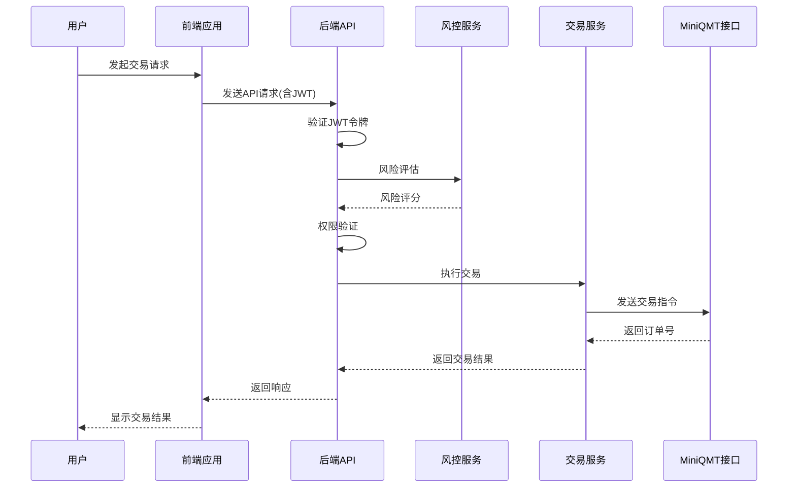

## 结论
本系统建立了全面的交易风险控制与安全机制，涵盖了密码安全、身份认证、权限控制、交易风控和日志审计等多个方面。通过bcrypt哈希算法确保密码存储安全，JWT令牌实现无状态的身份认证，多层次的权限控制防止越权操作。前端实施二次确认机制和密码输入安全设计，后端通过严格的权限验证和风控规则确保交易安全。系统详细记录所有交易日志，支持完整的审计追溯。整体安全体系设计合理，能够有效保护用户资产安全，防范各类交易风险。