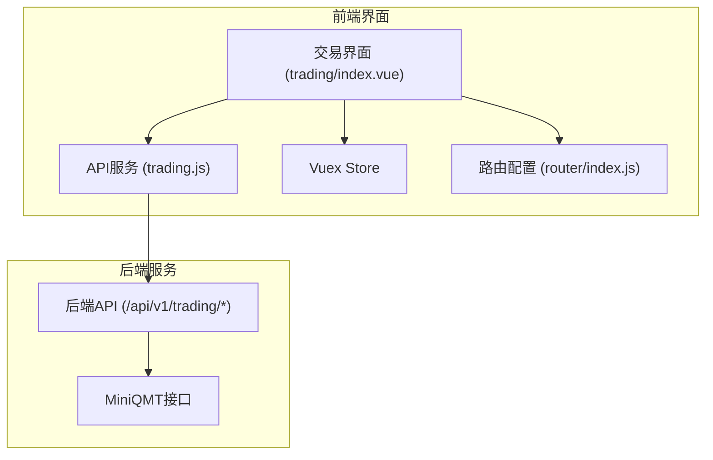
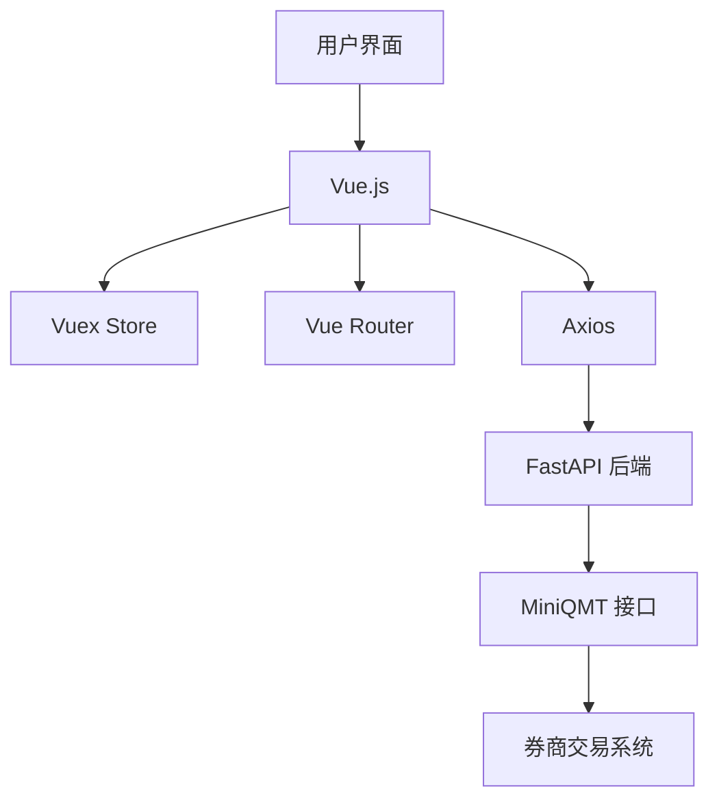
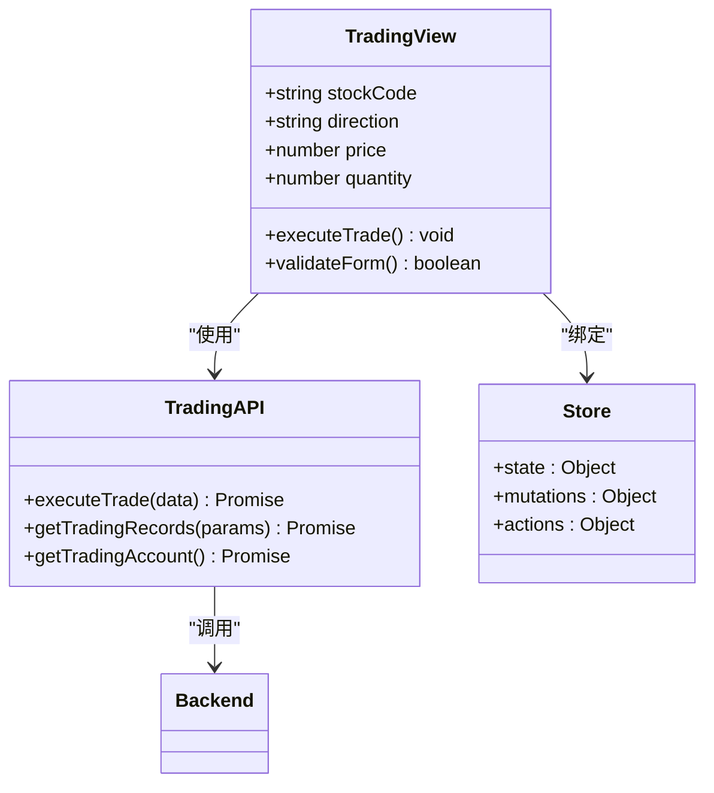
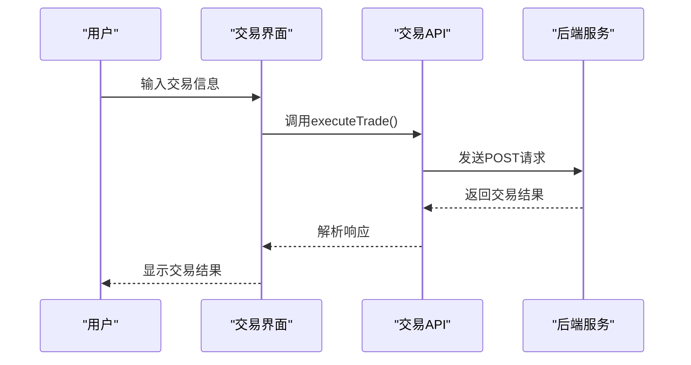
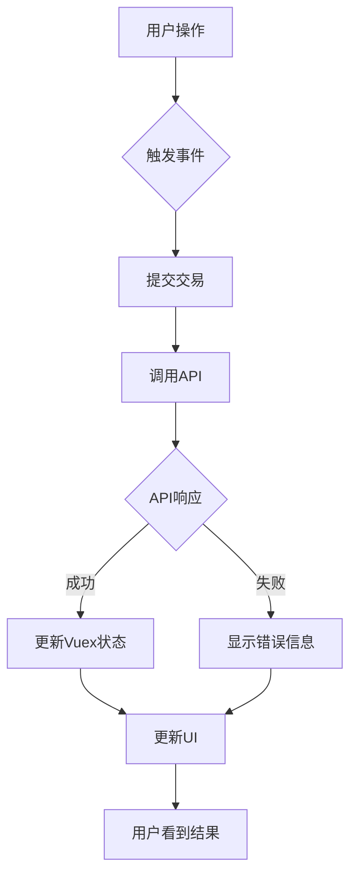
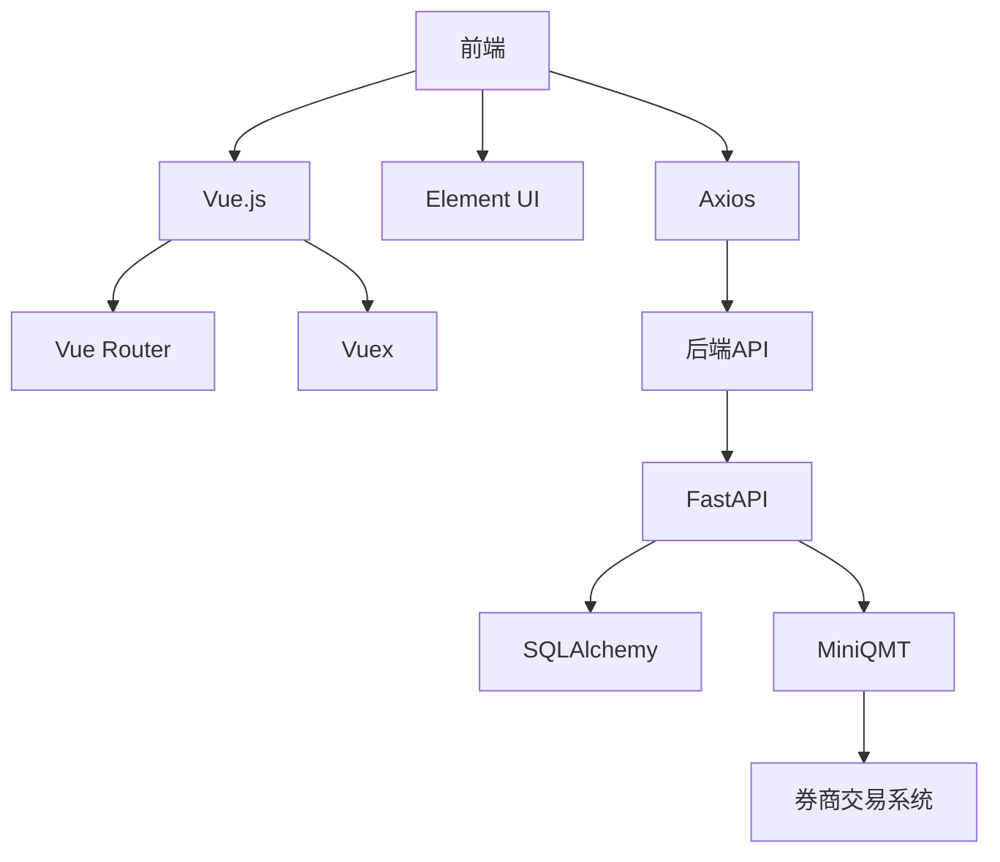
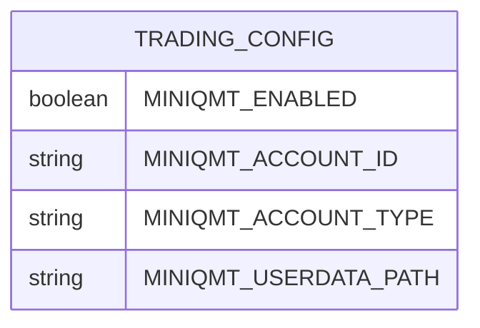

# 前端交易界面操作指南

<cite>
**本文档引用的文件**   
- [index.vue](file://frontend\src\views\trading\index.vue)
- [trading.js](file://frontend\src\api\trading.js)
- [request.js](file://frontend\src\utils\request.js)
- [stock.js](file://frontend\src\api\stock.js)
- [config.js](file://frontend\src\api\config.js)
- [index.js](file://frontend\src\router\index.js)
- [index.vue](file://frontend\src\views\config\index.vue)
- [miniqmt_interface.py](file://old\miniqmt_interface.py)
</cite>

## 目录
1. [简介](#简介)
2. [项目结构](#项目结构)
3. [核心组件](#核心组件)
4. [架构概述](#架构概述)
5. [详细组件分析](#详细组件分析)
6. [依赖分析](#依赖分析)
7. [性能考虑](#性能考虑)
8. [故障排除指南](#故障排除指南)
9. [结论](#结论)
10. [附录](#附录)（如有必要）

## 简介
本文档系统化描述前端交易界面的功能布局与用户操作流程。说明界面如何通过trading.js调用后端API完成交易指令提交，包括表单输入验证、交易密码弹窗、确认对话框等交互细节。解释UI状态管理机制（如加载中、成功提示、错误反馈）与Vuex store的集成方式。提供关键代码片段，展示Vue组件如何绑定数据模型并响应用户事件。指导用户完成股票代码输入、买卖方向选择、价格与数量设置、一键下单等操作，并说明界面如何实时更新持仓变化与订单状态。

## 项目结构
根据项目结构分析，前端交易界面主要位于`frontend/src/views/trading/`目录下，其核心文件为`index.vue`。该界面通过`frontend/src/api/trading.js`文件与后端API进行通信。系统的路由配置在`frontend/src/router/index.js`中定义，Vuex状态管理在`frontend/src/store/`目录下实现。交易功能与系统其他模块（如股票分析、持仓管理、AI盯盘等）紧密集成，形成一个完整的量化交易系统。

**Diagram sources**
- [index.vue](file://frontend\src\views\trading\index.vue)
- [trading.js](file://frontend\src\api\trading.js)
- [index.js](file://frontend\src\router\index.js)

**Section sources**
- [index.vue](file://frontend\src\views\trading\index.vue)
- [trading.js](file://frontend\src\api\trading.js)
- [index.js](file://frontend\src\router\index.js)

## 核心组件
前端交易界面的核心组件包括交易表单、状态管理、API通信和用户交互。交易表单负责收集用户输入的股票代码、买卖方向、价格和数量等信息。状态管理通过Vuex store实现，确保UI状态与数据模型同步。API通信通过`trading.js`文件中的`executeTrade`函数实现，该函数封装了与后端API的交互逻辑。用户交互包括表单验证、交易密码弹窗、确认对话框等，确保交易的安全性和用户体验。

**Section sources**
- [index.vue](file://frontend\src\views\trading\index.vue)
- [trading.js](file://frontend\src\api\trading.js)
- [request.js](file://frontend\src\utils\request.js)

## 架构概述
系统采用前后端分离的架构，前端使用Vue.js框架，后端使用FastAPI框架。前端通过Axios库与后端API进行通信，后端通过MiniQMT接口与券商交易系统对接。Vuex用于管理前端应用的状态，Vue Router用于管理页面路由。整个系统通过RESTful API进行数据交换，确保了系统的可扩展性和可维护性。

**Diagram sources**
- [trading.js](file://frontend\src\api\trading.js)
- [request.js](file://frontend\src\utils\request.js)
- [miniqmt_interface.py](file://old\miniqmt_interface.py)

## 详细组件分析
### 交易界面分析
交易界面目前处于开发阶段，其基本结构已经定义。界面包含一个简单的标题和开发中提示。根据系统其他部分的实现，可以推断出该界面将包含股票代码输入、买卖方向选择、价格与数量设置、一键下单等功能。

**Diagram sources**
- [index.vue](file://frontend\src\views\trading\index.vue)
- [trading.js](file://frontend\src\api\trading.js)
- [store](file://frontend\src\store\)

**Section sources**
- [index.vue](file://frontend\src\views\trading\index.vue)
- [trading.js](file://frontend\src\api\trading.js)

### API通信分析
API通信通过`frontend/src/api/trading.js`文件实现，该文件导出了三个主要函数：`getTradingRecords`、`executeTrade`和`getTradingAccount`。这些函数使用`request`库（封装了Axios）向后端API发送HTTP请求。`executeTrade`函数用于提交交易指令，是交易流程的核心。

**Diagram sources**
- [trading.js](file://frontend\src\api\trading.js)
- [request.js](file://frontend\src\utils\request.js)

**Section sources**
- [trading.js](file://frontend\src\api\trading.js)
- [request.js](file://frontend\src\utils\request.js)

### 状态管理分析
状态管理通过Vuex实现，但目前的`stock.js`模块仅包含基本的分析列表和当前分析状态。随着交易功能的开发，预计会添加更多的状态管理逻辑，如交易记录、账户信息、持仓数据等。

**Diagram sources**
- [stock.js](file://frontend\src\store\modules\stock.js)
- [request.js](file://frontend\src\utils\request.js)

**Section sources**
- [stock.js](file://frontend\src\store\modules\stock.js)
- [request.js](file://frontend\src\utils\request.js)

## 依赖分析
系统依赖关系复杂，前端依赖Vue.js、Element UI、Axios等库，后端依赖FastAPI、SQLAlchemy、MiniQMT等。前端与后端通过RESTful API进行通信，后端通过MiniQMT接口与券商交易系统对接。这种架构确保了系统的模块化和可扩展性。

**Diagram sources**
- [package.json](file://frontend\package.json)
- [requirements.txt](file://backend\requirements.txt)
- [miniqmt_interface.py](file://old\miniqmt_interface.py)

**Section sources**
- [package.json](file://frontend\package.json)
- [requirements.txt](file://backend\requirements.txt)
- [miniqmt_interface.py](file://old\miniqmt_interface.py)

## 性能考虑
系统性能主要受网络延迟、API响应时间和前端渲染速度影响。为了提高性能，建议采用以下措施：
1. 使用WebSocket实现实时数据推送，减少轮询带来的网络开销。
2. 对API响应进行缓存，减少重复请求。
3. 优化前端组件的渲染性能，避免不必要的重渲染。
4. 使用CDN加速静态资源的加载。

## 故障排除指南
当交易功能出现问题时，可以按照以下步骤进行排查：
1. 检查网络连接是否正常。
2. 检查后端API是否正常运行。
3. 检查MiniQMT接口是否正常连接。
4. 检查交易参数是否正确。
5. 查看浏览器控制台和后端日志，获取详细的错误信息。

**Section sources**
- [request.js](file://frontend\src\utils\request.js)
- [miniqmt_interface.py](file://old\miniqmt_interface.py)

## 结论
前端交易界面是整个量化交易系统的重要组成部分，它连接了用户与后端交易系统。虽然目前该界面还处于开发阶段，但其架构设计合理，功能明确。随着开发的深入，该界面将实现完整的交易功能，为用户提供便捷、安全的交易体验。

## 附录
### 交易配置说明
在使用交易功能前，需要在系统配置中启用MiniQMT量化交易，并填写正确的账户信息。配置项包括：
- **启用MiniQMT量化交易**：是否启用MiniQMT接口。
- **账户**：交易账户ID。
- **账户类型**：股票账户（STOCK）或信用账户（CREDIT）。
- **用户数据地址**：MiniQMT用户数据目录的绝对路径。

**Diagram sources**
- [index.vue](file://frontend\src\views\config\index.vue)
- [miniqmt_interface.py](file://old\miniqmt_interface.py)

**Section sources**
- [index.vue](file://frontend\src\views\config\index.vue)
- [miniqmt_interface.py](file://old\miniqmt_interface.py)