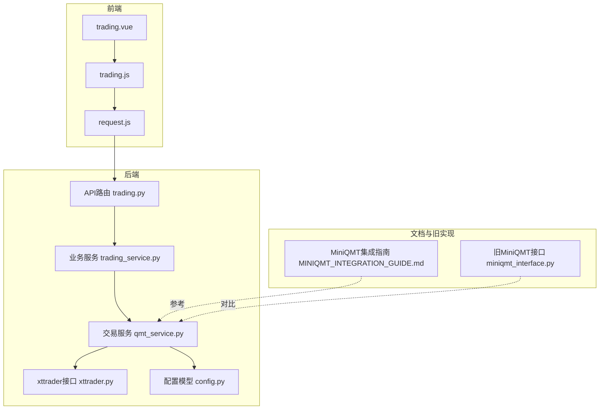
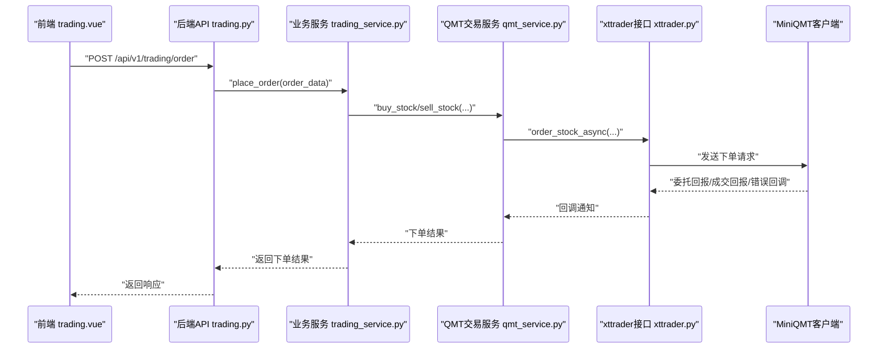
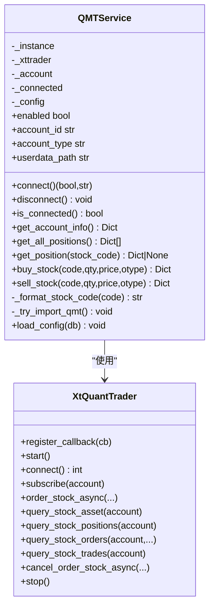
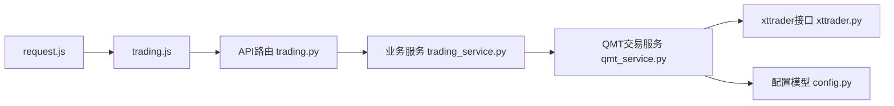

# 量化交易集成

<cite>
**本文引用的文件**
- [qmt_service.py](file://backend/app/services/qmt_service.py)
- [xttrader.py](file://xtquant/xttrader.py)
- [trading.py](file://backend/app/api/v1/trading.py)
- [trading_service.py](file://backend/app/services/trading_service.py)
- [index.vue](file://frontend/src/views/trading/index.vue)
- [trading.js](file://frontend/src/api/trading.js)
- [request.js](file://frontend/src/utils/request.js)
- [config.py](file://backend/app/models/config.py)
- [MINIQMT_INTEGRATION_GUIDE.md](file://docs/MINIQMT_INTEGRATION_GUIDE.md)
- [miniqmt_interface.py](file://old/miniqmt_interface.py)
- [security.py](file://backend/app/core/security.py)
- [exceptions.py](file://backend/app/core/exceptions.py)
</cite>

## 目录
1. [简介](#简介)
2. [项目结构](#项目结构)
3. [核心组件](#核心组件)
4. [架构总览](#架构总览)
5. [详细组件分析](#详细组件分析)
6. [依赖关系分析](#依赖关系分析)
7. [性能考虑](#性能考虑)
8. [故障排查指南](#故障排查指南)
9. [结论](#结论)
10. [附录](#附录)

## 简介
本文件系统化梳理了量化交易集成能力，重点说明与MiniQMT平台的对接机制。内容覆盖：
- 后端服务层如何通过xtquant提供的xttrader接口实现交易指令发送、账户查询、订单管理等；
- 前端交易界面（trading.vue）的操作流程与安全控制（如交易密码校验思路）；
- API接口规范（下单、撤单、查询持仓等）；
- 异常处理机制（网络中断、交易拒绝）与日志记录策略；
- QMT环境配置与API密钥绑定指引。

## 项目结构
围绕量化交易的关键文件分布如下：
- 后端服务层：qmt_service.py负责MiniQMT连接与交易；trading_service.py提供业务服务封装；trading.py定义对外API路由。
- 前端：trading.vue承载交易视图；trading.js封装交易相关HTTP请求；request.js统一拦截器与鉴权。
- xtquant SDK：xttrader.py提供xttrader/XtQuantTrader/XtQuantTraderCallback等核心接口。
- 文档：MINIQMT_INTEGRATION_GUIDE.md提供MiniQMT集成与使用指南。
- 安全与异常：security.py提供JWT与密码工具；exceptions.py提供通用异常类型。

图表来源
- [trading.py](file://backend/app/api/v1/trading.py#L1-L53)
- [trading_service.py](file://backend/app/services/trading_service.py#L1-L29)
- [qmt_service.py](file://backend/app/services/qmt_service.py#L1-L591)
- [xttrader.py](file://xtquant/xttrader.py#L120-L800)
- [config.py](file://backend/app/models/config.py#L1-L21)
- [trading.js](file://frontend/src/api/trading.js#L1-L29)
- [request.js](file://frontend/src/utils/request.js#L1-L95)
- [MINIQMT_INTEGRATION_GUIDE.md](file://docs/MINIQMT_INTEGRATION_GUIDE.md#L1-L258)
- [miniqmt_interface.py](file://old/miniqmt_interface.py#L1-L765)

章节来源
- [trading.py](file://backend/app/api/v1/trading.py#L1-L53)
- [trading_service.py](file://backend/app/services/trading_service.py#L1-L29)
- [qmt_service.py](file://backend/app/services/qmt_service.py#L1-L591)
- [xttrader.py](file://xtquant/xttrader.py#L120-L800)
- [config.py](file://backend/app/models/config.py#L1-L21)
- [trading.js](file://frontend/src/api/trading.js#L1-L29)
- [request.js](file://frontend/src/utils/request.js#L1-L95)
- [MINIQMT_INTEGRATION_GUIDE.md](file://docs/MINIQMT_INTEGRATION_GUIDE.md#L1-L258)
- [miniqmt_interface.py](file://old/miniqmt_interface.py#L1-L765)

## 核心组件
- QMT交易服务（qmt_service.py）
  - 单例封装MiniQMT连接与交易能力，提供账户查询、持仓查询、买入、卖出、连接管理等。
  - 通过xtquant的xttrader接口与MiniQMT交互，支持异步下单与回调。
- xttrader接口（xttrader.py）
  - 提供XtQuantTrader/XtQuantTraderCallback等核心类，封装连接、订阅、下单、撤单、查询、回调等。
- API路由与服务（trading.py、trading_service.py）
  - 定义交易相关API与业务服务封装，当前实现为占位，后续可接入QMT服务。
- 前端交易界面与请求（trading.vue、trading.js、request.js）
  - 前端交易页面占位；trading.js封装交易相关HTTP请求；request.js统一注入Authorization头与错误处理。
- 配置模型（config.py）
  - 提供键值型配置表，用于存储MiniQMT相关配置项。
- MiniQMT集成指南（MINIQMT_INTEGRATION_GUIDE.md）
  - 提供MiniQMT环境配置、连接、下单、撤单、策略执行等使用说明。
- 旧MiniQMT接口（miniqmt_interface.py）
  - 提供完整的MiniQMT接口实现示例，便于对照与迁移。

章节来源
- [qmt_service.py](file://backend/app/services/qmt_service.py#L1-L591)
- [xttrader.py](file://xtquant/xttrader.py#L120-L800)
- [trading.py](file://backend/app/api/v1/trading.py#L1-L53)
- [trading_service.py](file://backend/app/services/trading_service.py#L1-L29)
- [config.py](file://backend/app/models/config.py#L1-L21)
- [MINIQMT_INTEGRATION_GUIDE.md](file://docs/MINIQMT_INTEGRATION_GUIDE.md#L1-L258)
- [miniqmt_interface.py](file://old/miniqmt_interface.py#L1-L765)

## 架构总览
后端通过FastAPI提供交易API，业务服务层调用QMT交易服务，QMT交易服务再通过xttrader接口与MiniQMT通信。前端通过trading.js发起请求，request.js统一处理鉴权与错误。

图表来源
- [trading.py](file://backend/app/api/v1/trading.py#L1-L53)
- [trading_service.py](file://backend/app/services/trading_service.py#L1-L29)
- [qmt_service.py](file://backend/app/services/qmt_service.py#L403-L563)
- [xttrader.py](file://xtquant/xttrader.py#L450-L553)

## 详细组件分析

### QMT交易服务（qmt_service.py）
- 连接管理
  - 通过XtQuantTrader创建会话、注册回调、启动线程、建立连接、订阅账户。
  - 支持断开连接与连接状态检查。
- 账户查询
  - 通过query_stock_asset获取资金信息，并汇总总浮动盈亏。
- 持仓查询
  - 通过query_stock_positions获取持仓列表，补充股票名称、当前价、持仓天数、盈亏等。
- 交易下单
  - 买入：校验数量（A股100股/手）、构造完整股票代码、选择报价类型、异步下单。
  - 卖出：校验可卖数量、T+1限制、异步下单。
- 辅助功能
  - 股票代码格式化（补齐市场后缀）。
  - 配置加载（从数据库AppConfig表读取MiniQMT相关配置）。

图表来源
- [qmt_service.py](file://backend/app/services/qmt_service.py#L1-L591)
- [xttrader.py](file://xtquant/xttrader.py#L120-L800)

章节来源
- [qmt_service.py](file://backend/app/services/qmt_service.py#L1-L591)
- [xttrader.py](file://xtquant/xttrader.py#L120-L800)

### xttrader接口（xttrader.py）
- 关键能力
  - XtQuantTraderCallback：连接断开、委托回报、成交回报、错误回调等。
  - XtQuantTrader：连接、启动、订阅、下单（异步/同步）、撤单、查询资产/持仓/订单/成交等。
- 回调与异步
  - 通过回调类接收推送事件，支持异步下单与撤单响应。
- 常量与类型
  - 通过xtconstant/xttype等模块提供订单类型、账户类型等常量与类型定义。

章节来源
- [xttrader.py](file://xtquant/xttrader.py#L23-L120)
- [xttrader.py](file://xtquant/xttrader.py#L120-L800)

### API与业务服务（trading.py、trading_service.py）
- API路由
  - 定义交易状态查询、下单、订单列表等接口。
- 业务服务
  - 当前为占位实现，后续可直接调用QMT交易服务完成下单、查询等。

章节来源
- [trading.py](file://backend/app/api/v1/trading.py#L1-L53)
- [trading_service.py](file://backend/app/services/trading_service.py#L1-L29)

### 前端交易界面与请求（trading.vue、trading.js、request.js）
- trading.vue
  - 当前为占位页面，后续可扩展交易表单、订单列表、账户信息展示等。
- trading.js
  - 封装交易记录查询、执行交易、获取账户信息等HTTP请求。
- request.js
  - 统一注入Authorization Bearer令牌，处理响应状态与错误提示。

章节来源
- [index.vue](file://frontend/src/views/trading/index.vue#L1-L14)
- [trading.js](file://frontend/src/api/trading.js#L1-L29)
- [request.js](file://frontend/src/utils/request.js#L1-L95)

### MiniQMT集成指南（MINIQMT_INTEGRATION_GUIDE.md）
- 环境配置
  - 提供环境变量与代码配置两种方式，包含启用开关、账户ID、服务地址与端口等。
- 使用流程
  - 安装MiniQMT、启用量化功能、添加监测股票、监控执行等。
- 接口说明
  - 提供MiniQMTInterface类的主要方法与策略信号执行说明。

章节来源
- [MINIQMT_INTEGRATION_GUIDE.md](file://docs/MINIQMT_INTEGRATION_GUIDE.md#L1-L258)

### 旧MiniQMT接口（miniqmt_interface.py）
- 完整实现
  - 包含连接、断开、账户信息、持仓、下单、撤单、策略信号执行、仓位计算、风控指标等。
- 对比价值
  - 可作为qmt_service.py的实现参考，便于迁移与对齐。

章节来源
- [miniqmt_interface.py](file://old/miniqmt_interface.py#L1-L765)

## 依赖关系分析
- 组件耦合
  - trading.py依赖trading_service.py；trading_service.py依赖qmt_service.py；qmt_service.py依赖xttrader.py。
- 外部依赖
  - MiniQMT客户端（xttrader接口）、xtquant SDK、FastAPI、前端Axios。
- 配置依赖
  - QMT配置来源于数据库AppConfig表，键包括MINIQMT_ENABLED、MINIQMT_ACCOUNT_ID、MINIQMT_ACCOUNT_TYPE、MINIQMT_USERDATA_PATH等。

图表来源
- [trading.py](file://backend/app/api/v1/trading.py#L1-L53)
- [trading_service.py](file://backend/app/services/trading_service.py#L1-L29)
- [qmt_service.py](file://backend/app/services/qmt_service.py#L1-L591)
- [xttrader.py](file://xtquant/xttrader.py#L120-L800)
- [config.py](file://backend/app/models/config.py#L1-L21)
- [trading.js](file://frontend/src/api/trading.js#L1-L29)
- [request.js](file://frontend/src/utils/request.js#L1-L95)

章节来源
- [trading.py](file://backend/app/api/v1/trading.py#L1-L53)
- [trading_service.py](file://backend/app/services/trading_service.py#L1-L29)
- [qmt_service.py](file://backend/app/services/qmt_service.py#L1-L591)
- [xttrader.py](file://xtquant/xttrader.py#L120-L800)
- [config.py](file://backend/app/models/config.py#L1-L21)
- [trading.js](file://frontend/src/api/trading.js#L1-L29)
- [request.js](file://frontend/src/utils/request.js#L1-L95)

## 性能考虑
- 异步下单与回调
  - 使用order_stock_async避免阻塞主线程，通过回调接收回报，提升吞吐与稳定性。
- 事件循环与线程池
  - XtQuantTrader内部维护事件循环与线程池，确保回调处理与响应顺序。
- 日志与监控
  - 建议在qmt_service.py中完善日志级别与上下文信息，便于定位性能瓶颈与异常。

[本节为通用建议，不直接分析具体文件]

## 故障排查指南
- 连接失败
  - 检查MiniQMT客户端是否启动、账户是否登录、账户ID与用户数据路径是否正确。
- 下单失败
  - 检查资金是否充足、股票代码格式、交易时间、数量是否为100的整数倍、T+1限制。
- 网络中断/回调丢失
  - 关注xttrader的回调类on_disconnected/on_order_error/on_cancel_error等，必要时重连。
- 响应超时
  - 调整超时参数或优化下单频率，避免频繁请求导致堆积。
- 日志定位
  - 后端qmt_service.py与前端request.js均提供错误提示，结合MiniQMT客户端日志定位问题。

章节来源
- [qmt_service.py](file://backend/app/services/qmt_service.py#L130-L198)
- [qmt_service.py](file://backend/app/services/qmt_service.py#L403-L563)
- [xttrader.py](file://xtquant/xttrader.py#L23-L120)
- [request.js](file://frontend/src/utils/request.js#L33-L95)

## 结论
本系统已具备与MiniQMT对接的基础能力：后端通过qmt_service.py封装xttrader接口，提供账户查询、持仓查询、买入/卖出下单等核心功能；前端通过trading.js与request.js完成请求与鉴权。后续可在trading_service.py中完善下单与订单管理逻辑，并在trading.vue中实现交易界面与安全控制（如交易密码校验），最终形成完整的量化交易闭环。

[本节为总结性内容，不直接分析具体文件]

## 附录

### API接口规范（后端）
- 获取交易状态
  - 方法：GET
  - 路径：/api/v1/trading/status
  - 请求：无
  - 响应：success_response结构，包含交易状态信息
- 下单
  - 方法：POST
  - 路径：/api/v1/trading/order
  - 请求体：order_data（包含stock_code、quantity、price、order_type等）
  - 响应：success_response，包含下单结果
- 获取订单列表
  - 方法：GET
  - 路径：/api/v1/trading/orders?page&page_size
  - 响应：success_response，包含订单列表

章节来源
- [trading.py](file://backend/app/api/v1/trading.py#L1-L53)

### 前端接口规范（前端）
- 获取交易记录
  - 方法：GET
  - 路径：/api/v1/trading/records
  - 参数：params
- 执行交易
  - 方法：POST
  - 路径：/api/v1/trading/execute
  - 数据：data
- 获取账户信息
  - 方法：GET
  - 路径：/api/v1/trading/account

章节来源
- [trading.js](file://frontend/src/api/trading.js#L1-L29)
- [request.js](file://frontend/src/utils/request.js#L1-L95)

### QMT环境配置与API密钥绑定
- 环境变量配置
  - MINIQMT_ENABLED：是否启用MiniQMT（true/false）
  - MINIQMT_ACCOUNT_ID：交易账户ID
  - MINIQMT_ACCOUNT_TYPE：账户类型（如STOCK）
  - MINIQMT_USERDATA_PATH：MiniQMT用户数据路径
- 代码配置
  - 可在应用配置中读取上述键值，或通过配置模型AppConfig持久化。
- 使用步骤
  - 安装MiniQMT客户端并登录账户，启动API服务；
  - 在前端“实时监测”板块点击“连接MiniQMT”，等待成功提示；
  - 添加监测股票并启用量化自动交易，配置参数后保存。

章节来源
- [MINIQMT_INTEGRATION_GUIDE.md](file://docs/MINIQMT_INTEGRATION_GUIDE.md#L24-L64)
- [config.py](file://backend/app/models/config.py#L1-L21)
- [qmt_service.py](file://backend/app/services/qmt_service.py#L71-L109)

### 安全性控制（前端）
- 鉴权
  - request.js统一注入Authorization Bearer令牌，确保API访问安全。
- 交易密码
  - 建议在trading.vue中增加交易密码输入与二次确认，后端在下单接口处进行密码校验与风控（当前API占位，后续完善）。

章节来源
- [request.js](file://frontend/src/utils/request.js#L14-L30)
- [security.py](file://backend/app/core/security.py#L1-L38)

### 异常处理与日志
- 异常类型
  - 使用通用异常类型（如StockAnalysisException、DataSourceException、AIServiceException）统一处理。
- 日志记录
  - qmt_service.py中使用logging记录连接、下单、错误等关键事件；前端request.js统一处理错误响应。

章节来源
- [exceptions.py](file://backend/app/core/exceptions.py#L1-L33)
- [qmt_service.py](file://backend/app/services/qmt_service.py#L130-L198)